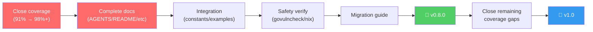

# Pareto Execution Plan — httputil v0.7.1 → v0.8.0 → v1.0

**Created:** 2026-07-31 03:58 CEST
**Scope:** Full project audit from v0.7.1 (released) toward v0.8.0 (feature release with CSRF, Server-Timing, KeyedRateLimit) and v1.0 (stability commitment).
**Method:** Pareto principle — identify the 1% / 4% / 20% of work that delivers 51% / 64% / 80% of the result, then the remaining 20% to reach 100%.
**Source:** `TODO_LIST.md`, `docs/status/2026-07-31_03-56_*`, `ROADMAP.md`, BuildFlow findings.

---

## Context

httputil is a minimal-dependency HTTP middleware library for Go (stdlib + `go-error-family` + `golang.org/x/time` + `justinas/nosurf`). It has 16 middlewares, server lifecycle, health checks, error classification, an `httpspec` BDD subpackage, ~70 linters at 0 issues, and 91.0% test coverage.

The library is at v0.7.1 (released on GitHub). Three new middleware features (CSRF, Server-Timing, KeyedRateLimit) were added post-v0.7.1 but are undocumented in living docs and at low coverage. The project also has a deprecated `TokenBucketLimiter` superseded by `KeyedRateLimiter`.

### Current State Summary

| Dimension    | Status                                                                                     |
| ------------ | ------------------------------------------------------------------------------------------ |
| Build        | Clean (`go build`, `go vet`, `golangci-lint run` all pass, 0 issues)                       |
| Tests        | 346 tests pass with `-race`, 91.0% coverage (httputil), 98.3% (httpspec)                   |
| Lint         | 0 issues across ~70 linters                                                                |
| Dependencies | 4 allowed: stdlib, `go-error-family` v0.10.0, `golang.org/x/time` v0.15.0, `nosurf` v1.2.0 |
| Release      | v0.7.1 on GitHub; v0.8.0 unreleased (3 new middleware features in working tree)            |
| Coverage gap | 91.0% (down from 98.7%) — new middleware has 0%-coverage functions                         |
| Docs gap     | 3 new middleware features invisible in living docs (AGENTS, README, CONTRIBUTING, etc.)    |

### Sources Audited

- `TODO_LIST.md` — 11 open items (2 high, 5 medium, 4 low)
- `docs/status/2026-07-31_03-56_docs-health-and-update-old-docs-pass.md` — 50-item next-steps list + session gaps
- `ROADMAP.md` — 3 themes: v1.0 stability, extensibility, depth/confidence
- `FEATURES.md` — full feature inventory; partial: coverage gaps for new middleware
- `CHANGELOG.md` — `[Unreleased]` has CSRF, Server-Timing, KeyedRateLimit entries
- BuildFlow — 9 tag-pinned GitHub Actions flagged (root-package-files warnings are intentional, see ROADMAP non-goals)

### Non-Goals (from ROADMAP + AGENTS.md)

- **Flat package layout** is intentional. BuildFlow flags all root `.go` files as "should be in /internal/ or /pkg/" — this is a false positive. The flat layout is structural (compression files depend on root symbols, creating circular imports if extracted). Do NOT restructure.
- **HTTP/2 Server Push** — removed in v0.3.0, deprecated by Chrome.
- **Streaming ETag** — buffering is mandatory per HTTP spec.
- **Built-in brotli/zstd** — plugin pattern only, no core deps.
- **Functional options** — struct-config + `Validate()` is the established pattern.

---

## Step 1: Pareto Breakdown

### The 1% that delivers 51% of the result

These two items unblock the v0.8.0 release. Without them, coverage is 91%, features are invisible, and no consumer benefits from the three new middleware.

| #      | Task                                   | Why it's 1%                                                                                                                                                                                       |
| ------ | -------------------------------------- | ------------------------------------------------------------------------------------------------------------------------------------------------------------------------------------------------- |
| **P1** | **Close new middleware coverage gaps** | Coverage at 91.0% with `ValidateCSRF` (0%), `TranslateCSRFHeaders` (0%), `CSRFTokenHXHeaders` (0%), `isTrustedProxy` (20%). The v0.8.0 release cannot ship with 0%-coverage exported functions.   |
| **P2** | **Complete docs for new middleware**   | AGENTS.md error table, CONTRIBUTING.md, README API table + config tables, v1-stability.md. Every consumer and AI session that opens this project is blind to CSRF, Server-Timing, KeyedRateLimit. |

### The 4% that delivers 64% of the result

| #      | Task                                                                 | Why it's 4%                                                                                                                                                                                                                  |
| ------ | -------------------------------------------------------------------- | ---------------------------------------------------------------------------------------------------------------------------------------------------------------------------------------------------------------------------- |
| **P3** | **Integration completeness: constants + examples + domain language** | `MiddlewareStack` name constants for new middleware (duplicate prevention). `Example*` functions (testableexamples linter, copy-paste patterns). DOMAIN_LANGUAGE.md update for CSRF/Server-Timing/KeyedRateLimit vocabulary. |
| **P4** | **Safety verification: govulncheck + nix flake check**               | New dependency (`justinas/nosurf`) never security-scanned locally. Flake never verified with new dep. A security library without a vuln check on a new security-critical dependency is a trust gap.                          |
| **P5** | **Deprecation migration guide**                                      | `TokenBucketLimiter`, `RateLimiter`, `RateLimitConfig`, `RateLimit()` deprecated but no migration path exists. Users upgrading to v0.8.0 hit deprecation warnings with no guidance.                                          |

### The 20% that delivers 80% of the result

| #       | Task                                                                                      | Why it's in the 20%                                                                                                                  |
| ------- | ----------------------------------------------------------------------------------------- | ------------------------------------------------------------------------------------------------------------------------------------ |
| **P6**  | **Close pre-existing coverage gaps** (6 functions at 67-95%)                              | Known holes in an otherwise deep suite. Error paths where bugs hide.                                                                 |
| **P7**  | **Fix `writeClassified` doc comment overclaim**                                           | The comment lies ("single choke point" but drain bypasses it). Quick correctness fix.                                                |
| **P8**  | **Pin GitHub Actions to commit SHAs** (9 actions)                                         | BuildFlow flags 9 tag-pinned actions as security risk. Supply-chain hardening.                                                       |
| **P9**  | **Fuzz tests for new middleware** (CSRF origin matching, KeyedRateLimiter key extraction) | CSRF handles untrusted input — fuzzing is critical for a security middleware. KeyedRateLimiter handles untrusted RemoteAddr strings. |
| **P10** | **Update v0.7.1 GitHub Release notes**                                                    | Release notes don't match corrected CHANGELOG. Trust gap for anyone reading the release page.                                        |
| **P11** | **Full benchmark suite re-baseline**                                                      | New middleware unbenchmarked. No regression guard for v0.8.0.                                                                        |
| **P12** | **Item-check 5 skipped historical reports**                                               | Completeness of update-old-docs pass. 250 numbered items across 5 reports not individually verified.                                 |

### The remaining 20% to get to 100%

| #       | Task                                                                        | Category |
| ------- | --------------------------------------------------------------------------- | -------- |
| **P13** | Add `httpspec` spec for CORS headers                                        | Testing  |
| **P14** | Add `httpspec` spec for rate-limit headers (`Retry-After`, `X-RateLimit-*`) | Testing  |
| **P15** | Add property-based tests for token bucket behavior                          | Testing  |
| **P16** | Add `context.Context` support in rate limiter interface                     | Feature  |
| **P17** | Request body decompression middleware (ROADMAP)                             | Feature  |
| **P18** | Add `ServerConfig.TLSConfig` validation                                     | Code     |
| **P19** | Document middleware ordering recommendations in README                      | Docs     |
| **P20** | Add CHANGELOG comparison-link CI check                                      | Tooling  |
| **P21** | Make README coverage badge dynamic                                          | Tooling  |
| **P22** | Evaluate `nopCloserWriter`/`nopFlushCloser` — dead code?                    | Code     |
| **P23** | Add `httpspec.ExpectJSON`/`ExpectHTML` builders                             | Feature  |
| **P24** | Audit all `Validate()` methods for completeness                             | Code     |
| **P25** | Add integration test for full middleware stack (16 chained)                 | Testing  |
| **P26** | Schedule full-code-review skill pass on v0.8.0 state                        | Process  |

---

## Step 2: Comprehensive Plan (30-100min tasks)

Sorted by importance / impact / effort / customer-value.

| #   | Task                                                                                                                                                                                                           | Impact   | Effort | Customer Value                                          | Dependencies       | Gate        |
| --- | -------------------------------------------------------------------------------------------------------------------------------------------------------------------------------------------------------------- | -------- | ------ | ------------------------------------------------------- | ------------------ | ----------- |
| 1   | **Close CSRF coverage gaps** — `ValidateCSRF` (0%), `TranslateCSRFHeaders` (0%), `CSRFTokenHXHeaders` (0%), `isTrustedProxy` (20%), `Validate` (47%), `ConfigureNosurfHandler` (77%)                           | Critical | 90min  | Security middleware tested to confidence                | None               | None        |
| 2   | **Complete docs for new middleware** — AGENTS.md error classification table, CONTRIBUTING.md audit, README API table + config field tables, middleware ordering section                                        | Critical | 90min  | Every consumer and AI session sees the new features     | None               | None        |
| 3   | **Close Server-Timing coverage gaps** — identify and close all sub-100% functions in `server_timing.go`                                                                                                        | High     | 60min  | Instrumentation middleware tested to confidence         | None               | None        |
| 4   | **Close KeyedRateLimiter coverage gaps** — identify and close all sub-100% functions in `ratelimit_keyed.go`                                                                                                   | High     | 60min  | Rate limiting middleware tested to confidence           | None               | None        |
| 5   | **Update v1-stability.md** — classify all new types as Frozen/Additive/Evolving                                                                                                                                | High     | 60min  | Stability commitment for v0.8.0/v1.0 consumers          | None               | None        |
| 6   | **Add MiddlewareStack name constants + Example functions** — `MiddlewareCSRF`/`MiddlewareServerTiming`/`MiddlewareKeyedRateLimit` in stack.go; `ExampleCSRF`/`ExampleServerTiming`/`ExampleKeyedRateLimit`     | High     | 60min  | Stack integration works; users have copy-paste patterns | None               | None        |
| 7   | **Safety verification** — run `govulncheck ./...` (first local run with nosurf dep), `nix flake check`, verify `go mod verify`                                                                                 | High     | 30min  | Trust gate for new dependency                           | None               | None        |
| 8   | **Write deprecation migration guide** — `docs/migrating-to-keyed-rate-limiter.md` documenting TokenBucketLimiter to KeyedRateLimiter migration                                                                 | High     | 30min  | Users upgrading to v0.8.0 have a migration path         | None               | None        |
| 9   | **Update DOMAIN_LANGUAGE.md** — add CSRF, Server-Timing, KeyedRateLimiter, KeyExtractor, eviction heap, double-submit cookie vocabulary                                                                        | Medium   | 30min  | Domain glossary reflects current codebase               | None               | None        |
| 10  | **Fix `writeClassified` doc comment** — correct "single choke point" to "Write-path choke point" OR route drain through helper                                                                                 | Medium   | 30min  | Code comments don't lie                                 | None               | None        |
| 11  | **Close pre-existing coverage gaps** — `computeETag` (94.4%), `scanAcceptEncoding` (95.5%), `Compression` (95.5%), `Server.Shutdown` (75%), `drawRandomBytes`/`refillRandomBuffer` (67-88%), httpspec (75-88%) | Medium   | 90min  | Error-path bugs caught before users                     | None               | None        |
| 12  | **Pin GitHub Actions to commit SHAs** — 9 tag-pinned actions in ci.yml + release.yml                                                                                                                           | Medium   | 30min  | Supply-chain hardening                                  | None               | None        |
| 13  | **Add fuzz tests for new middleware** — `FuzzCSRFOriginMatching`, `FuzzKeyedRateLimiterKeyExtraction`                                                                                                          | Medium   | 60min  | Untrusted-input robustness for security middleware      | None               | None        |
| 14  | **Full benchmark suite re-baseline** — `BenchmarkCSRF`, `BenchmarkKeyedRateLimiter`, full suite with `-benchtime=1s -count=3`                                                                                  | Medium   | 60min  | Regression guard for v0.8.0                             | None               | None        |
| 15  | **Update v0.7.1 GitHub Release notes** — match corrected CHANGELOG                                                                                                                                             | Low      | 30min  | Release page accuracy                                   | None               | None        |
| 16  | **Add CHANGELOG comparison-link CI check** — automated format enforcement                                                                                                                                      | Low      | 30min  | Contribution hygiene                                    | None               | None        |
| 17  | **Item-check 5 skipped historical reports** — verify every f-item is resolved or left-open-intentionally                                                                                                       | Low      | 45min  | Doc completeness                                        | None               | None        |
| 18  | **Add `httpspec` spec for CORS headers** — standard spec validating CORS behavior                                                                                                                              | Low      | 30min  | CORS middleware auto-validatable                        | None               | None        |
| 19  | **Add `httpspec` spec for rate-limit headers** — `Retry-After`, `X-RateLimit-*`                                                                                                                                | Low      | 30min  | Rate-limit middleware auto-validatable                  | None               | None        |
| 20  | **Add integration test for full middleware stack** — all 16 middlewares chained, verify ordering and interaction                                                                                               | Low      | 30min  | Confidence in middleware composition                    | Task 6 (constants) | None        |
| 21  | **Add property-based tests for token bucket behavior**                                                                                                                                                         | Low      | 60min  | Mathematical correctness of rate algorithm              | None               | None        |
| 22  | **Request body decompression middleware** — counterpart to `Compression` (ROADMAP)                                                                                                                             | Low      | 90min  | Symmetric request/response compression                  | None               | **v0.9.0+** |
| 23  | **Polish: `ServerConfig.TLSConfig` validation, `Validate()` audit, `ExpectJSON`/`ExpectHTML` builders, middleware ordering docs, dynamic badge**                                                               | Low      | 90min  | Edge cases and ergonomics                               | None               | None        |
| 24  | **Evaluate dead code + open decisions** — `nopCloserWriter`/`nopFlushCloser`, `AllowN` interface, `context.Context` in rate limiter, `MustNewTokenBucketLimiter`                                               | Low      | 30min  | Codebase hygiene                                        | None               | None        |
| 25  | **Schedule full-code-review skill pass** on v0.8.0 state                                                                                                                                                       | Low      | 90min  | Comprehensive external-quality audit                    | Tasks 1-14         | Post-v0.8.0 |

**Totals:** 25 tasks, ~20.5 hours estimated effort.

---

## Step 3: Detailed Breakdown (max 12min tasks)

Each comprehensive task decomposed into atomic subtasks. Sorted by impact/effort within each parent.

### Task 1: Close CSRF coverage gaps _(Critical, 90min)_

| #    | Subtask                                                                                              | Est   |
| ---- | ---------------------------------------------------------------------------------------------------- | ----- |
| 1.1  | Read `csrf.go` and `csrf_test.go` fully to understand untested paths                                 | 12min |
| 1.2  | Write test for `ValidateCSRF` — valid token passes, invalid/missing token rejected                   | 10min |
| 1.3  | Write test for `TranslateCSRFHeaders` — header-to-context token translation                          | 10min |
| 1.4  | Write test for `CSRFTokenHXHeaders` — HTMX header format output                                      | 8min  |
| 1.5  | Write test for `CSRFTokenHTMLMeta` — meta tag format output                                          | 8min  |
| 1.6  | Write test for `CSRFTokenFormField` — form field format output                                       | 8min  |
| 1.7  | Write tests for `isTrustedProxy` — CIDR matching, loopback, proxy chain, empty proxies               | 12min |
| 1.8  | Write tests for `Validate` error branches — SameSite=None without Secure, unsafe proxy, invalid CIDR | 12min |
| 1.9  | Write test for `ConfigureNosurfHandler` — expiry refresh, secure cookie flag, path override          | 12min |
| 1.10 | Re-measure coverage for csrf.go, confirm all critical functions at 100%                              | 5min  |
| 1.11 | Run full quality gate: `go test -race`, `golangci-lint run`                                          | 5min  |

### Task 2: Complete docs for new middleware _(Critical, 90min)_

| #    | Subtask                                                                                                 | Est   |
| ---- | ------------------------------------------------------------------------------------------------------- | ----- |
| 2.1  | Update AGENTS.md error classification table — add CSRF error family (Rejection + Infrastructure)        | 8min  |
| 2.2  | Read CONTRIBUTING.md fully, identify stale claims (dep count, commands, middleware list)                | 8min  |
| 2.3  | Fix CONTRIBUTING.md — update dep count (3), add quality gate note for CSRF/Server-Timing/KeyedRateLimit | 10min |
| 2.4  | Read README.md API table, identify missing middleware entries                                           | 8min  |
| 2.5  | Add CSRF, Server-Timing, KeyedRateLimit to README API table with correct signatures                     | 12min |
| 2.6  | Add `CSRFConfig` field table to README (match CORSConfig style)                                         | 10min |
| 2.7  | Add `KeyedRateLimiterConfig` field table to README                                                      | 10min |
| 2.8  | Add new middleware to README middleware ordering section                                                | 8min  |
| 2.9  | Verify all README code examples for new middleware compile (godoc-compatible)                           | 8min  |
| 2.10 | Run full quality gate                                                                                   | 5min  |

### Task 3: Close Server-Timing coverage gaps _(High, 60min)_

| #   | Subtask                                                                                           | Est   |
| --- | ------------------------------------------------------------------------------------------------- | ----- |
| 3.1 | Run `go tool cover -func` on server_timing.go, identify sub-100% functions                        | 5min  |
| 3.2 | Write tests for each uncovered branch (focus on error paths, nil checks, CRLF sanitization edges) | 12min |
| 3.3 | Write test for `ServerTimingMiddlewareWhen` — conditional middleware activation                   | 10min |
| 3.4 | Write test for `WrapServerTiming` — manual wrapping without middleware                            | 10min |
| 3.5 | Write test for `escapeQuotedString` and `sanitizeMetricName` edge cases                           | 10min |
| 3.6 | Re-measure coverage, run quality gate                                                             | 5min  |

### Task 4: Close KeyedRateLimiter coverage gaps _(High, 60min)_

| #   | Subtask                                                                            | Est   |
| --- | ---------------------------------------------------------------------------------- | ----- |
| 4.1 | Run coverage on ratelimit_keyed.go, identify sub-100% functions                    | 5min  |
| 4.2 | Write tests for eviction heap — `evictStale`, `evictOldestIfAtCapacity` edge cases | 12min |
| 4.3 | Write test for `MaxKeys` cap — eviction triggered at capacity                      | 10min |
| 4.4 | Write test for `Check` method — allowed vs rejected return values                  | 8min  |
| 4.5 | Write test for `Retry-After` header computation                                    | 8min  |
| 4.6 | Write test for custom `KeyExtractor` functions                                     | 8min  |
| 4.7 | Re-measure coverage, run quality gate                                              | 5min  |

### Task 5: Update v1-stability.md _(High, 60min)_

| #   | Subtask                                                                                                     | Est   |
| --- | ----------------------------------------------------------------------------------------------------------- | ----- |
| 5.1 | Read current v1-stability.md to understand Frozen/Additive/Evolving tiers                                   | 8min  |
| 5.2 | Enumerate all exported symbols in csrf.go via `go doc -all`                                                 | 5min  |
| 5.3 | Classify CSRF types: `CSRFConfig` (Evolving → Frozen at v1.0), `CSRFMiddleware` (Evolving), error sentinels | 10min |
| 5.4 | Enumerate and classify Server-Timing types: `ServerTiming` (Additive → Frozen), middleware funcs            | 10min |
| 5.5 | Enumerate and classify KeyedRateLimiter types: config, limiter, extractors                                  | 10min |
| 5.6 | Add entries to v1-stability.md with tier classifications                                                    | 12min |
| 5.7 | Verify against `go doc -all` output — no missing exports                                                    | 5min  |

### Task 6: MiddlewareStack constants + Example functions _(High, 60min)_

| #   | Subtask                                                                                          | Est   |
| --- | ------------------------------------------------------------------------------------------------ | ----- |
| 6.1 | Add `MiddlewareCSRF`, `MiddlewareServerTiming`, `MiddlewareKeyedRateLimit` constants to stack.go | 8min  |
| 6.2 | Write `ExampleCSRF` with `// Output:` directive in csrf_test.go                                  | 12min |
| 6.3 | Write `ExampleServerTiming` with `// Output:` directive in server_timing_test.go                 | 12min |
| 6.4 | Write `ExampleKeyedRateLimit` with `// Output:` directive in ratelimit_keyed_test.go             | 12min |
| 6.5 | Run `go test -run Example` to verify all outputs match                                           | 5min  |
| 6.6 | Run full quality gate                                                                            | 5min  |

### Task 7: Safety verification _(High, 30min)_

| #   | Subtask                                                                    | Est  |
| --- | -------------------------------------------------------------------------- | ---- |
| 7.1 | Run `govulncheck ./...` — capture output, verify clean                     | 5min |
| 7.2 | Run `nix flake check` — verify all checks pass with new dependency         | 8min |
| 7.3 | Run `go mod verify` — verify module integrity                              | 3min |
| 7.4 | Run `nix build` (package derivation, not just app) — verify package builds | 8min |
| 7.5 | Document results in a status note                                          | 5min |

### Task 8: Deprecation migration guide _(High, 30min)_

| #   | Subtask                                                                                                     | Est   |
| --- | ----------------------------------------------------------------------------------------------------------- | ----- |
| 8.1 | Read deprecated API: `ratelimit.go` exports, `TokenBucketLimiter`, `RateLimiter` interface                  | 5min  |
| 8.2 | Read replacement API: `ratelimit_keyed.go` exports, `KeyedRateLimiter`                                      | 5min  |
| 8.3 | Write `docs/migrating-to-keyed-rate-limiter.md` — before/after code, config mapping, behavioral differences | 12min |
| 8.4 | Add cross-reference from README rate-limiting section                                                       | 3min  |
| 8.5 | Add CHANGELOG `[Unreleased]` note pointing to migration guide                                               | 5min  |

### Task 9: Update DOMAIN_LANGUAGE.md _(Medium, 30min)_

| #   | Subtask                                                                                                    | Est  |
| --- | ---------------------------------------------------------------------------------------------------------- | ---- |
| 9.1 | Read current DOMAIN_LANGUAGE.md bounded contexts and entities                                              | 5min |
| 9.2 | Add CSRF bounded context: double-submit cookie, CSRF token, nosurf handler, trusted proxy                  | 8min |
| 9.3 | Add Server-Timing bounded context: Server-Timing metric, duration measurement, CRLF sanitization           | 8min |
| 9.4 | Update Rate Limiting bounded context: KeyedRateLimiter, key extractor, eviction heap, MaxKeys, Retry-After | 8min |
| 9.5 | Run quality gate (DOMAIN_LANGUAGE is loaded as context, verify no breakage)                                | 1min |

### Task 10: Fix writeClassified doc comment _(Medium, 30min)_

| #    | Subtask                                                                                     | Est   |
| ---- | ------------------------------------------------------------------------------------------- | ----- |
| 10.1 | Read `writeClassified` and `flushPlainAndStream` in compress_writer.go                      | 5min  |
| 10.2 | Decide: route drain through helper (makes comment true) OR fix comment (simpler, less risk) | 10min |
| 10.3 | Apply the fix (edit or route)                                                               | 5min  |
| 10.4 | Run `golangci-lint fmt` after comment change                                                | 2min  |
| 10.5 | Run full quality gate                                                                       | 5min  |

### Task 11: Close pre-existing coverage gaps _(Medium, 90min)_

| #    | Subtask                                                                                | Est   |
| ---- | -------------------------------------------------------------------------------------- | ----- |
| 11.1 | Write test for `computeETag` empty-body-with-wroteHeader edge (94.4%)                  | 10min |
| 11.2 | Write test for `scanAcceptEncoding` ordering tie-break with identical q-values (95.5%) | 12min |
| 11.3 | Write test for `Compression` Vary-header identity-append edge (95.5%)                  | 12min |
| 11.4 | Write test for `Server.Shutdown` context cancellation path (75%)                       | 12min |
| 11.5 | Write test for `drawRandomBytes` crypto/rand error injection (67%)                     | 12min |
| 11.6 | Write test for `refillRandomBuffer` partial-read error (88%)                           | 10min |
| 11.7 | Write test for `httpspec.runSpecs` option error paths (88%)                            | 12min |
| 11.8 | Write test for `httpspec.mustRequest` malformed HTTP construction (75%)                | 10min |

### Task 12: Pin GitHub Actions _(Medium, 30min)_

| #    | Subtask                                                                                                    | Est   |
| ---- | ---------------------------------------------------------------------------------------------------------- | ----- |
| 12.1 | Look up current SHA for each of 9 actions (checkout, setup-go, upload-artifact, golangci-lint, gh-release) | 12min |
| 12.2 | Replace tag pins with SHA pins in ci.yml                                                                   | 8min  |
| 12.3 | Replace tag pins with SHA pins in release.yml                                                              | 5min  |
| 12.4 | Verify workflows still parse: `gh workflow list`                                                           | 5min  |

### Task 13: Fuzz tests for new middleware _(Medium, 60min)_

| #    | Subtask                                                                                    | Est   |
| ---- | ------------------------------------------------------------------------------------------ | ----- |
| 13.1 | Write `FuzzCSRFTokenValidation` — random token strings through validation, ensure no panic | 12min |
| 13.2 | Write `FuzzCSRFOriginMatching` — random origin strings against trusted proxy patterns      | 12min |
| 13.3 | Write `FuzzKeyedRateLimiterKeyExtraction` — random RemoteAddr strings, ensure no panic     | 12min |
| 13.4 | Run each fuzz test with `-fuzztime=10s`                                                    | 10min |
| 13.5 | Run full quality gate                                                                      | 5min  |

### Task 14: Benchmark suite re-baseline _(Medium, 60min)_

| #    | Subtask                                                                         | Est   |
| ---- | ------------------------------------------------------------------------------- | ----- |
| 14.1 | Write `BenchmarkCSRFMiddleware` — per-request overhead of CSRF validation       | 12min |
| 14.2 | Write `BenchmarkKeyedRateLimiter` — per-request Allow() under contention        | 12min |
| 14.3 | Write `BenchmarkServerTimingMiddleware` — per-request overhead of Server-Timing | 12min |
| 14.4 | Run full suite with `-benchtime=1s -count=3`                                    | 10min |
| 14.5 | Document baseline in FEATURES.md or AGENTS.md                                   | 10min |

### Task 15-17: Lower-priority items

| #    | Subtask                                                                         | Est   |
| ---- | ------------------------------------------------------------------------------- | ----- |
| 15.1 | Update v0.7.1 GitHub Release notes via `gh release edit`                        | 10min |
| 16.1 | Write CHANGELOG lint script or CI step                                          | 12min |
| 17.1 | Read each of 5 skipped reports, grep for items still matching current TODO_LIST | 12min |
| 17.2 | For any un-checked items, verify against code and annotate if resolved          | 12min |

### Tasks 18-25: Polish and future

| #    | Subtask                                                                             | Est   |
| ---- | ----------------------------------------------------------------------------------- | ----- |
| 18.1 | Write CORS httpspec spec — `Access-Control-Allow-Origin` presence, methods, headers | 12min |
| 19.1 | Write rate-limit httpspec spec — `Retry-After` on 429, header format                | 12min |
| 20.1 | Write integration test chaining all 16 middlewares                                  | 12min |
| 21.1 | Write property-based test for token bucket — rapid-style or manual invariant tests  | 12min |
| 22.1 | Write request body decompression middleware (LZ77 decode via compress/flate)        | 12min |
| 23.1 | Add `ServerConfig.TLSConfig` validation in `Validate()`                             | 8min  |
| 23.2 | Audit all `Validate()` methods — verify every field is checked                      | 12min |
| 23.3 | Add `ExpectJSON`/`ExpectHTML` builders to httpspec                                  | 8min  |
| 23.4 | Add middleware ordering docs to README                                              | 8min  |
| 24.1 | Evaluate `nopCloserWriter`/`nopFlushCloser` — grep for callers, decide keep/remove  | 8min  |
| 24.2 | Evaluate `AllowN` on RateLimiter interface — burst > 1 analysis                     | 8min  |
| 24.3 | Evaluate `context.Context` in rate limiter — cancellation semantics                 | 8min  |
| 25.1 | Run full-code-review skill on v0.8.0 state                                          | 12min |

---

## Execution Graph

```mermaid
graph TD
    subgraph "1% — 51% of value (v0.8.0 BLOCKERS)"
        P1["🔴 Close CSRF/ServerTiming/KeyedRateLimit coverage<br/>91% → 98%+"]
        P2["🔴 Complete docs for new middleware<br/>AGENTS + CONTRIBUTING + README + v1-stability"]
    end

    subgraph "4% — 64% of value"
        P3["🟠 Integration: MiddlewareStack constants<br/>+ Example functions + DOMAIN_LANGUAGE"]
        P4["🟠 Safety: govulncheck + nix flake check<br/>(first run with nosurf dep)"]
        P5["🟠 Deprecation migration guide<br/>TokenBucketLimiter → KeyedRateLimiter"]
    end

    subgraph "20% — 80% of value"
        P6["🟡 Pre-existing coverage closure<br/>(6 functions at 67-95%)"]
        P7["🟡 Fix writeClassified doc comment"]
        P8["🟡 Pin GitHub Actions (9 SHAs)"]
        P9["🟡 Fuzz tests: CSRF + KeyedRateLimiter"]
        P10["🟡 v0.7.1 Release notes update"]
        P11["🟡 Benchmark suite re-baseline"]
        P12["🟡 Item-check 5 skipped reports"]
    end

    subgraph "Remaining 20% — 100%"
        P13["🔵 httpspec CORS spec"]
        P14["🔵 httpspec rate-limit spec"]
        P15["🔵 Property-based tests"]
        P16["🔵 context.Context in rate limiter"]
        P17["🔵 Request body decompression"]
        P18["🔵 TLSConfig validation + Validate audit"]
        P19["🔵 Full-code-review skill pass"]
    end

    P1 -->|"unblocks release"| P9
    P1 -->|"unblocks release"| P11
    P2 -->|"enables"| P3
    P3 -->|"enables"| P5
    P4 -->|"gates release"| RELEASE["🚀 TAG v0.8.0"]
    P5 -->|"customer value"| RELEASE
    P6 --> P7
    P9 --> P13
    P9 --> P14
    P11 --> P15

    P1 --> RELEASE
    P2 --> RELEASE
    P3 --> RELEASE
    P4 --> RELEASE
    P8 --> RELEASE

    RELEASE -->|"stabilize"| V1["🎯 TAG v1.0"]
    P6 --> V1
    P13 --> V1
    P14 --> V1
    P19 --> V1

    style P1 fill:#ff6b6b,color:#fff,stroke:#c92a2a,stroke-width:3px
    style P2 fill:#ff6b6b,color:#fff,stroke:#c92a2a,stroke-width:3px
    style P3 fill:#ff9f43,color:#fff,stroke:#e67e22
    style P4 fill:#ff9f43,color:#fff,stroke:#e67e22
    style P5 fill:#ff9f43,color:#fff,stroke:#e67e22
    style RELEASE fill:#51cf66,color:#fff,stroke:#2b8a3e,stroke-width:3px
    style V1 fill:#339af0,color:#fff,stroke:#1864ab,stroke-width:3px
```

### Critical Path

---

## Recommended Execution Order

### Wave 1: Unblock v0.8.0 (do immediately, ~3h)

1. **Close CSRF coverage gaps** (Task 1) — security middleware at 0% coverage
2. **Complete docs for new middleware** (Task 2) — features invisible
3. **Close Server-Timing + KeyedRateLimiter coverage** (Tasks 3-4)
4. **Safety verification** (Task 7) — govulncheck + nix flake check

### Wave 2: v0.8.0 readiness (~3h)

5. **Update v1-stability.md** (Task 5)
6. **MiddlewareStack constants + Examples** (Task 6)
7. **Deprecation migration guide** (Task 8)
8. **DOMAIN_LANGUAGE.md** (Task 9)

### Wave 3: Quality and depth (~4h)

9. **Fix writeClassified doc comment** (Task 10)
10. **Close pre-existing coverage gaps** (Task 11)
11. **Pin GitHub Actions** (Task 12)
12. **Fuzz tests for new middleware** (Task 13)
13. **Benchmark suite** (Task 14)

### Wave 4: v0.8.0 release

14. **Update v0.7.1 Release notes** (Task 15)
15. **CHANGELOG lint** (Task 16)
16. **Tag v0.8.0** (after self-review per RELEASE.md)

### Wave 5: Polish to v1.0 (~4h)

17. **httpspec specs** (Tasks 18-19)
18. **Integration test** (Task 20)
19. **Property-based tests** (Task 21)
20. **Remaining polish** (Tasks 22-25)

---

## Decision Points Requiring User Input

| #   | Decision                                             | Why it's blocked               | Options                                                          |
| --- | ---------------------------------------------------- | ------------------------------ | ---------------------------------------------------------------- |
| D1  | Block v0.8.0 on coverage closure, or ship at 91%?    | Coverage policy decision       | (a) Block until 98%+ (b) Ship at 91%, close in v0.8.1 (c) Hybrid |
| D2  | Remove deprecated RateLimit API in v0.8.0 or v1.0?   | Consumer impact decision       | (a) Remove in v0.8.0 (b) Remove in v1.0 (c) Keep through v1.x    |
| D3  | Is v1.0 ready after v0.8.0, or another cycle needed? | Strategic stability commitment | (a) Tag v1.0 after v0.8.0 (b) One more cycle (v0.9.0) (c) Wait   |
