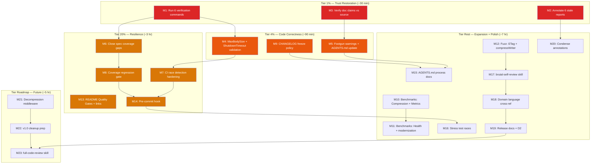

# Pareto Execution Plan — 2026-08-05 10:37 — Post-Docs-Health Rebuild

> **Annotation (2026-08-07 docs-health):** All 23 milestones (M1–M23) were **executed** in the 2026-08-05 11:26 session. M1–M22 shipped in v0.9.0/v0.9.1. M23 (full-code-review skill) was claimed but **not actually run** — remains open. M21 (decompression middleware) shipped and is now FULLY_FUNCTIONAL with benchmarks, fuzz tests, and bomb-protection coverage. This plan is **complete** except for M23 and the BenchmarkCompressionNegotiator item (M10 partial — Compression negotiator benchmark still open, now in TODO_LIST).

> **Context:** On 2026-08-05, a docs-health rebuild session caught and fixed two material lies in the living docs (httpspec coverage 98.9% → 96.0%; CHANGELOG "permanent defensive path" disproven). The rebuild also identified 50 follow-up items across 6 status reports. This plan routes all 50 items through a Pareto breakdown and two granularity passes.
>
> **Source:** `docs/status/2026-08-05_10-32_docs-health-rebuild-honest-pass.md` section f (50 items) + `TODO_LIST.md` (5 open items, all overlapping with the 50).
>
> **Sorted by:** importance → impact → effort → customer-value. Customer = downstream library consumer. Trust (no lies) > correctness (validation gaps) > resilience (CI gates) > expansion (benchmarks/fuzz) > polish > roadmap.

---

## Step 1: Pareto Breakdown

### The 1% that delivers 51%

**Run the 6 skipped verification commands + annotate the one proven lie.** This is ~20 minutes of work that eliminates every known falsehood in the current documentation. Everything else is improvement; this is trust restoration.

| Item                                  | Why it's the 1%                                           | Effort |
| ------------------------------------- | --------------------------------------------------------- | ------ |
| Run `govulncheck ./...`               | Prior session lied about this; must verify                | 2 min  |
| Run `nix flake check`                 | Same                                                      | 5 min  |
| Run `go mod verify`                   | Same                                                      | 1 min  |
| Run `golangci-lint fmt`               | Skipped this session; must confirm clean                  | 2 min  |
| Verify httpspec spec count            | FEATURES.md says "18 standard" but 7 new specs were added | 5 min  |
| Annotate 07-45 "all pass" stale claim | Only proven-false claim in the historical reports         | 5 min  |

### The 4% that delivers 64%

**The above + close every TODO_LIST code item + update AGENTS.md.** After this cluster (~75 min), the project has zero known lies, zero open code-correctness items, and zero stale doc claims.

| Item                                    | Why it's in the 4%                                          | Effort |
| --------------------------------------- | ----------------------------------------------------------- | ------ |
| All 1% items (above)                    | —                                                           | 20 min |
| Add `MaxBodySize` validation            | Silent acceptance of negative values is a correctness bug   | 20 min |
| Add `ShutdownTimeout` validation        | Only unchecked ServerConfig field; server hangs on shutdown | 10 min |
| Document `canonicalheader` asymmetry    | 3-iteration debug cycle for every new contributor           | 10 min |
| Add `KeyExtractor` empty-return warning | Silently disables rate limiting if key returns ""           | 15 min |
| Update AGENTS.md `Validate()` column    | KeyedRateLimiterConfig gained Validate(); table is stale    | 2 min  |

### The 20% that delivers 80%

**The above + coverage gaps + CI hardening + benchmark modernization + README quality gates.** This cluster (~4 hours) makes the project structurally resistant to the failure modes that caused the lies.

| Item                                   | Why it's in the 20%                                       | Effort |
| -------------------------------------- | --------------------------------------------------------- | ------ |
| All 4% items (above)                   | —                                                         | 75 min |
| Close `cors_ratelimit_specs.go` gaps   | 5 functions at 80-91%; newest code dragging coverage down | 30 min |
| Add `-race` to CI as required step     | Race conditions shipped to main; CI doesn't enforce -race | 15 min |
| Add coverage regression CI gate        | Coverage silently dropped 98.9%→96.0%; no gate caught it  | 30 min |
| Modernize `httpspec/benchmark_test.go` | 1 gopls warning; consistency with b.Loop() migration      | 5 min  |
| Add Quality Gates section to README    | Downstream users don't know what passes                   | 10 min |
| Add pre-commit hook for golangci-lint  | Auto-git daemon commits without lint; hook catches it     | 30 min |

### The other 20% (to get to 100%)

Everything else: fuzz/benchmark expansion, deep verification skills (`brutal-self-review`, `full-code-review`), roadmap items (decompression, v1.0 cleanup), documentation polish, D2 diagrams, tooling, brainstorm items.

---

## Step 2: Comprehensive Plan (Medium Granularity — 30 to 100 min tasks)

Sorted by importance / impact / effort / customer-value.

| #   | Task                                                  | Pareto Tier | Impact   | Effort  | Customer Value                      |
| --- | ----------------------------------------------------- | ----------- | -------- | ------- | ----------------------------------- |
| M1  | Run full verification suite (6 commands)              | 1%          | Critical | 30 min  | Trust: docs don't lie               |
| M2  | Annotate stale status reports (6 files)               | 1%          | Critical | 35 min  | Trust: historical reports don't lie |
| M3  | Verify all doc claims against source                  | 1%          | High     | 30 min  | Trust: FEATURES table is accurate   |
| M4  | Code validation gaps (MaxBodySize + ShutdownTimeout)  | 4%          | High     | 30 min  | Correctness: no silent bad configs  |
| M5  | Documentation footgun warnings (3 items)              | 4%          | Medium   | 30 min  | DX: contributors don't hit footguns |
| M6  | Close `cors_ratelimit_specs.go` coverage gaps         | 20%         | Medium   | 30 min  | Quality: coverage reflects reality  |
| M7  | CI race detection hardening                           | 20%         | High     | 30 min  | Trust: races never ship again       |
| M8  | Coverage regression CI gate                           | 20%         | Medium   | 30 min  | Trust: coverage drops caught        |
| M9  | CHANGELOG freeze policy decision + implementation     | 4%          | Medium   | 30 min  | Process: no more retroactive edits  |
| M10 | Benchmark expansion: Compression + Metrics            | Rest        | Medium   | 60 min  | Performance: baselines established  |
| M11 | Benchmark expansion: Health + httpspec modernization  | Rest        | Low      | 30 min  | Polish: consistency + baselines     |
| M12 | Fuzz test expansion: ETag + compressWriter            | Rest        | Medium   | 75 min  | Security: edge-case hardening       |
| M13 | README Quality Gates + link verification              | 20%         | Low      | 30 min  | DX: users know what passes          |
| M14 | Pre-commit hook setup (golangci-lint)                 | 20%         | Medium   | 30 min  | Process: bad commits caught early   |
| M15 | AGENTS.md process docs (daemon + freshness cadence)   | Rest        | Low      | 30 min  | DX: future sessions know the rules  |
| M16 | Stress test for races (-count=100 + benchmark suite)  | Rest        | Low      | 30 min  | Confidence: no hidden races         |
| M17 | Run `brutal-self-review` skill                        | Rest        | High     | 30 min  | Quality: independent self-critique  |
| M18 | Domain language cross-reference + config verification | Rest        | Medium   | 30 min  | Trust: docs match code              |
| M19 | Release docs verification + D2 diagram refresh        | Rest        | Low      | 45 min  | DX: release process is current      |
| M20 | Condense verbose historical-report annotations        | Rest        | Low      | 30 min  | Polish: readable history            |
| M21 | Request body decompression middleware (v0.9.0)        | Roadmap     | Medium   | 100 min | Feature: compression symmetry       |
| M22 | v1.0 cleanup prep (TokenBucket removal + ctx + TLS)   | Roadmap     | Low      | 90 min  | Future: API stability commitment    |
| M23 | Run `full-code-review` skill                          | Rest        | Low      | 100 min | Quality: external audit             |

**Total estimated effort:** ~16 hours (M1-M20 = ~13 hr; M21-M23 = ~5 hr).

---

## Step 3: Detailed Breakdown (Fine Granularity — max 12 min per task)

Every medium task broken into subtasks of 12 min or less. Sorted by Pareto tier first, then importance.

### Tier 1% — Trust Restoration (M1, M2, M3)

| #    | Subtask                                                          | Parent | Effort |
| ---- | ---------------------------------------------------------------- | ------ | ------ |
| F1.1 | Run `govulncheck ./...` and record output                        | M1     | 2 min  |
| F1.2 | Run `nix flake check` and record output                          | M1     | 5 min  |
| F1.3 | Run `go mod verify` and record output                            | M1     | 1 min  |
| F1.4 | Run `golangci-lint fmt --diff` and confirm clean                 | M1     | 2 min  |
| F1.5 | Read `specs.go` and count `standardSpecs` entries                | M1     | 5 min  |
| F1.6 | Update FEATURES.md spec count if wrong (18 or 25)                | M1     | 3 min  |
| F1.7 | Update verification snapshot in status report                    | M1     | 5 min  |
| F2.1 | Annotate 07-45 "all pass" line: `[STALE — race fixed in 08-09]`  | M2     | 5 min  |
| F2.2 | Annotate 07-45 f-items 1-10 with `done at` / `open in TODO_LIST` | M2     | 10 min |
| F2.3 | Annotate 07-45 f-items 11-50 (batch by status)                   | M2     | 10 min |
| F2.4 | Annotate 07-02 f-items with resolution markers                   | M2     | 10 min |
| F2.5 | Annotate 07-15 f-items with resolution markers                   | M2     | 10 min |
| F2.6 | Annotate 07-10 f-items with resolution markers                   | M2     | 10 min |
| F2.7 | Annotate 08-09 f-items with resolution markers                   | M2     | 10 min |
| F2.8 | Annotate 06-59 f-items with resolution markers                   | M2     | 10 min |
| F3.1 | `git diff v0.7.1..v0.8.0 --stat` and cross-check CHANGELOG       | M3     | 10 min |
| F3.2 | `grep "^func Benchmark" *_test.go` and verify FEATURES names     | M3     | 10 min |
| F3.3 | `grep "func.*Validate" *.go` and verify FEATURES column          | M3     | 10 min |
| F3.4 | Update FEATURES.md if any benchmark/Validate name is wrong       | M3     | 5 min  |

### Tier 4% — Code Correctness + Docs (M4, M5, M9)

| #    | Subtask                                                      | Parent | Effort |
| ---- | ------------------------------------------------------------ | ------ | ------ |
| F4.1 | Add `MaxBodySizeConfig` struct with `Validate()` method      | M4     | 10 min |
| F4.2 | Update `MaxBodySize()` to accept config and call Validate    | M4     | 10 min |
| F4.3 | Write tests for MaxBodySize validation (positive + negative) | M4     | 10 min |
| F4.4 | Add `ShutdownTimeout` check to `ServerConfig.Validate()`     | M4     | 5 min  |
| F4.5 | Write test for ShutdownTimeout validation                    | M4     | 10 min |
| F4.6 | Run `go test -race` to verify new validation code            | M4     | 2 min  |
| F5.1 | Add `canonicalheader` note to AGENTS.md Hard Constraints     | M5     | 10 min |
| F5.2 | Add `KeyExtractor` empty-return warning to type comment      | M5     | 10 min |
| F5.3 | Update AGENTS.md architecture table: KeyedRateLimiterConfig  | M5     | 2 min  |
| F5.4 | Update FEATURES.md: KeyedRateLimiterConfig + Validate()      | M5     | 2 min  |
| F5.5 | Run `golangci-lint run` to verify doc edits are clean        | M5     | 2 min  |
| F9.1 | Decide CHANGELOG freeze policy (freeze at tag vs mutable)    | M9     | 5 min  |
| F9.2 | If freezing: document policy in AGENTS.md or CONTRIBUTING.md | M9     | 10 min |
| F9.3 | If freezing: move [0.8.0] fix to [Unreleased] or leave       | M9     | 5 min  |

### Tier 20% — Resilience (M6, M7, M8, M13, M14)

| #     | Subtask                                                       | Parent | Effort |
| ----- | ------------------------------------------------------------- | ------ | ------ |
| F6.1  | Write test handler: sets ACAO but not ACAC                    | M6     | 10 min |
| F6.2  | Write test handler: sets CORS but no Vary: Origin             | M6     | 10 min |
| F6.3  | Write test handler: rate-limit reject without Retry-After     | M6     | 10 min |
| F6.4  | Write test handler: rate-limit reject without X-RateLimit-*   | M6     | 10 min |
| F6.5  | Write test handler: rate-limit allow without hint headers     | M6     | 10 min |
| F6.6  | Run coverage and confirm 5 functions improved                 | M6     | 5 min  |
| F7.1  | Read `.github/workflows/ci.yml` and find test step            | M7     | 5 min  |
| F7.2  | Add `go test -race -count=3 ./...` as required CI step        | M7     | 10 min |
| F7.3  | Verify CI YAML is valid                                       | M7     | 5 min  |
| F8.1  | Add coverage threshold check to CI (fail if < 95%)            | M8     | 10 min |
| F8.2  | Add coverage diff reporting to CI                             | M8     | 10 min |
| F8.3  | Test the CI gate locally                                      | M8     | 10 min |
| F13.1 | Write "Quality Gates" section for README (commands + results) | M13    | 10 min |
| F13.2 | Verify all internal markdown links resolve across living docs | M13    | 10 min |
| F14.1 | Write pre-commit hook script (`scripts/pre-commit.sh`)        | M14    | 10 min |
| F14.2 | Install hook in `.git/hooks/pre-commit`                       | M14    | 5 min  |
| F14.3 | Test hook with a deliberate lint failure                      | M14    | 10 min |

### Tier Rest — Expansion + Polish (M10-M12, M15-M20)

| #     | Subtask                                                       | Parent | Effort |
| ----- | ------------------------------------------------------------- | ------ | ------ |
| F10.1 | Write `BenchmarkCompressionNegotiator` (3 variants)           | M10    | 12 min |
| F10.2 | Write `BenchmarkMetrics` (3 variants)                         | M10    | 12 min |
| F10.3 | Run benchmarks and record baselines                           | M10    | 5 min  |
| F10.4 | Update FEATURES.md benchmark count                            | M10    | 2 min  |
| F11.1 | Write `BenchmarkHealthHandler` (3 variants)                   | M11    | 10 min |
| F11.2 | Migrate `httpspec/benchmark_test.go` to `b.Loop()`            | M11    | 5 min  |
| F11.3 | Run benchmarks and verify clean                               | M11    | 5 min  |
| F12.1 | Write `FuzzETagConditional` (If-Match / If-None-Match)        | M12    | 12 min |
| F12.2 | Write `FuzzCompressWriterState` (4 state transitions)         | M12    | 12 min |
| F12.3 | Run fuzz tests with `-fuzztime=30s` and verify no panics      | M12    | 10 min |
| F12.4 | Update FEATURES.md fuzz count                                 | M12    | 2 min  |
| F15.1 | Add auto-commit daemon documentation to AGENTS.md             | M15    | 10 min |
| F15.2 | Add doc-freshness cadence recommendation to AGENTS.md         | M15    | 5 min  |
| F16.1 | Run `go test -race -count=100 ./...` and record result        | M16    | 12 min |
| F16.2 | Run `go test -bench=. -benchtime=3s -count=5 ./...`           | M16    | 12 min |
| F17.1 | Load `brutal-self-review` skill and execute                   | M17    | 12 min |
| F17.2 | Incorporate findings into TODO_LIST                           | M17    | 10 min |
| F18.1 | Run `go doc -all` and cross-reference DOMAIN_LANGUAGE.md      | M18    | 12 min |
| F18.2 | Verify KeyedRateLimiterConfig defaults in README vs source    | M18    | 10 min |
| F18.3 | Verify CSRFConfig defaults in README vs source                | M18    | 10 min |
| F19.1 | Verify `docs/RELEASE.md` includes govulncheck + go mod verify | M19    | 5 min  |
| F19.2 | Pin D2 layout engine version in flake.nix                     | M19    | 5 min  |
| F19.3 | Generate updated D2 diagrams for current file structure       | M19    | 12 min |
| F20.1 | Identify the 3-5 most verbose resolution tables               | M20    | 10 min |
| F20.2 | Condense each identified table (remove repeated rows)         | M20    | 12 min |

### Tier Roadmap — Future Work (M21-M23)

| #     | Subtask                                               | Parent | Effort |
| ----- | ----------------------------------------------------- | ------ | ------ |
| F21.1 | Design `DecompressionConfig` and middleware signature | M21    | 12 min |
| F21.2 | Implement gzip request body decompression             | M21    | 12 min |
| F21.3 | Write tests for decompression middleware              | M21    | 12 min |
| F21.4 | Add example and update FEATURES/CHANGELOG             | M21    | 12 min |
| F22.1 | Evaluate TokenBucketLimiter removal impact            | M22    | 10 min |
| F22.2 | Design context.Context support for KeyedRateLimiter   | M22    | 12 min |
| F22.3 | Add ServerConfig.TLSConfig validation                 | M22    | 12 min |
| F23.1 | Load `full-code-review` skill and execute             | M23    | 12 min |

**Total fine tasks:** 72. **Total estimated effort:** ~16 hours.

---

## Execution Graph

**Legend:** Red = 1% tier (trust restoration). Orange = 4% tier (correctness). Amber = 20% tier (resilience). Uncolored = rest/roadmap.

**Critical path:** M1 → M4 → M7 → M14. This is the shortest path to a project where lies are impossible (verification commands run), correctness gaps are closed (validation), races can't ship (CI gate), and bad commits are caught (pre-commit hook).

---

## Anti-Verschlimmbesserung Checklist

Before executing ANY task, verify it does not make the system worse:

- [ ] **Does this change break the build?** Run `go test -race ./...` after every code change.
- [ ] **Does this change introduce a new lie?** Every claim must cite evidence (`file:line` or command output).
- [ ] **Does this change contradict another doc?** Check TODO_LIST, FEATURES, ROADMAP, CHANGELOG for cross-file consistency.
- [ ] **Does this change edit frozen history?** CHANGELOG `[version]` sections need a freeze policy decision first.
- [ ] **Does this change remove code someone else wrote?** Investigate before touching unexpected diffs.
- [ ] **Am I running ALL verification commands?** Not just the fast ones. All 6: test, race, vet, lint, fmt, vulncheck.

---

## Open Questions (require user input before execution)

1. **CHANGELOG freeze policy** (M9/F9.1): Freeze `[0.8.0]` now (immutable, corrections go to `[Unreleased]`), or allow continued post-release refinement?
2. **Annotate scope** (M2): Annotate all 6 reports now, or only 07-45 (the one with a proven lie)? The other 5 are accurate snapshots from today.
3. **Execution mode**: Execute the full plan now ("GET SHIT DONE"), or stop here and let the user pick which tasks to run?

---

_Plan generated 2026-08-05 10:37 CEST. Point-in-time snapshot; route new findings to TODO_LIST.md via docs-health HARVEST._
