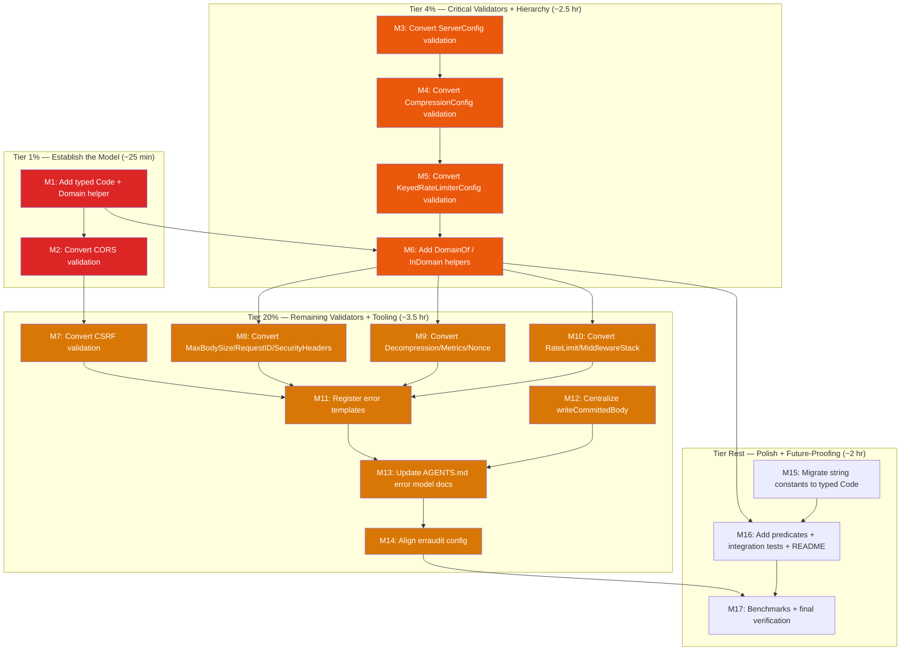

# Pareto Execution Plan — 2026-08-14 13:53 — Typed Hierarchical Error System

> **Context:** The project already uses `github.com/larsartmann/go-error-family` for runtime HTTP errors, but configuration-validation errors are still plain stdlib sentinels (`errors.New` + `fmt.Errorf`). The erraudit scan reports 83 violations, most of which are artifacts of the mismatched `--enforce-samber-oops` flag. The goal is to make every error typed, hierarchical, and fully classified without adding dependencies or breaking the public API.
>
> **Source:** `docs/reviews/2026-08-14_error-system-review.html` and the erraudit output attached to the review session.
>
> **Sorted by:** importance → impact → effort → customer-value. Customer = downstream library consumer. Correctness (typed config errors) > trust (no false positives) > resilience (tooling alignment) > polish (docs/predicates).

---

## Step 1: Pareto Breakdown

### The 1% that delivers 51%

**Establish the typed-code model and convert the smallest visible validator.** This is ~25 minutes of work that proves the entire approach: a `Code` type, domain extraction, package-level classified sentinels, contextual clones, and a test that asserts `Coded`/`Classified`/`Contextual`.

| # | Item | Why it's the 1% | Effort |
| --- | --- | --- | --- |
| 1.1 | Add `type Code string`, `Code.Domain()`, and typed constants for existing HTTP codes in `errors.go` | Creates the type system every other task builds on | 10 min |
| 1.2 | Convert `CORSConfig.Validate()` to `errorfamily.NewRejection` sentinels with context | Proves the pattern in the smallest non-trivial validator | 10 min |
| 1.3 | Add a test that asserts CORS validation errors are Coded/Classified/Contextual | Prevents regression and shows consumers how to match | 5 min |

### The 4% that delivers 64%

**The above + convert the three most critical config validators and add `DomainOf` / `InDomain` helpers.** After this cluster (~2.5 hours), every major middleware has at least one classified config error, and consumers can query errors by domain.

| # | Item | Why it's in the 4% | Effort |
| --- | --- | --- | --- |
| 1.x | All 1% items | — | 25 min |
| 2.1 | Convert `ServerConfig.Validate()` to classified errors | Server config errors are high-impact (timeouts, TLS, address) | 30 min |
| 2.2 | Convert `CompressionConfig.Validate()` to classified errors | Complex validator with multiple invariant failures | 30 min |
| 2.3 | Convert `KeyedRateLimiterConfig.Validate()` to classified errors | Rate-limiting correctness depends on valid config | 20 min |
| 2.4 | Add `DomainOf(err)` and `InDomain(err, domain)` helpers | Enables hierarchical matching without string parsing | 15 min |
| 2.5 | Add tests asserting all converted validators return classified errors | Guarantees the new model holds for the 4% tier | 15 min |

### The 20% that delivers 80%

**The above + all remaining validators + error template registration + write-swallow helper + AGENTS.md update + erraudit alignment.** This cluster (~6 hours) makes the error system internally consistent and tooling-clean.

| # | Item | Why it's in the 20% | Effort |
| --- | --- | --- | --- |
| 2.x | All 4% items | — | 2.5 hr |
| 3.1 | Convert `MaxBodySizeConfig.Validate()` to classified errors | Correctness: negative body-size limit is a bug | 15 min |
| 3.2 | Convert `RequestIDConfig.Validate()` to classified errors | Small validator, completes propagation middleware | 15 min |
| 3.3 | Convert `SecurityHeadersConfig.Validate()` to classified errors | Security-related config should be diagnostic | 15 min |
| 3.4 | Convert `CSRFConfig.Validate()` to classified errors (finish existing partial work) | Already exports `ErrCSRFConfig`; finish the rest | 20 min |
| 3.5 | Convert `DecompressionConfig.Validate()` to classified errors | Bomb-protection config should be diagnostic | 15 min |
| 3.6 | Convert `MetricsConfig.Validate()` and `NonceConfig.Validate()` to classified errors | Small validators, completes coverage | 20 min |
| 3.7 | Convert `RateLimitConfig.Validate()` and `MiddlewareStack.Validate()` to classified errors | Deprecated but still exported API | 20 min |
| 3.8 | Register error templates for all new config error codes | Enables user-facing `what/why/fix/escape` messages | 30 min |
| 3.9 | Centralize intentional post-header write swallows in `writeCommittedBody` | Makes a correct-but-noisy pattern explicit | 20 min |
| 3.10 | Update `AGENTS.md` error classification table and policy | Future sessions know the model | 20 min |
| 3.11 | Align erraudit configuration with `go-error-family` (drop `--enforce-samber-oops`) | Removes false-positive flood | 15 min |
| 3.12 | Add comprehensive tests for typed code matching and domain helpers | Guarantees hierarchy is testable | 25 min |

### The other 20% (to get to 100%)

Everything else: migrate all exported string error-code constants to typed `Code` constants while preserving backward compatibility, add domain-specific predicates, expand error tests across middleware, add benchmarks for error construction, update README with consumer guidance, and consider v1 API changes (concrete `*errorfamily.Error` return types).

---

## Step 2: Comprehensive Plan (Medium Granularity — 30 to 100 min tasks)

Sorted by importance / impact / effort / customer-value.

| # | Task | Pareto Tier | Impact | Effort | Customer Value |
| --- | --- | --- | --- | --- | --- |
| M1 | Add `type Code string`, `Code.Domain()`, and typed constants for existing HTTP codes in `errors.go` | 1% | Critical | 30 min | Type safety: no accidental code mixing |
| M2 | Convert `CORSConfig.Validate()` to classified errors with context and tests | 1% | High | 30 min | Model proof + visible improvement |
| M3 | Convert `ServerConfig.Validate()` to classified errors with tests | 4% | High | 60 min | Correctness: server config failures are diagnostic |
| M4 | Convert `CompressionConfig.Validate()` to classified errors with tests | 4% | High | 60 min | Correctness: compression config failures are diagnostic |
| M5 | Convert `KeyedRateLimiterConfig.Validate()` to classified errors with tests | 4% | High | 45 min | Correctness: rate-limit config failures are diagnostic |
| M6 | Add `DomainOf(err)`, `InDomain(err, domain)`, and tests | 4% | High | 30 min | Hierarchy: consumers can match by domain |
| M7 | Convert `CSRFConfig.Validate()` to classified errors with tests | 20% | Medium | 45 min | Consistency: complete partial work |
| M8 | Convert `MaxBodySizeConfig.Validate()` + `RequestIDConfig.Validate()` + `SecurityHeadersConfig.Validate()` with tests | 20% | Medium | 45 min | Coverage: propagation/security validators |
| M9 | Convert `DecompressionConfig.Validate()` + `MetricsConfig.Validate()` + `NonceConfig.Validate()` with tests | 20% | Medium | 45 min | Coverage: remaining lifecycle validators |
| M10 | Convert `RateLimitConfig.Validate()` + `MiddlewareStack.Validate()` with tests | 20% | Low | 45 min | Coverage: deprecated/stack validators |
| M11 | Register error templates for all new config error codes | 20% | Medium | 30 min | UX: structured user-facing messages |
| M12 | Centralize post-header write swallows in `writeCommittedBody` | 20% | Low | 30 min | Clarity: explicit intentional swallow pattern |
| M13 | Update `AGENTS.md` error model documentation | 20% | Medium | 30 min | Trust: future sessions know the policy |
| M14 | Align erraudit config / instructions with `go-error-family` | 20% | High | 30 min | Trust: tooling reports match project policy |
| M15 | Migrate exported string error-code constants to typed `Code` constants (backward-compatible) | Rest | Medium | 45 min | Type safety: compile-time code grouping |
| M16 | Add domain predicates + integration tests + README guidance | Rest | Low | 60 min | Polish: consumer-friendly matching API |
| M17 | Benchmark error construction and run final verification suite | Rest | Low | 60 min | Confidence: no perf regression |

**Total estimated effort:** ~11 hours.

---

## Step 3: Detailed Breakdown (Fine Granularity — max 12 min per task)

Every medium task broken into subtasks of 12 min or less. Sorted by Pareto tier first, then importance.

### Tier 1% — Establish the Model (M1, M2)

| # | Subtask | Parent | Effort |
| --- | --- | --- | --- |
| F1.1 | Define `type Code string` and `func (Code) Domain()` in `errors.go` | M1 | 10 min |
| F1.2 | Add typed constants for `http.*` codes and backward-compatible `string` aliases | M1 | 10 min |
| F1.3 | Add `DomainOf(err)` helper using `errors.AsType[errorfamily.Coded]` | M1 | 10 min |
| F1.4 | Add tests for `Code.Domain()` and `DomainOf()` | M1 | 10 min |
| F2.1 | Replace CORS stdlib sentinels with `errorfamily.NewRejection` constants | M2 | 10 min |
| F2.2 | Update `CORSConfig.Validate()` to clone sentinels with context | M2 | 10 min |
| F2.3 | Add test asserting CORS error is Coded/Classified/Contextual | M2 | 10 min |
| F2.4 | Run `go test -race ./...` and `golangci-lint run` for CORS changes | M2 | 5 min |

### Tier 4% — Critical Validators + Hierarchy Helpers (M3-M6)

| # | Subtask | Parent | Effort |
| --- | --- | --- | --- |
| F3.1 | Replace ServerConfig stdlib sentinels with classified constants | M3 | 12 min |
| F3.2 | Update `ServerConfig.Validate()` branches to clone with context | M3 | 12 min |
| F3.3 | Add tests for all ServerConfig validation error codes | M3 | 12 min |
| F3.4 | Run verification suite after ServerConfig changes | M3 | 5 min |
| F4.1 | Replace CompressionConfig stdlib sentinels with classified constants | M4 | 12 min |
| F4.2 | Update `CompressionConfig.Validate()` branches to clone with context | M4 | 12 min |
| F4.3 | Add tests for all CompressionConfig validation error codes | M4 | 12 min |
| F4.4 | Verify compression tests still pass | M4 | 5 min |
| F5.1 | Replace KeyedRateLimiterConfig stdlib sentinels with classified constants | M5 | 10 min |
| F5.2 | Update `KeyedRateLimiterConfig.Validate()` branches | M5 | 10 min |
| F5.3 | Add tests for KeyedRateLimiterConfig validation errors | M5 | 10 min |
| F6.1 | Implement `InDomain(err, domain string) bool` helper | M6 | 10 min |
| F6.2 | Add table-driven test for `DomainOf`/`InDomain` across sample errors | M6 | 12 min |

### Tier 20% — Remaining Validators + Tooling (M7-M14)

| # | Subtask | Parent | Effort |
| --- | --- | --- | --- |
| F7.1 | Convert CSRF `errors.New` sentinels in `CSRFConfig.Validate()` | M7 | 12 min |
| F7.2 | Add context to CSRF validation errors and update tests | M7 | 12 min |
| F7.3 | Verify CSRF tests still pass | M7 | 5 min |
| F8.1 | Convert `MaxBodySizeConfig.Validate()` to classified errors | M8 | 10 min |
| F8.2 | Convert `RequestIDConfig.Validate()` to classified errors | M8 | 10 min |
| F8.3 | Convert `SecurityHeadersConfig.Validate()` to classified errors | M8 | 12 min |
| F8.4 | Add tests for M8 validators | M8 | 10 min |
| F9.1 | Convert `DecompressionConfig.Validate()` to classified errors | M9 | 10 min |
| F9.2 | Convert `MetricsConfig.Validate()` to classified errors | M9 | 10 min |
| F9.3 | Convert `NonceConfig.Validate()` to classified errors | M9 | 10 min |
| F9.4 | Add tests for M9 validators | M9 | 10 min |
| F10.1 | Convert `RateLimitConfig.Validate()` to classified errors | M10 | 12 min |
| F10.2 | Convert `MiddlewareStack.Validate()` to classified errors | M10 | 12 min |
| F10.3 | Add tests for M10 validators | M10 | 10 min |
| F11.1 | Collect all new config error codes | M11 | 5 min |
| F11.2 | Register message templates for new config codes in `RegisterErrorClassifications()` | M11 | 12 min |
| F11.3 | Add test verifying templates exist for every config code | M11 | 10 min |
| F12.1 | Create `writeCommittedBody(w http.ResponseWriter, body []byte)` helper | M12 | 10 min |
| F12.2 | Replace scattered `_, _ = w.Write(...)` post-header sites with helper | M12 | 12 min |
| F12.3 | Add doc comment explaining intentional swallow | M12 | 5 min |
| F13.1 | Add "Error Model" section to `AGENTS.md` | M13 | 12 min |
| F13.2 | Update error classification table with new config codes | M13 | 10 min |
| F14.1 | Document the correct erraudit invocation for this project | M14 | 10 min |
| F14.2 | Update any tooling/scripts that pass `--enforce-samber-oops` | M14 | 10 min |
| F14.3 | Re-run erraudit with aligned flags and confirm clean | M14 | 5 min |

### Tier Rest — Polish + Future-Proofing (M15-M17)

| # | Subtask | Parent | Effort |
| --- | --- | --- | --- |
| F15.1 | Convert `ErrCodeWriteFailed` etc. to typed `Code` constants | M15 | 12 min |
| F15.2 | Preserve backward-compatible `string` aliases | M15 | 5 min |
| F15.3 | Update internal call sites to use typed constants | M15 | 12 min |
| F15.4 | Add compile-time assertion that `Code` is a string alias | M15 | 5 min |
| F16.1 | Add `IsCORSConfigError`, `IsCompressionConfigError`, etc. predicates | M16 | 12 min |
| F16.2 | Add integration test matching errors by code/domain | M16 | 12 min |
| F16.3 | Add README section: "Handling errors from httputil" | M16 | 12 min |
| F17.1 | Write benchmark for `errorfamily.NewRejection` and sentinel clone | M17 | 12 min |
| F17.2 | Run `go test -race -count=10 ./...` final verification | M17 | 12 min |
| F17.3 | Run `golangci-lint run` and `go vet ./...` final verification | M17 | 10 min |

**Total fine tasks:** 62. **Total estimated effort:** ~11 hours.

---

## Execution Graph

**Legend:** Red = 1% tier (establish the model). Orange = 4% tier (critical validators + hierarchy). Amber = 20% tier (remaining validators + tooling). Uncolored = rest/polish.

**Critical path:** M1 → M2 → M7 → M11 → M13 → M14 → M17. This is the shortest path to a project where the error model is typed, all validators are classified, templates are registered, docs are accurate, tooling is aligned, and the final verification suite passes.

---

## Anti-Verschlimmbesserung Checklist

Before executing ANY task, verify it does not make the system worse:

- [ ] **Does this change break the build?** Run `go test -race ./...` after every code change.
- [ ] **Does this change introduce a new unclassified error?** Every new error must implement `Coded`/`Classified`/`Contextual` via `go-error-family`.
- [ ] **Does this change alter a public API signature?** Keep `Validate() error` in v0.x; use `*errorfamily.Error` values internally.
- [ ] **Does this change remove an exported constant?** Preserve string aliases like `ErrCodeWriteFailed`.
- [ ] **Does this change contradict `AGENTS.md`?** Update the error classification table if new codes are added.
- [ ] **Does this change edit frozen CHANGELOG history?** Corrections to released versions go in `[Unreleased]`.
- [ ] **Am I running the aligned erraudit flags?** Do not use `--enforce-samber-oops` against project policy.

---

## Open Questions (require user input before execution)

1. **Return-type migration (M-v1):** Should a future v1.0 change `Validate() error` to `Validate() *errorfamily.Error`, or keep the `error` interface for flexibility?
2. **erraudit policy (M14):** Should the project add an erraudit config file (e.g., `.erraudit.yml`) to encode the `go-error-family` policy, or just document the correct CLI invocation?
3. **Execution mode:** Execute the full plan now ("GET SHIT DONE"), stop here for approval, or run only the 1%/4% tiers first?

---

_Plan generated 2026-08-14 13:53 CEST. Point-in-time snapshot; route new findings to `TODO_LIST.md` via docs-health HARVEST._
