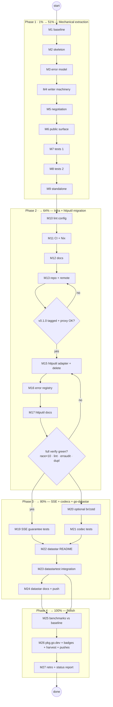

# Plan: Extract Response Compression into `go-compression`

**Date:** 2026-08-16 08:03
**Status:** Approved for execution
**Trigger:** go-datastar's README lists "SSE compression: official SDK Yes / go-datastar No" as a losing row. This is the second consumer that justifies a dedicated module (the go-etag extraction playbook, `docs/status/2026-08-07_06-44_etag-extraction-to-go-etag.md`, is the template — including its mistakes, which this plan explicitly pays down).

---

## 1. Context

- httputil's compression subsystem is its largest cohesive unit: **7 non-test files (~1,600 LOC) + 9 test files (~1,800 LOC)**.
- The SSE-critical property already exists and is correct: `compressWriter.Flush()` performs `writer.Flush()` (Z_SYNC_FLUSH semantics) **then** flushes the underlying `ResponseWriter`, and `text/event-stream` is not in `DefaultIncompressibleTypes()`. Flush-per-event works today; it is just not tested or documented as an SSE guarantee.
- Negotiation priority already ranks `brotli > zstd > gzip > deflate > identity`; brotli/zstd factories are missing only because httputil's depguard bans the codec libraries. A new module can own them.
- The 2026-08-05 "root stays flat" decision explicitly deferred extraction until a second consumer appeared (documented in `docs/modularization/2026-08-05_DECISION.html`). go-datastar is that consumer.

### Repositories touched

| Repo | Role | Change |
| --- | --- | --- |
| `../go-compression` (new) | Standalone module | Receives all response-compression code, error model, tests; gains optional brotli/zstd codecs; full infra (LICENSE, CI, lint, remote, tag) |
| `httputil` (this repo) | Former owner | Deletes 16 moved files, keeps thin **deprecated** adapter (etag.go pattern), registers error-classification superset, updates depguard + docs |
| `../go-datastar` | Consumer | README row flip + "Compressing SSE" docs; `datastartest` gains an optional integration test (**root go.mod stays dep-free**) |

## 2. Decisions (encoded, not open)

1. **Name:** `github.com/larsartmann/go-compression`, package `compression` (follows go-etag / go-sse / go-error-family pattern).
2. **API:** `compression.Middleware` alias (`func(http.Handler) http.Handler`) + canonical constructor `compression.New(cfg)`. httputil keeps `Compression()` as a deprecated adapter — identical to the `etag.go` precedent.
3. **Decompression stays in httputil.** It is request-side, bomb-protection focused, and has no external consumer. Revisit post-v1.0.
4. **Error codes:** go-compression owns `compression.*` codes and carries string-identical copies of the shared `http.write_failed` / `http.hijack_*` codes (root's `recorder.go` also uses them — duplication across modules is the already-accepted go-etag pattern). Both modules classify via `go-error-family`; httputil's `RegisterErrorClassifications()` registers the superset.
5. **go-datastar root module gets NO new dependency.** Integration is docs + README snippet + a test-only dependency in the separate `datastartest` module. Root stays `go-error-family` + `go-sse` only.
6. **brotli/zstd are optional subpackages** (`compression/brotli`, `compression/zstd`) using `andybalholm/brotli` + `klauspost/compress/zstd`. Go module graph pruning keeps the core stdlib-only for consumers that don't import them. These deps are banned in httputil — that rule does not transfer.
7. **go-compression is NOT added to httputil's go.work** (go-etag precedent): it is consumed as a tagged, versioned dependency from the module proxy. Dev flow = tag early (v0.1.0 before httputil migration), `go get` the tag.

### Anti-VERSCHLIMMBESSER guardrails

- **Byte-for-byte logic move.** No refactors, no renames beyond `package` + necessary symbol visibility, no "improvements" during the move. Behavior deltas (new codecs, SSE tests) come AFTER the moved tests are green.
- **The auto-commit daemon exists.** Every phase ends with a deliberate `git commit --no-verify` + detailed message so history is never left to daemon inference (etag lesson, items 41/45).
- **Definition of done includes go-etag's unpaid debt:** LICENSE, .gitignore, .editorconfig, CI, remote, deliberate commits. flake.nix is included (go-datastar has one; go-etag skipped it — recorded as go-etag debt, not replicated).
- **Ordering rule from AGENTS.md:** after deleting moved files from httputil, run `go build ./...` IMMEDIATELY and fix the cascade before touching anything else.

## 3. File Inventory

### Moves to go-compression (adapted: package rename, import fixes)

| httputil file | LOC | Destination |
| --- | --- | --- |
| `compression.go` | 235 | `compression.go` (config + factories + middleware) |
| `compression_negotiator.go` | 234 | `negotiator.go` |
| `compression_qvalue.go` | 149 | `qvalue.go` |
| `compress_writer.go` | 298 | `writer.go` |
| `compress_writer_compress.go` | 64 | `writer_compress.go` |
| `compress_pool.go` | 41 | `pool.go` |
| `compress_content_type.go` | 34 | `content_type.go` |
| `wrapper.go` | 85 | `response_wrapper.go` (root's `capabilities_test.go` gets a local test double) |
| `compression_test.go` | 566 | tests (split as needed) |
| `compress_writer_test.go` | 445 | tests (split as needed) |
| `compression_negotiator_test.go` | 256 | tests |
| `compression_qvalue_test.go` | 153 | tests |
| `compression_factory_test.go` | 80 | tests |
| `compression_behavior_test.go` | 59 | tests |
| `compression_bench_test.go` | 53 | benchmarks |
| `compression_negotiator_bench_test.go` | 42 | benchmarks |
| `compress_fuzz_test.go` | 42 | fuzz |

### Root symbols the moved code uses (must be inlined/owned by go-compression)

- `responseWrapper` (moves with wrapper.go), `Middleware` alias (new), `validateConfig` (inline a local copy), `DetectCapabilities` (audit usage; inline if referenced), `codeWriteFailed`/`codeHijack*` (string-identical copies), `errUnexpectedPoolType` etc. (move).

## 4. Pareto Breakdown

### The 1% that delivers 51%

**Mechanical extraction with green tests.** New module skeleton + moved code + adapted tests + httputil still building via its own copy. Nothing else matters if this isn't byte-identical in behavior. (M1–M9)

### The 4% that deliver 64% (cumulative)

**Infra + release wiring.** LICENSE/CI/lint/README/remote/tag v0.1.0, httputil migrated onto the versioned dependency with adapter + superset error registration. At this point go-datastar could `go get` it today. (M10–M18)

### The 20% that deliver 80% (cumulative)

**The customer-visible result.** SSE flush guarantee tested + documented, optional brotli/zstd codecs (README parity with official SDK: "gzip, Brotli, Zstd"), go-datastar README row flipped to Yes with drop-in snippet, datastartest integration test. (M19–M24)

### The other 20% to reach 100%

Benchmarks ported + compared, pkg.go.dev verification, badges, TODO_LIST/FEATURES/CHANGELOG/ROADMAP reconciliation across all three repos, status-report annotations, retro, final pushes. (M25–M27)

## 5. Step 2 — Comprehensive Plan (tasks 30–100 min)

Sorted by importance (phase order = execution order; within phase by impact/effort ratio).

| ID | Task | Impact | Effort | Tier |
| --- | --- | --- | --- | --- |
| M1 | Baseline: clean tree, `go test -race ./...`, lint, compression benchmarks recorded | H (safety) | 30m | 1% |
| M2 | Repo skeleton: go.mod, LICENSE, .gitignore, .editorconfig, dprint.json, git init | H (unblocks all) | 45m | 1% |
| M3 | Error model: `compression.*` + copied `http.*` codes, sentinels, templates, completeness test | H | 90m | 1% |
| M4 | Move writer machinery: wrapper, writer, writer_compress, pool; fix symbols/imports | H | 100m | 1% |
| M5 | Move negotiation: negotiator, qvalue, content_type | H | 60m | 1% |
| M6 | Public surface: config + Validate, factories, `New()`, `Middleware` alias, doc.go | H | 60m | 1% |
| M7 | Adapt test suite part 1: compression_test.go, compress_writer_test.go (+ testutil) | H | 100m | 1% |
| M8 | Adapt test suite part 2: negotiator, qvalue, factory, behavior, fuzz; `-race -count=10` green | H | 90m | 1% |
| M9 | Standalone surgery: inline validateConfig/capabilities, zero httputil imports, build alone | H (proves extraction) | 60m | 1% |
| M10 | Port `.golangci.yml`, scope depguard for codec subpackages, lint+fmt to 0 issues | H (quality gate) | 60m | 4% |
| M11 | CI: build, test-race, golangci-lint, govulncheck, erraudit; flake.nix + check | H | 60m | 4% |
| M12 | README (what/why/install/quick start/config/SSE) + testable examples + doc.go polish | M-H | 90m | 4% |
| M13 | AGENTS.md + CHANGELOG.md; deliberate initial commits; `gh repo create` + push | H (etag debt) | 60m | 4% |
| M14 | Tag v0.1.0 (annotated); verify `go get` resolves from proxy in scratch module | H (unblocks httputil) | 45m | 4% |
| M15 | httputil: `go get` tag, delete 16 files, write deprecated adapter, capabilities_test double, `go build` cascade fix | H | 90m | 4% |
| M16 | httputil error registry: superset registration, errorTemplates split, code-list + domain tests green | H | 100m | 4% |
| M17 | httputil depguard entry + AGENTS/FEATURES/CHANGELOG/README updates | M-H | 90m | 4% |
| M18 | httputil full verification: race×10, lint, erraudit gates, art-dupl, server_timing, httpspec | H (gate) | 60m | 4% |
| M19 | SSE guarantee: flush-per-event test, latency bound, `text/event-stream` regression test, README SSE section | H (the actual point) | 90m | 20% |
| M20 | Optional codecs: `compression/zstd` + `compression/brotli` factories with pooling; core stays zero-dep | H (SDK parity) | 100m | 20% |
| M21 | Codec tests: priority negotiation br>zstd>gzip>deflate, roundtrips, pool-reuse assertions, q-value matrix | H | 60m | 20% |
| M22 | go-datastar README: flip comparison row, rewrite "official wins" bullet, "Compressing SSE" section + snippet | H (customer value) | 60m | 20% |
| M23 | datastartest: test-only dep, SSE-through-compression integration test, root go.mod verified untouched, example curl check | M-H | 90m | 20% |
| M24 | go-datastar FEATURES/CHANGELOG/AGENTS + commit/push | M | 45m | 20% |
| M25 | Port benchmarks, run vs httputil baseline, record numbers in repo | M | 60m | 100% |
| M26 | pkg.go.dev verify, badges, TODO_LIST harvest, final commits/pushes (all repos) | M | 60m | 100% |
| M27 | Retro: annotate etag-extraction status reports, log go-etag flake debt, write session status report | M | 30m | 100% |

**Total: 27 tasks, ~27.5 h.**

## 6. Step 3 — Fine-Grained Breakdown (tasks ≤ 12 min)

Phase 0 — Baseline

| ID | Task | ≤ | Impact | Depends on |
| --- | --- | --- | --- | --- |
| F0.1 | Verify clean tree; run `go build ./...` + `go test -race ./...` baseline green | 12m | H | — |
| F0.2 | Run `golangci-lint run` (0 issues) + `go test -bench` compression; record baseline numbers | 12m | H | F0.1 |

Phase 1 — go-compression skeleton (M2)

| ID | Task | ≤ | Impact | Depends on |
| --- | --- | --- | --- | --- |
| F1.1 | `mkdir ../go-compression && git init` | 5m | H | F0.* |
| F1.2 | Write `go.mod` (module path, go 1.26) | 5m | H | F1.1 |
| F1.3 | Write `LICENSE` (MIT, Lars Artmann, year) | 5m | H | F1.1 |
| F1.4 | Write `.gitignore` + `.editorconfig` (copy from go-etag) | 5m | M | F1.1 |
| F1.5 | Copy `dprint.json` from go-etag | 5m | M | F1.1 |
| F1.6 | Deliberate initial commit (detailed message) | 5m | M | F1.2–F1.5 |

Phase 2 — Error model (M3)

| ID | Task | ≤ | Impact | depends on |
| --- | --- | --- | --- | --- |
| F2.1 | Create `errors.go`: `compression.*` code consts + string-identical `http.write/hijack` code copies | 12m | H | F1.6 |
| F2.2 | Sentinel vars via go-error-family constructors; `RegisterErrorClassifications()` | 12m | H | F2.1 |
| F2.3 | `errorTemplates` map (what/why/fix/wayOut, `{key}` placeholders) | 12m | H | F2.1 |
| F2.4 | Template-completeness test mirroring `errors_templates_test.go` | 12m | H | F2.3 |

Phase 3 — Writer machinery (M4)

| ID | Task | ≤ | Impact | depends on |
| --- | --- | --- | --- | --- |
| F3.1 | Move `wrapper.go` → `response_wrapper.go` (package rename) | 12m | H | F2.4 |
| F3.2 | Move `compress_writer.go` → `writer.go` | 12m | H | F3.1 |
| F3.3 | Move `compress_writer_compress.go` → `writer_compress.go` | 12m | H | F3.2 |
| F3.4 | Move `compress_pool.go` → `pool.go` | 12m | H | F3.2 |
| F3.5 | Fix imports/aliases; `go build ./...` green | 12m | H | F3.3, F3.4 |

Phase 4 — Negotiation (M5)

| ID | Task | ≤ | Impact | depends on |
| --- | --- | --- | --- | --- |
| F4.1 | Move `compression_negotiator.go` → `negotiator.go` | 12m | H | F3.5 |
| F4.2 | Move `compression_qvalue.go` → `qvalue.go` | 12m | H | F3.5 |
| F4.3 | Move `compress_content_type.go` → `content_type.go` | 12m | H | F3.5 |
| F4.4 | `go vet` + build green | 10m | H | F4.1–F4.3 |

Phase 5 — Public surface (M6)

| ID | Task | ≤ | Impact | depends on |
| --- | --- | --- | --- | --- |
| F5.1 | Move `compression.go`: `CompressionConfig`, `Validate()`, defaults | 12m | H | F4.4 |
| F5.2 | Add `Middleware` alias + `New()` constructor naming decision | 12m | H | F5.1 |
| F5.3 | Move `GzipWriterFactory`/`DeflateWriterFactory` + `DefaultWriterFactories*` | 12m | H | F5.1 |
| F5.4 | Write `doc.go` package documentation | 12m | M | F5.2 |

Phase 6 — Tests part 1 (M7)

| ID | Task | ≤ | Impact | depends on |
| --- | --- | --- | --- | --- |
| F6.1 | Move + adapt `compression_test.go` (part 1) | 12m | H | F5.3 |
| F6.2 | Move + adapt `compression_test.go` (part 2, split if >12m chunks) | 12m | H | F6.1 |
| F6.3 | Move + adapt `compress_writer_test.go` (part 1) | 12m | H | F5.3 |
| F6.4 | Move + adapt `compress_writer_test.go` (part 2) | 12m | H | F6.3 |
| F6.5 | Create `testutil_test.go` — ONLY helpers actually called (etag lesson #47) | 12m | M | F6.1–F6.4 |

Phase 7 — Tests part 2 (M8)

| ID | Task | ≤ | Impact | depends on |
| --- | --- | --- | --- | --- |
| F7.1 | Move + adapt `compression_negotiator_test.go` | 12m | H | F6.5 |
| F7.2 | Move + adapt `compression_qvalue_test.go` | 12m | H | F6.5 |
| F7.3 | Move + adapt `compression_factory_test.go` | 12m | H | F6.5 |
| F7.4 | Move + adapt `compression_behavior_test.go` | 12m | H | F6.5 |
| F7.5 | Move + adapt `compress_fuzz_test.go` (+ short fuzz run) | 12m | H | F6.5 |
| F7.6 | `go test -race -count=10 ./...` green in new module | 12m | H | F7.1–F7.5 |

Phase 8 — Standalone surgery (M9)

| ID | Task | ≤ | Impact | depends on |
| --- | --- | --- | --- | --- |
| F8.1 | Inline local `validateConfig` (slog behavior preserved) | 12m | H | F7.6 |
| F8.2 | Audit + inline `DetectCapabilities` usage if referenced | 12m | H | F7.6 |
| F8.3 | `rg httputil` → zero hits; build in isolated GOPATH (no workspace) | 12m | H | F8.1, F8.2 |

Phase 9 — Lint config (M10)

| ID | Task | ≤ | Impact | depends on |
| --- | --- | --- | --- | --- |
| F9.1 | Copy `.golangci.yml` from httputil | 12m | H | F8.3 |
| F9.2 | Depguard: allow `$gostd`, module, go-error-family, `klauspost/compress`, `andybalholm/brotli` | 12m | H | F9.1 |
| F9.3 | `golangci-lint run` → 0 issues; `golangci-lint fmt` clean | 12m | H | F9.2 |

Phase 10 — CI + Nix (M11)

| ID | Task | ≤ | Impact | depends on |
| --- | --- | --- | --- | --- |
| F10.1 | `.github/workflows/ci.yml`: build + `test -race` matrix | 12m | H | F9.3 |
| F10.2 | Add golangci-lint + govulncheck + erraudit jobs | 12m | H | F10.1 |
| F10.3 | Write `flake.nix` (mirror go-datastar); `nix flake check` | 12m | M | F9.3 |

Phase 11 — Docs (M12)

| ID | Task | ≤ | Impact | depends on |
| --- | --- | --- | --- | --- |
| F11.1 | README: what/why, install, quick start | 12m | M-H | F9.3 |
| F11.2 | README: config table + SSE-safety section skeleton | 12m | M-H | F11.1 |
| F11.3 | `example_test.go` with ≥3 testable `// Output:` examples | 12m | M | F5.4 |
| F11.4 | `doc.go` polish aligned with README | 12m | M | F11.3 |

Phase 12 — Repo + remote (M13)

| ID | Task | ≤ | Impact | depends on |
| --- | --- | --- | --- | --- |
| F12.1 | AGENTS.md: hard constraints (lint rules, commands, decisions 1–7 from this plan) | 12m | H | F11.4 |
| F12.2 | CHANGELOG.md (Keep a Changelog, `[Unreleased]` → v0.1.0) | 5m | M | F12.1 |
| F12.3 | Deliberate feature commit(s) with detailed messages | 12m | H | F12.2 |
| F12.4 | `gh repo create LarsArtmann/go-compression --public --source . --push` | 12m | H | F12.3 |

Phase 13 — Tag (M14)

| ID | Task | ≤ | Impact | depends on |
| --- | --- | --- | --- | --- |
| F14.1 | Annotated tag `v0.1.0` + push tag | 5m | H | F12.4 |
| F14.2 | Scratch module: `go get github.com/larsartmann/go-compression@v0.1.0` resolves from proxy | 12m | H | F14.1 |
| F14.3 | Confirm proxy listing (proxy.golang.org/@v listing) | 12m | M | F14.2 |

Phase 14 — httputil migration (M15)

| ID | Task | ≤ | Impact | depends on |
| --- | --- | --- | --- | --- |
| F15.1 | `go get go-compression@v0.1.0` in httputil; `go mod tidy` | 5m | H | F14.2 |
| F15.2 | Write deprecated adapter `compression.go` (mirror `etag.go`) | 12m | H | F15.1 |
| F15.3 | `git rm` the 7 moved non-test files | 12m | H | F15.2 |
| F15.4 | Remove/relocate the 9 moved test files; keep adapter smoke tests | 12m | H | F15.3 |
| F15.5 | `capabilities_test.go`: replace `responseWrapper` with local double | 12m | H | F15.3 |
| F15.6 | **`go build ./...` immediately**; fix cascade (AGENTS.md rule) | 12m | H | F15.2–F15.5 |

Phase 15 — httputil errors (M16)

| ID | Task | ≤ | Impact | depends on |
| --- | --- | --- | --- | --- |
| F16.1 | `RegisterErrorClassifications()`: call go-compression's register (superset, etag pattern) | 12m | H | F15.6 |
| F16.2 | Remove moved entries from `errorTemplates`; keep code constants for compat | 12m | H | F16.1 |
| F16.3 | Update `allHTTputilErrorCodes` list | 12m | H | F16.2 |
| F16.4 | `errors_templates_test` + domain tests green | 12m | H | F16.3 |

Phase 16 — httputil docs/lint (M17)

| ID | Task | ≤ | Impact | depends on |
| --- | --- | --- | --- | --- |
| F17.1 | `.golangci.yml` depguard: add `github.com/larsartmann/go-compression` | 12m | H | F16.4 |
| F17.2 | AGENTS.md: rewrite file table, deps section, non-obvious behaviors | 12m | H | F17.1 |
| F17.3 | FEATURES.md: compression → "delegated to go-compression" + adapter row | 12m | M | F17.2 |
| F17.4 | CHANGELOG `[Unreleased]`: detailed extraction entry | 12m | M | F17.3 |
| F17.5 | README.md compression mentions updated | 12m | M | F17.4 |

Phase 17 — httputil verification (M18)

| ID | Task | ≤ | Impact | depends on |
| --- | --- | --- | --- | --- |
| F18.1 | `go test -race -count=10 ./...` green | 12m | H | F17.5 |
| F18.2 | `golangci-lint run` → 0 issues | 12m | H | F18.1 |
| F18.3 | erraudit gates (legacy_as + stdlib_constructor) exit 0 | 12m | H | F18.1 |
| F18.4 | `art-dupl --type-aware` zero harmful clones | 12m | M | F18.1 |
| F18.5 | `server_timing` + `httpspec` suites green; deliberate commit + push | 12m | H | F18.2–F18.4 |

Phase 18 — SSE guarantee (M19)

| ID | Task | ≤ | Impact | depends on |
| --- | --- | --- | --- | --- |
| F19.1 | Test: `text/event-stream` handler + Flush per event → events arrive one-by-one through gzip | 12m | H | F18.5 |
| F19.2 | Test: first-event latency bound (<50ms locally) — no MinSize buffering stall | 12m | H | F19.1 |
| F19.3 | Regression: `text/event-stream` never in `DefaultIncompressibleTypes()` | 12m | H | F19.1 |
| F19.4 | README SSE section: guarantee + honest browser-support note (gzip universal on EventSource; br/zstd fetch-stream dependent) | 12m | M-H | F19.2 |

Phase 19 — Optional codecs (M20)

| ID | Task | ≤ | Impact | depends on |
| --- | --- | --- | --- | --- |
| F20.1 | `compression/zstd`: factory via `klauspost/compress/zstd` + `Reset` pooling | 12m | H | F18.5 |
| F20.2 | `compression/brotli`: factory via `andybalholm/brotli` | 12m | H | F18.5 |
| F20.3 | `go mod tidy`; verify core package still imports zero codec deps | 12m | H | F20.1, F20.2 |
| F20.4 | Lint + depguard scoping green for subpackages | 12m | M | F20.3 |

Phase 20 — Codec tests (M21)

| ID | Task | ≤ | Impact | depends on |
| --- | --- | --- | --- | --- |
| F21.1 | Negotiation priority test: `br > zstd > gzip > deflate` matrix | 12m | H | F20.3 |
| F21.2 | Roundtrip tests per codec (write → read → equal) | 12m | H | F20.3 |
| F21.3 | Pool-reuse assertions (Reset called; no re-alloc) | 12m | M | F21.2 |
| F21.4 | q-value matrix incl. br/zstd incl. malformed | 12m | M | F21.1 |

Phase 21 — go-datastar README (M22)

| ID | Task | ≤ | Impact | depends on |
| --- | --- | --- | --- | --- |
| F22.1 | Flip comparison row: "Yes — drop-in via go-compression (SSE-safe)" | 12m | H | F19.4 |
| F22.2 | Rewrite "Where the official SDK wins" compression bullet | 12m | H | F22.1 |
| F22.3 | Add "Compressing SSE responses" section + composition snippet | 12m | H | F22.2 |
| F22.4 | Update "When to choose which" section | 12m | M | F22.3 |

Phase 22 — datastartest integration (M23)

| ID | Task | ≤ | Impact | depends on |
| --- | --- | --- | --- | --- |
| F23.1 | Add go-compression as test-only dep in `datastartest` module | 12m | M-H | F22.4 |
| F23.2 | Integration test: datastar SSE stream through `compression.New()`, events parsed gzip-decompressed | 12m | H | F23.1 |
| F23.3 | Verify root go.mod untouched + `module_boundary_test` green | 12m | H | F23.2 |
| F23.4 | Manual: run example app, `curl --compressed -N` sees streaming events | 12m | M | F23.3 |

Phase 23 — go-datastar docs (M24)

| ID | Task | ≤ | Impact | depends on |
| --- | --- | --- | --- | --- |
| F24.1 | FEATURES.md compression row | 12m | M | F23.4 |
| F24.2 | CHANGELOG entry | 12m | M | F24.1 |
| F24.3 | AGENTS.md note (integration path, root stays dep-free) | 12m | M | F24.2 |
| F24.4 | Deliberate commit + push go-datastar | 12m | M | F24.3 |

Phase 24 — Benchmarks (M25)

| ID | Task | ≤ | Impact | depends on |
| --- | --- | --- | --- | --- |
| F25.1 | Port `compression_bench_test.go` | 12m | M | F21.4 |
| F25.2 | Port negotiator benchmark | 12m | M | F25.1 |
| F25.3 | Run vs F0.2 baseline; record deltas in `docs/` | 12m | M | F25.2 |

Phase 25 — Final (M26)

| ID | Task | ≤ | Impact | depends on |
| --- | --- | --- | --- | --- |
| F26.1 | Verify pkg.go.dev page renders go-compression docs | 12m | M | F21.4 |
| F26.2 | README badges (GoRef, CI, ReportCard, MIT) | 12m | M | F26.1 |
| F26.3 | Harvest remaining plan items into TODO_LIST.md (all repos) | 12m | M | F26.2 |
| F26.4 | Final deliberate commits + push: go-compression, httputil, go-datastar | 12m | H | F26.3 |

Phase 26 — Retro (M27)

| ID | Task | ≤ | Impact | depends on |
| --- | --- | --- | --- | --- |
| F27.1 | Annotate etag-extraction status reports with outcome links | 12m | M | F26.4 |
| F27.2 | Add "go-etag flake.nix debt" TODO to go-etag backlog | 12m | L | F27.1 |
| F27.3 | Write `docs/status/` session report for this extraction | 12m | M | F27.2 |

**Total: 110 fine tasks across 27 medium tasks.**

## 7. Execution Graph

**Gates:** v0.1.0 proxy resolution blocks httputil migration (no replace directives, ever). Full-repo verification blocks all customer-visible work. No phase skips.

## 8. Verification Checklist (Definition of Done)

- [ ] go-compression: `go test -race -count=10 ./...` green, fuzz ported, lint 0 issues, CI green on GitHub
- [ ] go-compression: LICENSE, CI, remote, AGENTS.md, README + badges, testable examples, tagged v0.1.0, pkg.go.dev listed
- [ ] SSE: flush-per-event test + latency bound + `text/event-stream` regression green; README documents guarantee
- [ ] Codecs: br/zstd optional subpackages; core package imports zero codec deps; priority matrix green
- [ ] httputil: builds, race×10 green, lint 0, erraudit gates 0, art-dupl 0, server_timing + httpspec green; deprecated adapter works; error superset registered; docs updated; CHANGELOG entry
- [ ] go-datastar: README row flipped + SSE section; datastartest integration test green; root go.mod untouched; committed + pushed
- [ ] All three repos: deliberate commits with detailed messages; TODO_LIST/FEATURES/CHANGELOG reconciled; status report written

## 9. Risks

| Risk | Mitigation |
| --- | --- |
| Auto-commit daemon mangles history mid-extraction (etag lesson 41/45) | Deliberate `git commit --no-verify` at every phase boundary; check `git log` before/after |
| Behavior drift during move | Byte-for-byte move rule; baseline benchmarks (F0.2) compared at F25.3 |
| `go build` cascade in httputil surprises | F15.6 runs build immediately after deletion (AGENTS.md cross-cutting rule) |
| SSE compression silently buffered by MinSize | F19.2 latency-bound test catches it |
| Brotli/Zstd on EventSource not universally supported | Honest README note; gzip remains default (F19.4) |
| go-datastar purity advocates object to any dep | Root untouched; test-only dep confined to datastartest module (decision 5) |
