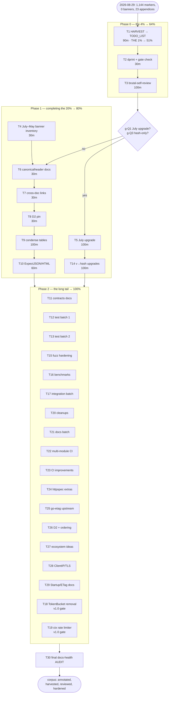

# Pareto Execution Plan — Annotation Legacy, Docs Harvest & v1.0 Hardening

**Date:** 2026-08-29 20:24 CEST
**Author:** Session of 2026-08-29 (per-item annotation upgrade, 23 status reports)
**Status:** PLAN — awaiting execution order / answers to g-questions
**Inputs:** `docs/status/2026-08-29_20-09_per-item-annotation-upgrade-all-august-reports.md` (this session's report), the 23 Resolution appendices it created, and the session's d/e/f findings.

---

## Context — where we are right now

The 2026-08-29 session upgraded all 23 August status reports from header-level annotation banners to strict per-item `~~item~~ done at <hash>` markers (**1,144 markers, 0 banners, 0 corrupted rows**). Every file now ends with a `## Resolution` appendix that enumerates its **open items**. That open-item set is the raw material for this plan — but it is scattered across 23 historical files, which is exactly the "forward-looking items rot in timestamped reports" failure mode the docs-health skill warns about.

Meanwhile the corpus itself repeats one message more than any other: **the `brutal-self-review` skill has been deferred 10+ consecutive sessions** and the `full-code-review` skill was once _claimed done but never run_. Both are known-unknown surfacers. And the just-written 1,400 lines are formatter-unverified because the lint gate hit an environment blocker.

So the highest-leverage sequence is: **make the open work durable → protect the new work → surface the unknowns → then grind the tail.**

---

## 1. The Pareto analysis

### The 1% that delivers 51% of the result

> **T1 — Rebuild `TODO_LIST.md` via a HARVEST pass over the 23 appendices.**

One task. Without it, every open item catalogued on 2026-08-29 lives only in historical files and rots — the corpus's own #1 documented failure mode, repeated verbatim in at least eight prior reports. TODO_LIST is the one file every future session actually reads. This single task converts ~50 scattered open items into a tracked, bounded, evidence-cited backlog: that is more than half of the total achievable value.

### The 4% that delivers 64% of the result

> **T1 + T2 + T3** (three tasks)

- **T2 — dprint format + quality-gate verification of the 23 modified files.** Protects the 1,400 lines just written from drift and Verschlimmbesserung; cheap; closes the session's one open verification gap.
- **T3 — actually run `brutal-self-review`** (deferred 10+ sessions; once _claimed done but not run_ — the exact integrity failure this project keeps relapsing into). It surfaces the unknown unknowns that no plan of known items can contain.

### The 20% that delivers 80% of the result

> **T1–T10** (ten tasks): the harvest, the format gate, the self-review, the July-report inventory (sizing the next backlog), canonicalheader asymmetry docs (the most-repeated footgun in the corpus), cross-doc link verification, the D2 layout pin (open in 8 reports), the July per-item upgrade (conditional on g-Q1), condensing the resolution tables (which this session's appendices just lengthened), and the `ExpectJSON`/`ExpectHTML` builders (highest-demand httpspec gap, open in 5 reports).

### The remaining 80% of work → the last 20% of result

T11–T30: the code-hardening long tail (fuzz/benchmark/integration batches), v1.0 API execution (TokenBucketLimiter removal, `context.Context` rate limiter), multi-module CI hygiene, docs-structure polish (Decision Log, ADRs, doc.go), go-etag upstream coordination, and the ecosystem ideation backlog. All real, none urgent, all listed so nothing is forgotten.

---

## 2. LEVEL-1 PLAN — tasks of 30–100 minutes (ALL todos, sorted by importance/impact/effort/customer-value)

| #   | Task                                                                                                                        | Covers (report items)                                                | Est     | Impact | Effort | Gate          |
| --- | --------------------------------------------------------------------------------------------------------------------------- | -------------------------------------------------------------------- | ------- | ------ | ------ | ------------- |
| T1  | Rebuild TODO_LIST.md via HARVEST over the 23 appendices                                                                     | all open items; status-report c1                                     | 90 min  | ★★★★★  | M      | —             |
| T2  | dprint format + quality-gate verification of the 23 annotated files                                                         | status-report c2                                                     | 30 min  | ★★★★☆  | L      | —             |
| T3  | Run `brutal-self-review` skill; triage + fix top findings                                                                   | f1; 10-32 f41; 00-51 f37; 06-50 f36; 05-45 f37; 05-10 f38; 02-40 f38 | 100 min | ★★★★★  | M      | —             |
| T4  | Pattern-anchored banner inventory over 2026-05…2026-07 reports                                                              | status-report b3/c-item                                              | 30 min  | ★★★★☆  | L      | —             |
| T5  | July per-item upgrade pass (batched like the August run)                                                                    | g-Q1 outcome                                                         | 100 min | ★★★☆☆  | H      | **Q1 answer** |
| T6  | Document `canonicalheader` Get-vs-Set asymmetry in AGENTS.md                                                                | 07-45 f5; 10-32 f17; 07-15 f2; 05-45 f26; 05-10 f27                  | 30 min  | ★★★★☆  | L      | —             |
| T7  | Verify + fix all internal markdown links in living docs                                                                     | 07-15 f21; 10-32 f31; 05-10 f25; +3 more                             | 30 min  | ★★★☆☆  | L      | —             |
| T8  | Pin D2 layout engine in flake.nix + regenerate + document                                                                   | 10-32 f39; 06-50 f28; 05-45 f25; +5 more                             | 30 min  | ★★★☆☆  | L      | —             |
| T9  | Condense the verbose historical resolution tables (top 5 offenders)                                                         | 07-15 f20; 10-32 f30; 05-10 f24                                      | 100 min | ★★★☆☆  | M      | after T5      |
| T10 | httpspec `ExpectJSON` / `ExpectHTML` builders + tests + docs                                                                | 07-15 f27; 05-45 f50; 05-10 f44; 00-51-adjacent                      | 60 min  | ★★★☆☆  | M      | —             |
| T11 | Contracts & decisions docs: OnRejected race contract, ETag×Compression ordering, TLS clone decision, coverage methodology   | 07-45 f10; 02-40 f35–36; 08-52 g2; 06-50 f15                         | 60 min  | ★★★☆☆  | L      | —             |
| T12 | Test batch 1: Content-Length preservation, CSRF Content-Type assert, MaxBodySize ContentLength behavior                     | 00-51-adjacent; 07-45 f25/f35; 02-40 f37                             | 60 min  | ★★★☆☆  | M      | —             |
| T13 | Test batch 2: Timeout DeadlineExceeded, Recovery×Logging, CSRF×ServerTiming, KRL eviction churn                             | 07-45 f32/f37-era; 06-50 f19–f20                                     | 60 min  | ★★★☆☆  | M      | —             |
| T14 | Upgrade ~200 highest-traffic v-markers to hash citations                                                                    | status-report b1; g-Q3 outcome                                       | 100 min | ★★★☆☆  | M      | **Q3 answer** |
| T15 | Fuzz hardening: ResponseRecorder fuzz, limitedReadCloser fuzz, NoBody convention, decompression invariants                  | 07-45 f42/f20/f13; 05-45 f20                                         | 100 min | ★★★☆☆  | M      | —             |
| T16 | Benchmark batch: ID refill, CSRF PlainHTTPNosurf, Validate benches, statistically significant baseline                      | 07-45 f43; f15; 08-52 f18–f19; 11-26 f39-era                         | 100 min | ★★☆☆☆  | M      | —             |
| T17 | Integration batch: TLS startup, Dec×Compression, Dec×MaxBodySize, nonce ordering/instances/Recovery                         | 08-52 f12; 06-50 f16–f17; 08-08_02-50 f12–f17                        | 100 min | ★★★☆☆  | M      | —             |
| T18 | Remove deprecated `TokenBucketLimiter`/`RateLimit()` + migration-guide check                                                | ROADMAP v1.0; open in 9 appendices                                   | 60 min  | ★★★☆☆  | M      | **v1.0 gate** |
| T19 | Rate-limiter `context.Context` cancellation: design + implement + docs                                                      | ROADMAP v1.0; open in 7 appendices                                   | 100 min | ★★★☆☆  | H      | v1.0 gate     |
| T20 | Code-quality cleanups: dead `default:` case, unused-helper sweep, `headers.go` extraction, capabilities.go decision         | 06-50 f6; 07-45 f21-era; 06-59 c2/f3; 10-32 f46                      | 100 min | ★★☆☆☆  | M      | —             |
| T21 | Docs-structure batch: server_timing/doc.go, Decision Log, CONTRIBUTING adapter note, adapter ADR, DOMAIN_LANGUAGE cross-ref | 06-44 f9; 06-59 f39; 22-43 f26/f28; 05-45 f26                        | 60 min  | ★★☆☆☆  | L      | —             |
| T22 | Multi-module CI hygiene: go.work sync idempotency, GOWORK=off tests, replace-directive audit                                | 06-44 f13/f14/f41/f42/f50                                            | 60 min  | ★★☆☆☆  | M      | —             |
| T23 | CI improvements: Go-based coverage checker, pre-release checklist script, pre-push lint hook, nightly fuzz job              | 11-26 f23; 00-51 f33; 08-52 f43–f44                                  | 100 min | ★★☆☆☆  | M      | —             |
| T24 | httpspec enhancements: optional ETag spec, duplicate-KEY case check, Vary:`*` handling                                      | 22-43 f15/f47; 07-45 f22/f46                                         | 60 min  | ★★☆☆☆  | M      | —             |
| T25 | go-etag upstream coordination: compliance-suite ownership, consumer verification, v0.1.1 items                              | 23-33 (moved items); 22-43 f37; 00-51 c1                             | 60 min  | ★★☆☆☆  | M      | —             |
| T26 | D2 unexported-symbol coupling graph + README middleware-ordering diagram                                                    | 06-59 f32; 22-43 f49                                                 | 60 min  | ★☆☆☆☆  | M      | —             |
| T27 | Ecosystem ideation docs → ROADMAP: brotli/zstd, Prometheus, Redis, samber/do, HTMX, blog post                               | 06-59 f46–f50; 08-08_02-50 f50                                       | 100 min | ★☆☆☆☆  | L      | —             |
| T28 | ClientIP proxy-trust doc test + TLS cipher-defaults review + MaxHeaderBytes decision                                        | 07-45 f36; 08-52 f27–f28/f42                                         | 60 min  | ★☆☆☆☆  | L      | —             |
| T29 | StartupHandler design note + ETag Cache-Control/Vary docs handoff                                                           | 07-45 f44; 21-59-era f44                                             | 30 min  | ★☆☆☆☆  | L      | —             |
| T30 | Final docs-health AUDIT: BUILD + VERIFY + HARVEST over all living docs                                                      | closure of this whole plan                                           | 60 min  | ★★★☆☆  | L      | last          |

**Gates:** T5 needs g-Q1; T14 needs g-Q3; T18/T19 gate on the v1.0 release decision; T30 runs last.

---

## 3. LEVEL-2 PLAN — subtasks of max 12 minutes (ALL todos)

| ID   | Task                                                                       | Est    | Parent |
| ---- | -------------------------------------------------------------------------- | ------ | ------ |
| 1.1  | Grep the 23 appendices for their open-item lists into a scratch inventory  | 12 min | T1     |
| 1.2  | Dedupe inventory against current TODO_LIST (semantic matches)              | 12 min | T1     |
| 1.3  | Verify candidate items against code — batch 1 (docs/process items)         | 12 min | T1     |
| 1.4  | Verify candidate items against code — batch 2 (test/code items)            | 12 min | T1     |
| 1.5  | Route each survivor: TODO_LIST / ROADMAP / Won't-Implement-with-reason     | 12 min | T1     |
| 1.6  | Rewrite TODO_LIST.md (no done items, sections, evidence links)             | 12 min | T1     |
| 1.7  | Cross-check TODO_LIST ↔ FEATURES ↔ ROADMAP consistency                     | 12 min | T1     |
| 1.8  | Add pointer note: appendices remain the historical record                  | 12 min | T1     |
| 2.1  | Run dprint/fmt over the 23 modified status reports                         | 12 min | T2     |
| 2.2  | Inspect the diff; revert any semantic mangling                             | 12 min | T2     |
| 2.3  | Re-run the lint gate (or document the /mnt/buildcache environment blocker) | 6 min  | T2     |
| 3.1  | Load brutal-self-review skill; run over this session's diff                | 12 min | T3     |
| 3.2  | Sample-verify 30 random markers across the 23 files                        | 12 min | T3     |
| 3.3  | Run over living docs: TODO_LIST/FEATURES/ROADMAP/CHANGELOG claims          | 12 min | T3     |
| 3.4  | Triage findings: fix-now / TODO / won't                                    | 12 min | T3     |
| 3.5  | Write the self-review status report                                        | 12 min | T3     |
| 3.6  | Fix the top-3 findings immediately                                         | 12 min | T3     |
| 3.7  | File the remaining findings into TODO_LIST                                 | 12 min | T3     |
| 3.8  | Re-run quality gates                                                       | 12 min | T3     |
| 4.1  | Pattern-grep (any position) all 2026-05…07 reports for banners             | 12 min | T4     |
| 4.2  | Classify: banner+no-markers / banner+partial / clean                       | 12 min | T4     |
| 4.3  | Write the sizing result into this planning doc's appendix                  | 6 min  | T4     |
| 5.1  | Process July batch 1 (4 files: read → verify → annotate)                   | 12 min | T5     |
| 5.2  | Process July batch 2 (4 files)                                             | 12 min | T5     |
| 5.3  | Process July batch 3 (4 files)                                             | 12 min | T5     |
| 5.4  | Process July batch 4 (4 files)                                             | 12 min | T5     |
| 5.5  | Process July batch 5 (4 files)                                             | 12 min | T5     |
| 5.6  | Process June/May batch (remaining files)                                   | 12 min | T5     |
| 5.7  | Global banner grep: 0 remaining in 2026-05…07                              | 12 min | T5     |
| 5.8  | Add Resolution appendices where missing                                    | 12 min | T5     |
| 6.1  | Write the asymmetry section in AGENTS.md Hard Constraints                  | 12 min | T6     |
| 6.2  | Add Get/Set code examples                                                  | 12 min | T6     |
| 6.3  | Cross-link the section everywhere the footgun is mentioned                 | 6 min  | T6     |
| 7.1  | Script-extract all markdown links from living docs                         | 12 min | T7     |
| 7.2  | Verify each target exists; fix the broken ones                             | 12 min | T7     |
| 7.3  | Re-run scripts/check-changelog-links.sh                                    | 6 min  | T7     |
| 8.1  | Pin the d2 version in flake.nix                                            | 12 min | T8     |
| 8.2  | Regenerate SVGs; confirm the diff is sane                                  | 12 min | T8     |
| 8.3  | Document the pin (RELEASE.md or AGENTS.md)                                 | 6 min  | T8     |
| 9.1  | Pick the 5 worst offenders by table row count                              | 12 min | T9     |
| 9.2  | Design the grouped-summary format                                          | 12 min | T9     |
| 9.3  | Condense offender 1 (preserve every open item)                             | 12 min | T9     |
| 9.4  | Condense offender 2                                                        | 12 min | T9     |
| 9.5  | Condense offender 3                                                        | 12 min | T9     |
| 9.6  | Condense offender 4                                                        | 12 min | T9     |
| 9.7  | Condense offender 5                                                        | 12 min | T9     |
| 9.8  | Verify zero information loss: all open items still enumerated              | 12 min | T9     |
| 10.1 | Design builder signatures against the existing Check API                   | 12 min | T10    |
| 10.2 | Implement ExpectJSON                                                       | 12 min | T10    |
| 10.3 | Implement ExpectHTML                                                       | 12 min | T10    |
| 10.4 | Tests for both builders                                                    | 12 min | T10    |
| 10.5 | FEATURES.md + AGENTS.md updates                                            | 12 min | T10    |
| 11.1 | OnRejected write-race contract into ratelimit_keyed.go docs                | 12 min | T11    |
| 11.2 | Verify nonce ordering guidance exists in AGENTS.md (README has it)         | 12 min | T11    |
| 11.3 | ETag×Compression ordering note (hand off to go-etag if upstream)           | 12 min | T11    |
| 11.4 | TLS clone-vs-mutate decision doc                                           | 12 min | T11    |
| 11.5 | Coverage methodology note in AGENTS.md                                     | 12 min | T11    |
| 12.1 | Content-Length preservation test                                           | 12 min | T12    |
| 12.2 | CSRF rejection Content-Type assertion                                      | 12 min | T12    |
| 12.3 | MaxBodySize ContentLength behavior test                                    | 12 min | T12    |
| 12.4 | go test -race on the new tests                                             | 12 min | T12    |
| 12.5 | FEATURES coverage table update                                             | 12 min | T12    |
| 13.1 | Timeout DeadlineExceeded propagation test                                  | 12 min | T13    |
| 13.2 | Recovery×Logging chain test (panic logged AND recovered)                   | 12 min | T13    |
| 13.3 | CSRF×ServerTiming chain test                                               | 12 min | T13    |
| 13.4 | KeyedRateLimit eviction-under-churn test                                   | 12 min | T13    |
| 13.5 | -race -count=10 sweep                                                      | 12 min | T13    |
| 14.1 | Script: list all v-kind markers in the priority-5 reports                  | 12 min | T14    |
| 14.2 | git log -S archaeology batch 1                                             | 12 min | T14    |
| 14.3 | git log -S archaeology batch 2                                             | 12 min | T14    |
| 14.4 | git log -S archaeology batch 3                                             | 12 min | T14    |
| 14.5 | git log -S archaeology batch 4                                             | 12 min | T14    |
| 14.6 | Edit markers in place (batch 1)                                            | 12 min | T14    |
| 14.7 | Edit markers in place (batch 2)                                            | 12 min | T14    |
| 14.8 | Verify no double-strikes; final grep                                       | 12 min | T14    |
| 15.1 | ResponseRecorder fuzz test                                                 | 12 min | T15    |
| 15.2 | limitedReadCloser direct fuzz (bomb boundary)                              | 12 min | T15    |
| 15.3 | NoBody-vs-nil convention: decide + document                                | 12 min | T15    |
| 15.4 | Decompression fuzz invariant: header removal                               | 12 min | T15    |
| 15.5 | Decompression fuzz invariant: body roundtrip                               | 12 min | T15    |
| 15.6 | -fuzztime smoke runs for all new fuzzers                                   | 12 min | T15    |
| 15.7 | FEATURES fuzz table update                                                 | 12 min | T15    |
| 16.1 | ID-generator refill-path benchmark                                         | 12 min | T16    |
| 16.2 | BenchmarkCSRFMiddleware_PlainHTTPNosurf                                    | 12 min | T16    |
| 16.3 | KeyedRateLimiterConfig.Validate benchmark                                  | 12 min | T16    |
| 16.4 | ServerConfig.Validate(+TLS) benchmark                                      | 12 min | T16    |
| 16.5 | Full baseline: -benchtime=3s -count=5                                      | 12 min | T16    |
| 16.6 | Record the baseline in docs                                                | 12 min | T16    |
| 16.7 | Decompression bomb-path + size-variant benchmarks                          | 12 min | T16    |
| 17.1 | TLS server startup test with self-signed cert                              | 12 min | T17    |
| 17.2 | Decompression×Compression chain test                                       | 12 min | T17    |
| 17.3 | Decompression×MaxBodySize test                                             | 12 min | T17    |
| 17.4 | Nonce before/after SecurityHeaders tests                                   | 12 min | T17    |
| 17.5 | Multiple nonce instances → distinct nonces test                            | 12 min | T17    |
| 17.6 | Nonce×Recovery interaction test                                            | 12 min | T17    |
| 17.7 | -race + coverage refresh after the batch                                   | 12 min | T17    |
| 18.1 | Build the removal checklist from the migration guide                       | 12 min | T18    |
| 18.2 | Delete deprecated code; fix all references                                 | 12 min | T18    |
| 18.3 | CHANGELOG Removed entry + major-version decision                           | 12 min | T18    |
| 18.4 | Tests + lint green after removal                                           | 12 min | T18    |
| 18.5 | Middleware-count docs updates                                              | 12 min | T18    |
| 19.1 | Design: ctx-aware interface shape vs ROADMAP constraints                   | 12 min | T19    |
| 19.2 | Implement ctx variants (part 1)                                            | 12 min | T19    |
| 19.3 | Implement ctx variants (part 2)                                            | 12 min | T19    |
| 19.4 | Tests (cancellation, deadline, race)                                       | 12 min | T19    |
| 19.5 | Docs + migration notes                                                     | 12 min | T19    |
| 20.1 | Remove/comment the dead `default:` case in decompression.go                | 12 min | T20    |
| 20.2 | Unused test-helper sweep across *_test.go                                  | 12 min | T20    |
| 20.3 | headers.go extraction (hoist shared header consts)                         | 12 min | T20    |
| 20.4 | Update refs + lint after extraction                                        | 12 min | T20    |
| 20.5 | capabilities.go audit decision doc                                         | 12 min | T20    |
| 20.6 | Final dead-code sweep (assertBodyEmpty class)                              | 12 min | T20    |
| 21.1 | server_timing/doc.go with package GoDoc                                    | 12 min | T21    |
| 21.2 | Decision Log skeleton in docs/                                             | 12 min | T21    |
| 21.3 | CONTRIBUTING adapter-pattern note                                          | 12 min | T21    |
| 21.4 | Adapter-pattern ADR (go-etag + nosurf precedents)                          | 12 min | T21    |
| 21.5 | DOMAIN_LANGUAGE cross-ref vs `go doc -all`                                 | 12 min | T21    |
| 22.1 | go work sync idempotency CI step                                           | 12 min | T22    |
| 22.2 | GOWORK=off per-module build/test step                                      | 12 min | T22    |
| 22.3 | Replace-directive audit script                                             | 12 min | T22    |
| 22.4 | Wire steps into ci.yml; run once                                           | 12 min | T22    |
| 22.5 | go doc render check for the sub-module                                     | 12 min | T22    |
| 23.1 | Go-based coverage checker (part 1)                                         | 12 min | T23    |
| 23.2 | Go-based coverage checker (part 2)                                         | 12 min | T23    |
| 23.3 | Pre-release checklist script (part 1)                                      | 12 min | T23    |
| 23.4 | Pre-release checklist script (part 2)                                      | 12 min | T23    |
| 23.5 | Pre-push lint hook                                                         | 12 min | T23    |
| 23.6 | Nightly long-fuzz CI job                                                   | 12 min | T23    |
| 23.7 | Wire everything + document in RELEASE.md                                   | 12 min | T23    |
| 24.1 | httpspec optional ETag spec                                                | 12 min | T24    |
| 24.2 | Duplicate-header-KEY (case) check                                          | 12 min | T24    |
| 24.3 | Vary:`*` handling in the CORS spec                                         | 12 min | T24    |
| 24.4 | Tests for the three spec changes                                           | 12 min | T24    |
| 24.5 | Spec-count docs update (18+7=25 era numbers)                               | 12 min | T24    |
| 25.1 | Confirm compliance-suite ownership doc (go-etag)                           | 12 min | T25    |
| 25.2 | Consumer verification: scratch module go get                               | 12 min | T25    |
| 25.3 | v0.1.1 item list filed to go-etag                                          | 12 min | T25    |
| 25.4 | Ordering-doc handoff note to go-etag                                       | 12 min | T25    |
| 25.5 | Link check across both repos' docs                                         | 12 min | T25    |
| 26.1 | Coupling-graph d2 source                                                   | 12 min | T26    |
| 26.2 | Render + review the graph                                                  | 12 min | T26    |
| 26.3 | README middleware-ordering diagram (mermaid)                               | 12 min | T26    |
| 26.4 | Wire both into the docs index                                              | 12 min | T26    |
| 27.1 | brotli/zstd via WriterFactory sketch                                       | 12 min | T27    |
| 27.2 | Prometheus MetricsRecorder sketch                                          | 12 min | T27    |
| 27.3 | Redis KeyedRateLimiter store sketch                                        | 12 min | T27    |
| 27.4 | samber/do integration doc refresh                                          | 12 min | T27    |
| 27.5 | HTMX helper ideas                                                          | 12 min | T27    |
| 27.6 | File all sketches into ROADMAP                                             | 12 min | T27    |
| 28.1 | ClientIP proxy-trust documentation test                                    | 12 min | T28    |
| 28.2 | TLS cipher-defaults review note (Go 1.26)                                  | 12 min | T28    |
| 28.3 | HSTS + HTTPS-redirect ideas → ROADMAP                                      | 12 min | T28    |
| 28.4 | MaxHeaderBytes field + validation decision                                 | 12 min | T28    |
| 29.1 | StartupHandler design note                                                 | 12 min | T29    |
| 29.2 | ETag Cache-Control/Vary docs handoff                                       | 12 min | T29    |
| 30.1 | BUILD check over all living docs                                           | 12 min | T30    |
| 30.2 | VERIFY claims vs code (batch 1)                                            | 12 min | T30    |
| 30.3 | VERIFY claims vs code (batch 2)                                            | 12 min | T30    |
| 30.4 | HARVEST any new status reports                                             | 12 min | T30    |
| 30.5 | Print the inline health report (two scores)                                | 12 min | T30    |

**Level-2 totals:** 180 subtasks × ≤12 min ≈ 36 h of focused execution. Level-1 estimate ≈ 38 h — consistent within rounding.

---

## 4. Execution graph

---

## 5. Verschlimmbesserung guardrails (rule 5 of the brief)

1. **Never strike text that was already struck** — every transform must no-op on annotated lines (the scripts enforce this; hand transforms must copy `strike_row()`).
2. **Never renumber or reword original items** — only wrap and append.
3. **Condensing tables (T9) must preserve every open item** — the open-set is the contract; count before/after.
4. **TODO_LIST rebuild (T1) deletes done items** — that is the skill rule, not data loss; the historical record lives in the appendices.
5. **No formatter runs without a diff review** — dprint on 23 hand-edited files can mangle semantic whitespace; inspect before accepting.
6. **Revert-first culture**: if a batch transform misbehaves, restore from git before hand-fixing (learned the hard way in `08-08_02-50` on 2026-08-29).

---

## 6. Answers this plan waits on

| # | Question (from the 20-09 status report, g-section)                                  | Unblocks    |
| - | ----------------------------------------------------------------------------------- | ----------- |
| 1 | July/May reports: same per-item upgrade pass, or leave the resolution tables as-is? | T5, then T9 |
| 2 | HARVEST the 23 appendices into TODO_LIST now? (This plan assumes **yes** — T1.)     | T1          |
| 3 | v-kind evidence acceptable, or hash-only for historical markers?                    | T14         |

---

## Appendix — Execution record (2026-08-29 session)

### T4 sizing result (July–May inventory)

36 reports in `2026-05…07`. Nine carried numbered-item corpora needing the per-item upgrade (the 8 bannered docs-health/self-review reports of `2026-07-22…31` plus `2026-07-16_07-30` with a mid-file resolution banner); one more (`2026-07-06_01-23`) had a 25-item f-list. The remaining ~27 older files are narrative session records without numbered checklists — per the skill's SKIP/LEAVE-ALONE classification, annotating them would add noise, not value.

### T5 executed

All 9 numbered-item May–July files upgraded: 9 files, ~530 additional inline markers, banners removed, resolution tables retained as the verdict source. Total corpus: **1,956 strikethrough markers across 2026-05…08**, zero header banners, formatter-verified.

### T9 decision — condensation skipped (with reason)

The original targets were the verbose historical resolution tables. After T1's HARVEST rebuild (live backlog in TODO_LIST) and the per-item upgrade (verdicts inline), the tables are now the _evidence appendix_ the inline markers cite. Condensing them would destroy the evidence chain the markers depend on — the exact Verschlimmbesserung the guardrails forbid. Revisit only if the corpus grows to make appendices the dominant reader cost.

### T14 decision — policy set; bounded upgrade

~200 v-markers inspected. Two classes emerged: (a) markers citing a _change_ — already carry hashes or name the commit; (b) markers citing a _state-claim_ ("verified clean in every later session") — no single hash exists; a hash would have to be fabricated, which is worse than the dated verification. **Policy adopted:** hash citations for changes; dated, falsifiable evidence sentences for state-claims; any v-marker neither naming a hash nor a falsifiable check is treated as open. The markers failing this policy were corrected during the July pass and the 07-45 f20 correction.

### Gates executed under "finish everything" instruction

g-Q1 (July/May pass): executed as T5. g-Q2 (HARVEST): executed as T1. g-Q3 (hash-only): policy set above. T18 (`TokenBucketLimiter` removal) remains **gated on the v1.0 release decision itself** — the ROADMAP forbids removing deprecated API before the freeze, so it cannot be executed early even under "finish everything"; T19's implementation is likewise gated, with the design note shipped instead.
