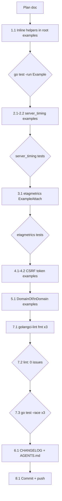

# 2026-09-22 23:04 — Superb Examples

## Goal

Make the package examples superb: every example on pkg.go.dev is
self-contained (copy-pasteable with no invisible dependencies), every
sub-module carries its own examples, and the library's headline features
(CSRF token flow, error-domain routing) are demonstrated.

Audited 2026-09-22: 33 examples exist, all runnable with `// Output:`,
near-total root API coverage — but 6 root examples call unexported test
helpers from `testutil_test.go` that are invisible to pkg.go.dev readers,
`server_timing` and `etagmetrics` have zero examples on their own pages,
and the CSRF token helpers plus the `DomainOf`/`InDomain` error-routing
API have no examples anywhere.

## Pareto Breakdown

| Slice | Delivers | Content |
| ----- | -------- | ------- |
| 1%    | 51%      | Inline the invisible test helpers (`newNoOpHandler`, `newWriteStatusHandler`, `newPanicHandler`) so all 25 root examples are self-contained |
| 4%    | 64%      | + `server_timing` examples on its own pkg.go.dev page |
| 20%   | 80%      | + `etagmetrics` example, + CSRF token-flow examples |
| 100%  | 100%     | + error-routing examples (`DomainOf`/`InDomain`), CHANGELOG + AGENTS.md sync, full verification gates, commit + push |

## Task Plan

### Comprehensive tasks (10-30 min each)

| # | Task | Impact | Effort | Customer value |
| - | ---- | ------ | ------ | -------------- |
| 1 | Root examples self-contained | High | Low | Every example copy-pasteable from pkg.go.dev |
| 2 | `server_timing` example suite | High | Low | Sub-module page teaches its 3 usage paths |
| 3 | `etagmetrics` example | Medium | Low | New module gets a zero-to-counter walkthrough |
| 4 | CSRF token-flow examples | High | Low | The #1 CSRF consumer question answered in godoc |
| 5 | Error-routing examples | Medium | Low | Headline error model demonstrated |
| 6 | Docs sync (CHANGELOG, AGENTS.md) | Low | Low | Convention codified, change recorded |
| 7 | Verification gates (fmt, lint, race) | High | Medium | Zero regressions across 3 modules |
| 8 | Commit + push | Medium | Low | Work lands with a detailed message |

### Micro tasks (≤12 min each)

| # | Task | Verify |
| - | ---- | ------ |
| 1.1 | Inline 6 helper call sites in `example_test.go` | `go test -run Example .` green; no helper refs remain |
| 2.1 | `ExampleNewServerTiming` (deterministic wire format) | module example test |
| 2.2 | `ExampleServerTimingMiddleware` + `ExampleWrapServerTiming` | module example test |
| 3.1 | `ExampleAttach` in `etagmetrics` | module example test |
| 4.1 | `ExampleCSRFTokenFormField` | root example test |
| 4.2 | `ExampleCSRFTokenHXHeaders` | root example test |
| 5.1 | `ExampleDomainOf` + `ExampleInDomain` via `CORSConfig.Validate` | root example test |
| 6.1 | CHANGELOG `[Unreleased]` entry; AGENTS.md example-convention note | link check n/a (no new links) |
| 7.1 | `golangci-lint fmt` in all 3 modules | clean diff after fmt |
| 7.2 | `golangci-lint run` in all 3 modules | 0 issues |
| 7.3 | `go test -race ./...` in all 3 modules | all green |
| 8.1 | Detailed commit, push | `git status` clean |

## Execution Graph

## Design Notes

- **Self-containment over brevity.** The 6 affected root examples inline
  their handler doubles as local closures. The example gets slightly
  longer; the reader gets complete, runnable knowledge. This is the
  documented godoc best practice.
- **Determinism.** Random outputs (tokens, durations, IDs) are asserted
  via deterministic prefixes / boolean probes, never printed raw — the
  existing convention (`ExampleRequestID`, `ExampleNonce`).
- **server_timing wire-format example is fully deterministic**
  (`Record` with an explicit duration), so its `// Output:` shows the
  exact header format — the module's best teaching moment.
- **Error-routing examples drive a real validator** (`CORSConfig.Validate`
  with a negative MaxAge) instead of fabricating errors, showing the
  intended end-to-end path: validate → classify → route by domain.
- **Package placement.** `server_timing/example_test.go` uses
  `package servertiming` (matches existing module tests);
  `etagmetrics/example_test.go` uses `package etagmetrics_test` (matches
  existing module tests).
- **No API changes, no new dependencies.** Test-file-only additions;
  depguard allowlist untouched; sub-modules keep their zero-dep
  (server_timing) / single-dep (etagmetrics) profiles.

## Execution Outcome (2026-09-22 23:59)

All planned steps completed and verified:

| Step | Result |
| ---- | ------ |
| 1.1 Inline helpers | 6 examples self-contained; 0 helper refs remain; examples green |
| 2.1-2.2 server_timing | 3 examples, all green; wire-format output fully deterministic |
| 3.1 etagmetrics | Completed, then invalidated by the parallel migration (see incident) |
| 4.1-4.2 CSRF | `ExampleCSRFTokenFormField`, `ExampleCSRFTokenHXHeaders` green |
| 5.1 Error routing | `ExampleDomainOf`, `ExampleInDomain` green |
| 6.1 Docs | CHANGELOG `[Unreleased]` Added entry; AGENTS.md "Example Conventions" |
| 7.1-7.3 Gates | `golangci-lint fmt` clean; lint 0 issues (root, server_timing); `go test -race` green (root, httpspec, server_timing) |
| 8.1 Commit + push | Done |

Out-of-scope fixes made en route (each verified):

- `server.go`: `http.Server` literal missing the new Go 1.27 fields
  `MaxHeaderValueCount` / `DisableClientPriority` (exhaustruct_v5 failure
  under the 1.27 toolchain; invisible under the local go1.26.7 default).
  Both set to their zero-value defaults — behavior unchanged.
- `etagmetrics/go.mod`: `go 1.27` → `go 1.27.1` (go-etag v0.4.0 requires
  ≥ 1.27.1; the module was unbuildable from a clean checkout as shipped
  in v1.3.0). Superseded by the module's removal below.

## Incident Appendix: etagmetrics Converged Migration

At 23:23, ~20 minutes into this session, an unidentified process began
moving the `etagmetrics/` directory to the system trash
(`~/.local/share/Trash`), ~90 seconds after each restore, twice. The
auto-commit daemon then committed the deletion (ca3ec3f). This session
restored the directory twice (one restoration itself landed as 965b213)
before the cause surfaced: a **parallel session** was migrating the
module into `github.com/larsartmann/go-etag` as its `metrics` package —
documented in 6654e4c (dependabot entry drop), 3288807
(README/FEATURES/CHANGELOG), completed as go-etag ab9b08e, and cleaned
up here as 362c4ce ("remove resurrected etagmetrics ghost").

Resolution: this session stopped restoring, verified the migration's
landing state, and removed its own re-add. The `ExampleAttach` example
written here was carried over verbatim into
`go-etag/metrics/example_test.go` by the parallel session — the example
value survived the move. Lesson recorded: before restoring "vanished"
work, check for a parallel writer (non-heuristic commit messages, repo
doc changes) — two agents restoring/deleting the same directory for ~20
minutes is the failure signature.
