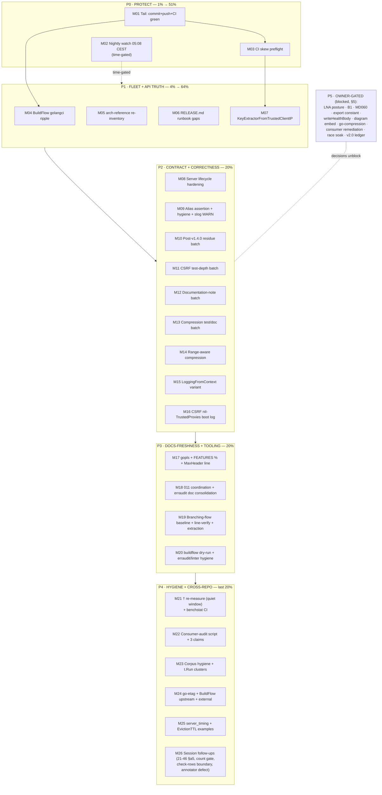

# Pareto Execution Plan — httputil Backlog (2026-10-09 22:20)

**Status:** plan (point-in-time snapshot — the living backlog is [TODO_LIST.md](../../TODO_LIST.md); this file ranks it, it does not replace it. Completed plan rows route back through TODO_LIST deletion + CHANGELOG per the docs-health cadence.)

**Input:** TODO_LIST @ 2026-10-09 post-audit state — 12 Medium, 29 Low, 5 Post-v1.1 items (44 tracked) + 6 session follow-ups = **50 discrete work items**, enumerated exhaustively in the two tables below.

**Sources:** the 2026-10-09 docs-health AUDIT (docs/status/2026-10-09_22-11), the 2026-10-09 consumer lint audit + branching-flow triage, and the pre-existing backlog. No research beyond this session's verified facts.

---

## 1. Pareto breakdown

### 1% → 51%: **Protect the pipeline** (3 items, ≈2 hours total)

Everything else on this list rots if the daily pipeline lies or master is red. The 2026-10-05..09 nine-day false-crash streak proved the nightly can silently die before fuzzing; today's session left ~30 changed files riding on daemon commits without a watched CI head. These three items are cheap, urgent, and guard every other item:

1. **Session tail: deliberate commit + push + green CI on the exact head** — makes today's audit durable (M01)
2. **Watch the first post-fix nightly (~03:08 UTC / 05:08 CEST) + verify the rolling-issue policy acts correctly** — first live exercise of a brand-new automation; a wrong auto-close could bury a real bug (M02, time-gated)
3. **CI skew preflight: fail-fast on nightly-vs-go.work floor mismatch** — permanently kills the false-crash class instead of triaging it again (M03)

### 4% → 64%: **Fleet + consumer-facing truth** (add 4 items, ≈6 hours)

4. **golangci v2.14.0 ripple into BuildFlow** — one session's lint fix becomes every project's lint fix; else the next repo hits the same export-data break (M04)
5. **architecture-reference full re-inventory** — the API doc 18 importers consult; stale rows = wrong consumer code (M05)
6. **RELEASE.md runbook gaps** — the next release is only as good as its checklist; 4 known holes (M06)
7. **`KeyExtractorFromTrustedClientIP(cidrs)`** — highest consumer-value feature: 6 fleet consumers hand-roll a security-sensitive trust gate today (M07)

### 20% → 80%: **Correctness + documentation debt with consumer impact** (add 9 tasks, ≈14 hours)

Server-lifecycle contract truth (M08), the twice-lost alias assertion + code hygiene (M09), the 2026-09-27 review's 12 bounded residue items (M10), CSRF test depth (M11), the documentation-note batch (M12), compression test/doc batch (M13), the Range-aware compression guard (M14), the Logging/CSRF-log additive APIs (M15/M16), and the docs-freshness cluster (M17/M18). These close every known gap between the docs and the code.

### The remaining 20% → 100%

Hygiene, tooling, cross-repo, and evidence work: branching-flow baseline (M19), linter/erraudit/tooling hygiene (M20), benchmark truth (M21), consumer-audit tooling (M22), corpus hygiene + t.Run ruling (M23), cross-repo batches (M24), examples (M25), session follow-ups (M26). Plus the **owner-gated register** (§5) — decisions, not tasks; blocked, not forgotten.

---

## 2. Execution graph

Ordering rules: P0 before everything (protection); within P2/P3, macro tasks are independent — parallelize across sessions where the machine allows; M21 needs a quiet-machine window and M02 a clock, both time-gated; everything in §5 waits for one-word owner rulings.

---

## 3. Comprehensive plan (30–100 min tasks — ALL TODOs, 27 rows)

| #   | Task (30–100 min)                                                                                                                                                                                                                                                             | TODO_LIST items covered                                                                                                     | Impact | Effort | Cust. value | Phase |
| --- | ----------------------------------------------------------------------------------------------------------------------------------------------------------------------------------------------------------------------------------------------------------------------------- | --------------------------------------------------------------------------------------------------------------------------- | ------ | ------ | ----------- | ----- |
| M01 | Deliberate commit of remaining audit changes, push, watch CI on the exact head                                                                                                                                                                                                | session follow-up (22-11 §c.1)                                                                                              | 5      | S      | M           | P0    |
| M02 | Nightly-fuzz watch: pre-flight workflow read, 05:08 CEST run check, rolling-issue policy verification, triage anything new                                                                                                                                                    | Medium "Watch the first post-fix nightly-fuzz run"                                                                          | 5      | S      | M           | P0    |
| M03 | CI skew preflight: fail-fast job comparing go.work floor vs nightly toolchain pin + green CI                                                                                                                                                                                  | Medium "CI guard: nightly-vs-floor Go skew preflight"                                                                       | 5      | M      | M           | P0    |
| M04 | BuildFlow: bump fleet lint pins to v2.14.0, sweep exact-Go-pin workarounds, `buildflow doctor` freshness on covered repos                                                                                                                                                     | Medium "Ripple golangci-lint v2.14.0 into BuildFlow"                                                                        | 4      | M      | M           | P1    |
| M05 | architecture-reference full re-inventory: every export row vs the tree (root, httpspec, server_timing)                                                                                                                                                                        | Low "architecture-reference full re-inventory"                                                                              | 4      | L      | H           | P1    |
| M06 | RELEASE.md gaps: server_timing drift-check step, build-and-run consumer probe, doc-snippet-refs → prerelease-check.sh, `-race -count=10` gate-9 evaluation                                                                                                                    | Low "RELEASE.md runbook gaps"                                                                                               | 4      | M      | M           | P1    |
| M07 | `KeyExtractorFromTrustedClientIP(cidrs)`: design note → implement → tests (XFF-trust edges) → race/lint/bench → docs snippet                                                                                                                                                  | Medium "Additive API: KeyExtractorFromTrustedClientIP"                                                                      | 5      | L      | H           | P1    |
| M08 | Server lifecycle hardening: public godoc happens-before guarantee on `Start`/`StartTLS`, restart-after-failure + forced-failure tests, FEATURES/README/arch-ref wording, `already_started` retryability note                                                                  | Low "Server lifecycle hardening"                                                                                            | 4      | M      | H           | P2    |
| M09 | Alias-identity assertion + code-hygiene micro-batch (`&Server` literal, makezero evaluation, sync.Once note) + silence the attestation-bench slog WARN                                                                                                                        | Low "Compile-time alias-identity assertion", "Code-hygiene micro-batch", "Silence the per-op slog WARN"                     | 3      | S      | M           | P2    |
| M10 | Post-v1.4.0 review residue batch: 12 bounded test/doc micro-items (Timeout negative test, invalid-gzip 400 test, 2 httpspec examples, stack doc promotion, Retry-After doc, burst guard, `String()`, errors sweep, `-shuffle=on`, coverage cross-check, off-cycle prerelease) | Low "Post-v1.4.0 review residue batch"                                                                                      | 4      | M      | M           | P2    |
| M11 | CSRF test-depth batch: scheme-less e2e, method-case pin, XFP-attestation fuzz variant, branch tests, HX seed + fallback-log assertion                                                                                                                                         | Low "CSRF test-depth batch"                                                                                                 | 4      | M      | M           | P2    |
| M12 | Documentation-note batch: SECURITY.md attestation paragraph, arch-ref lifecycle rows, DOMAIN_LANGUAGE entries, wildcard-host note, AGENTS canonicalheader/nolint/daemon notes, benchmarks.md CSRF section                                                                     | Low "Documentation-note batch"                                                                                              | 3      | M      | M           | P2    |
| M13 | Compression test/doc batch: identity-branch fuzz, fixture dedupe, oracle-normalization sweep, issue #4 follow-up comment, art-dupl flake pin                                                                                                                                  | Low "Compression test/doc batch"                                                                                            | 3      | M      | M           | P2    |
| M14 | Range-aware compression: design note (skip-on-Range vs Vary correctness) → implement → tests                                                                                                                                                                                  | Medium "Range-aware compression guard"                                                                                      | 4      | L      | H           | P2    |
| M15 | Context-aware `Logging` variant: API design → implement → test + example                                                                                                                                                                                                      | Medium "Additive API: context-aware Logging variant"                                                                        | 4      | M      | H           | P2    |
| M16 | CSRF opt-in boot-time log when enabled with nil `TrustedProxies` + test                                                                                                                                                                                                       | Low "CSRF: opt-in boot-time log"                                                                                            | 3      | S      | M           | P2    |
| M17 | Docs-freshness cluster: gopls stdversion confirmation, FEATURES coverage-gap % re-derivation vs CI artifact, MaxHeaderValueCount README line                                                                                                                                  | Low "Confirm gopls…", "Re-derive FEATURES…", "One README/API-notes line…"                                                   | 3      | S      | M           | P3    |
| M18 | 011-stale-httputil-versions coordination note + erraudit-residual doc consolidation (one canonical home)                                                                                                                                                                      | Low "011… v1.5.0 context", "Consolidate the erraudit-residual documentation"                                                | 3      | S      | L           | P3    |
| M19 | Branching-flow trio: fresh baseline run + per-section counts recorded, line-verify the 10 remaining rows, extract residual evidence AGENTS → arch-ref                                                                                                                         | Medium "Capture a fresh branching-flow baseline", Low "Line-verify the 10…", "Extract the branching-flow residual evidence" | 3      | M      | L           | P3    |
| M20 | Tooling hygiene: `buildflow --dry-run` composition confirm, erraudit tooling batch (fleet build, scope note, nolint audit, ci comment, parity), linter/config hygiene (noctx narrowing, darwin acceptance)                                                                    | Low "Re-run `buildflow --dry-run`", "erraudit tooling hygiene", "Linter/config hygiene"                                     | 2      | M      | L           | P3    |
| M21 | Benchmark truth: quiet-window re-measure of the 4 † rows + httpspec table, drop † flags; benchstat regression step in CI                                                                                                                                                      | Low "Quiet-window re-measure…", "Mechanize benchstat regression checks"                                                     | 3      | M      | M           | P4    |
| M22 | Consumer-audit tooling: commit `scripts/consumer-audit/` pipeline, close the 3 unverified claims, update filings                                                                                                                                                              | Low "Commit `scripts/consumer-audit/`", "Close the 3 unverified consumer-audit claims"                                      | 3      | M      | M           | P4    |
| M23 | Corpus hygiene: sample-audit keyword-batch verdicts, hash-upgrade sampled markers, leftover scanner + snapshot-citation check; prepare the t.Run convert-or-accept ruling                                                                                                     | Low "Corpus-hygiene sweep…", "Convert or officially accept the two `t.Run` clusters"                                        | 2      | M      | L           | P4    |
| M24 | Cross-repo sweep: go-etag hygiene batch, BuildFlow upstream batch (format-downgrade issue first), external micro-hygiene (d2-syntax, worktrees, Trash)                                                                                                                        | Low "go-etag repo hygiene batch", "BuildFlow upstream batch", "External micro-hygiene"                                      | 2      | M      | L           | P4    |
| M25 | Examples: `ExampleMeasureWithDesc`, nil-safe `ServerTimingFromContext`, `EvictionTTL` eviction example                                                                                                                                                                        | Low "server_timing + limiter examples"                                                                                      | 2      | S      | M           | P4    |
| M26 | Session follow-ups: 21-46 §a5 superseded strike, archive-count gate, check-rows boundary into AGENTS.md, annotator defect report, AGENTS fact-loss audit, `httptest.NewTestServer` evaluation                                                                                 | Low "Session follow-ups (2026-10-09…)", "Fresh-session fact-loss audit…", "Consider `httptest.NewTestServer`…"              | 2      | S      | L           | P4    |
| —   | **BLOCKED (owner-gated register, §5)** — LNA posture, B1 interpretation, go-compression preconditions, MD060, export constant, writeHealthBody, diagram embed, httpspec docs-site, consumer remediation go-ahead, race soak, v2.0 ledger ×5                                   | 14 items                                                                                                                    | —      | —      | —           | P5    |

Coverage check: all 12 Medium → M02/M03/M04/M07/M14/M15/M19; all 29 Low → M05/M06/M08–M13/M16–M26; 5 Post-v1.1 → §5 ledger; 6 session follow-ups → M01/M26. **Nothing dropped.**

---

## 4. Detailed breakdown (≤12 min micro-tasks — ALL TODOs, execution order)

Sort: execution order within phases; I = impact 1–5, M = minutes.

### P0 — Protect

| #  | Micro-task                                                                                                          | Src | I | ≤min |
| -- | ------------------------------------------------------------------------------------------------------------------- | --- | - | ---- |
| 1  | `git status` review; deliberate commit of any un-daemoned changes with detailed message                             | M01 | 5 | 5    |
| 2  | `git push origin master`                                                                                            | M01 | 5 | 2    |
| 3  | Watch CI run on the pushed head until green (Test + Lint jobs)                                                      | M01 | 5 | 10   |
| 4  | Pre-flight: read nightly-fuzz.yml trigger + rollup step once more; note the expected issue actions for green vs red | M02 | 4 | 10   |
| 5  | (05:08 CEST) Check nightly run result + the rolling issue's created/closed/commented state                          | M02 | 5 | 10   |
| 6  | Triage anything new; if policy acted wrong, capture logs + file the workflow bug                                    | M02 | 5 | 12   |
| 7  | Skew preflight: draft the fail-fast job YAML (compare `go.work` go directive vs workflow toolchain pin)             | M03 | 5 | 12   |
| 8  | Skew preflight: local YAML validation + docs/RELEASE.md pointer                                                     | M03 | 4 | 12   |
| 9  | Skew preflight: commit, PR-less push, confirm the job runs green on master                                          | M03 | 4 | 12   |
| 10 | BuildFlow: bump fleet lint pins to v2.14.0                                                                          | M04 | 4 | 12   |
| 11 | BuildFlow: sweep exact-Go-pin workarounds in its configs                                                            | M04 | 4 | 12   |
| 12 | `buildflow doctor` binary freshness; `nix run .#reinstall` + `cp` per the stale-binary trap                         | M04 | 3 | 12   |
| 13 | BuildFlow: commit + verify one sample repo lints green under the new pin                                            | M04 | 4 | 12   |

### P1 — Fleet + API truth

| #  | Micro-task                                                                                                   | Src | I | ≤min |
| -- | ------------------------------------------------------------------------------------------------------------ | --- | - | ---- |
| 14 | arch-ref re-inventory: root files A–M rows vs tree                                                           | M05 | 4 | 12   |
| 15 | arch-ref re-inventory: root files N–Z + server_timing rows                                                   | M05 | 4 | 12   |
| 16 | arch-ref re-inventory: httpspec rows + fix all stale cells found; dprint                                     | M05 | 4 | 12   |
| 17 | RELEASE.md: add server_timing drift-check step                                                               | M06 | 4 | 12   |
| 18 | RELEASE.md: add build-and-run consumer probe step                                                            | M06 | 4 | 12   |
| 19 | prerelease-check.sh: wire `doc-snippet-refs` (replace the comment-only pointer)                              | M06 | 3 | 12   |
| 20 | prerelease-check.sh: evaluate + implement `-race -count=10` as gate 9                                        | M06 | 3 | 12   |
| 21 | KeyExtractor: design note — API shape (`KeyExtractorFromTrustedClientIP(cidrs)`), trust semantics, fallback  | M07 | 5 | 12   |
| 22 | KeyExtractor: implement in `ratelimit_keyed.go` (reusing `isTrustedProxy`-class CIDR matching)               | M07 | 5 | 12   |
| 23 | KeyExtractor: table-free tests — trust gate, spoofed XFF, direct connection, IPv6                            | M07 | 5 | 12   |
| 24 | KeyExtractor: `-race -count=10`, golangci-lint, micro-bench                                                  | M07 | 4 | 12   |
| 25 | KeyExtractor: README rate-limiting section + `docs/integrations` snippet; CHANGELOG `[Unreleased]` Added     | M07 | 4 | 12   |
| 26 | Lifecycle: `Start` godoc — the happens-before guarantee sentence                                             | M08 | 4 | 12   |
| 27 | Lifecycle: `StartTLS` godoc — same guarantee + cert-failure behavior                                         | M08 | 4 | 12   |
| 28 | Lifecycle: restart-after-failed-`Start` test                                                                 | M08 | 4 | 12   |
| 29 | Lifecycle: forced-failure/listener-occupation `StartTLS` test                                                | M08 | 4 | 12   |
| 30 | Lifecycle: align FEATURES/README/arch-ref wording + `already_started` retryability note                      | M08 | 3 | 12   |
| 31 | Add `var _ httputil.Middleware = servertiming.Middleware(nil)` compile assertion; build                      | M09 | 3 | 5    |
| 32 | Hygiene: replace raw `&Server{http.Server: …}` literal with `NewServer` in server_test.go                    | M09 | 2 | 12   |
| 33 | Hygiene: evaluate the `//nolint:makezero` sites; record keep-or-retire per site                              | M09 | 2 | 12   |
| 34 | Hygiene: `sync.Once`-for-`RegisterErrorClassifications` decide-note (likely NOT-DO: init-once is documented) | M09 | 2 | 5    |
| 35 | Silence the attestation-bench slog WARN (bench-scoped discard)                                               | M09 | 2 | 12   |
| 36 | Residue: `TestTimeout_NegativeDuration`                                                                      | M10 | 3 | 12   |
| 37 | Residue: decompression invalid-gzip 400 direct test                                                          | M10 | 3 | 12   |
| 38 | Residue: `ExpectVaryContains` + `ExpectNotModifiedWithETag` examples                                         | M10 | 3 | 12   |
| 39 | Residue: promote stack.go zero-value doc comment to the type                                                 | M10 | 2 | 12   |
| 40 | Residue: document the keyed limiter's default Retry-After                                                    | M10 | 2 | 12   |
| 41 | Residue: `int(p.burst)` 32-bit guard/doc                                                                     | M10 | 2 | 12   |
| 42 | Residue: `AbsentEncodingPolicy.String()`                                                                     | M10 | 2 | 12   |
| 43 | Residue: errors.go template/family consistency sweep                                                         | M10 | 2 | 12   |
| 44 | Residue: `-shuffle=on` in the CI test job                                                                    | M10 | 2 | 12   |
| 45 | Residue: CI coverage-threshold cross-check vs FEATURES registry                                              | M10 | 2 | 12   |
| 46 | Residue: off-cycle `prerelease-check.sh` run on master                                                       | M10 | 2 | 12   |
| 47 | CSRF-depth: scheme-less `TrustedOrigins` e2e test                                                            | M11 | 3 | 12   |
| 48 | CSRF-depth: nosurf method-case pin test                                                                      | M11 | 2 | 12   |
| 49 | CSRF-depth: XFP-attestation fuzz variant (trusted-proxy × scheme matrix)                                     | M11 | 3 | 12   |
| 50 | CSRF-depth: `needsTranslation`/`forwardedProto`/`requestScheme` branch tests                                 | M11 | 3 | 12   |
| 51 | CSRF-depth: HX-headers seed + fallback-log slog assertion                                                    | M11 | 2 | 12   |
| 52 | Doc-notes: SECURITY.md attestation-conflict defense paragraph                                                | M12 | 3 | 12   |
| 53 | Doc-notes: arch-ref `already_started`/`name_empty` rows                                                      | M12 | 2 | 12   |
| 54 | Doc-notes: DOMAIN_LANGUAGE — "generation-swapped ring", "attestation conflict", OWS                          | M12 | 2 | 12   |
| 55 | Doc-notes: wildcard-host Validate note + canonicalheader Sec-Fetch-Site example                              | M12 | 2 | 12   |
| 56 | Doc-notes: AGENTS nolint<120 note + buildflow×daemon interplay note                                          | M12 | 2 | 12   |
| 57 | Doc-notes: benchmarks.md CSRF section (from `csrf_bench_test.go`)                                            | M12 | 2 | 12   |
| 58 | Compression: fuzz the `AbsentEncodingFirstConfigured` identity-policy branch                                 | M13 | 3 | 12   |
| 59 | Compression: dedupe `newLargePlainTextBody()` (×11 → helper)                                                 | M13 | 2 | 12   |
| 60 | Compression: sweep all fuzz oracles for Go-normalization vs ABNF; fix what fails                             | M13 | 3 | 12   |
| 61 | Compression: post the issue #4 follow-up comment (replace the dangling daemon hash)                          | M13 | 2 | 12   |
| 62 | Compression: pin art-dupl in flake.nix                                                                       | M13 | 2 | 12   |
| 63 | Range: design note — skip-on-Range vs Vary-correctness, frozen-API framing                                   | M14 | 4 | 12   |
| 64 | Range: implement the chosen guard in `compress_writer.go`/`compression.go`                                   | M14 | 4 | 12   |
| 65 | Range: tests (206 passthrough, Vary emission, negotiator interplay)                                          | M14 | 4 | 12   |
| 66 | Logging: design `LoggingFromContext` (option vs variant; logger nil-fallback)                                | M15 | 4 | 12   |
| 67 | Logging: implement                                                                                           | M15 | 4 | 12   |
| 68 | Logging: test + example + README row                                                                         | M15 | 3 | 12   |
| 69 | CSRF boot log: implement the opt-in construction warning (nil TrustedProxies)                                | M16 | 3 | 12   |
| 70 | CSRF boot log: test (captureCSRFConstructorLogs pattern)                                                     | M16 | 3 | 12   |

### P3 — Docs-freshness + tooling

| #  | Micro-task                                                                                                        | Src | I | ≤min |
| -- | ----------------------------------------------------------------------------------------------------------------- | --- | - | ---- |
| 71 | gopls `stdversion`: editor-side confirmation pass post-jsonv2; record verdict                                     | M17 | 2 | 12   |
| 72 | FEATURES: pull the current CI coverage artifact; re-derive the gap percentages                                    | M17 | 2 | 12   |
| 73 | README: one API-notes line for `MaxHeaderValueCount` via the server wrapper                                       | M17 | 2 | 5    |
| 74 | 011: leave the coordination note for the lint-audit session (file-boundary rule)                                  | M18 | 2 | 5    |
| 75 | erraudit: consolidate the three documentation homes into one + cross-refs                                         | M18 | 2 | 12   |
| 76 | Branching-flow: fresh `branching-flow all . --format markdown`; record per-section counts                         | M19 | 3 | 12   |
| 77 | Branching-flow: line-verify the 10 remaining sites; amend the AGENTS verdict sentence if needed                   | M19 | 3 | 12   |
| 78 | Branching-flow: extract residual evidence AGENTS → arch-ref lint profile; leave pointer                           | M19 | 2 | 12   |
| 79 | `buildflow --dry-run`: confirm findings-gate composition vs the documented classes                                | M20 | 2 | 12   |
| 80 | erraudit tooling: locate/install the fleet build; verify the documented commands                                  | M20 | 2 | 12   |
| 81 | erraudit tooling: AGENTS analyze-vs-lint note, `//nolint:erraudit` audit, ci.yml scope comment, pre-commit parity | M20 | 2 | 12   |
| 82 | Linter hygiene: narrow the noctx test exclusion to the lines that need it                                         | M20 | 2 | 12   |
| 83 | Linter hygiene: darwin — accept the omission explicitly or add `--all-systems` coverage                           | M20 | 2 | 12   |

### P4 — Hygiene + cross-repo

| #   | Micro-task                                                                                           | Src | I                                | ≤min |
| --- | ---------------------------------------------------------------------------------------------------- | --- | -------------------------------- | ---- |
| 84  | †: probe for a quiet window (ReadyHandler 1s×3 detector)                                             | M21 | 2                                | 12   |
| 85  | †: re-measure the 4 flagged rows + the httpspec table in-window                                      | M21 | 3                                | 12   |
| 86  | †: update docs/benchmarks.md, drop † flags where clean values landed                                 | M21 | 2                                | 12   |
| 87  | Benchstat: add the compare-vs-doc-baseline CI step                                                   | M21 | 2                                | 12   |
| 88  | Benchstat: verify the step against the uploaded bench.txt artifact                                   | M21 | 2                                | 12   |
| 89  | consumer-audit: commit the 6-step pipeline under `scripts/consumer-audit/`                           | M22 | 3                                | 12   |
| 90  | consumer-audit: README header + usage; wire into nothing (standalone tool)                           | M22 | 2                                | 12   |
| 91  | Claims: locate overview's `s.rateLimit` definition; update filing                                    | M22 | 2                                | 12   |
| 92  | Claims: check storbi's `MaxRequestBodySize` constant; update filing                                  | M22 | 2                                | 12   |
| 93  | Claims: locate GmbH's cookie-setting site; update filing                                             | M22 | 2                                | 12   |
| 94  | Corpus: sample-audit 30 keyword-batch "v" verdicts                                                   | M23 | 2                                | 12   |
| 95  | Corpus: hash-upgrade the sampled dated markers                                                       | M23 | 2                                | 12   |
| 96  | Corpus: leftover scanner re-run + html/d2/svg citation check                                         | M23 | 2                                | 12   |
| 97  | t.Run: convert security_test.go cluster 1 to standalone tests                                        | M23 | 2                                | 12   |
| 98  | t.Run: convert cluster 2 (or record the convention amendment)                                        | M23 | 2                                | 12   |
| 99  | go-etag: save the `reports/bench/-count=6` metrics artifact                                          | M24 | 2                                | 12   |
| 100 | go-etag: "hit ratio"/"adopted tag" DOMAIN_LANGUAGE entries                                           | M24 | 2                                | 12   |
| 101 | go-etag: review-and-roadmap drift check + snippet-refs equivalent + no-fuzz decision doc             | M24 | 2                                | 12   |
| 102 | go-etag: KeyHolderAI stale require bump                                                              | M24 | 2                                | 12   |
| 103 | BuildFlow: enumerate the 11 failed `buildflow format` steps + the downgrading step                   | M24 | 2                                | 12   |
| 104 | BuildFlow: file the format-normalize go-directive downgrade issue                                    | M24 | 3                                | 12   |
| 105 | BuildFlow: propose repair-steps-dry-by-default + module-inventory check + mutation-verify convention | M24 | 2                                | 12   |
| 106 | External: d2-syntax skill fix (`border-dashed` → `stroke-dash`)                                      | M24 | 1                                | 12   |
| 107 | External: go-etag stale worktrees + `~/.local/share/Trash` etagmetrics copies                        | M24 | 1                                | 12   |
| 108 | server_timing: `ExampleMeasureWithDesc`                                                              | M25 | 2                                | 12   |
| 109 | server_timing: nil-safe `ServerTimingFromContext` example                                            | M25 | 2                                | 12   |
| 110 | limiter: `EvictionTTL` eviction example                                                              | M25 | 2                                | 12   |
| 111 | Follow-up: strike 21-46 §a5 as superseded                                                            | M26 | 1                                | 5    |
| 112 | Follow-up: standing archive-count gate (script or buildflow detect-only step)                        | M26 | 1                                | 12   |
| 113 | Follow-up: check-rows scope boundary → AGENTS.md Doc-Freshness bullet                                | M26 | 2                                | 5    |
| 114 | Follow-up: report the annotate-status-items `                                                        | N   | `-table defect to the skill repo | M26  |
| 115 | AGENTS: independent fact-loss audit of the 217-line compression                                      | M26 | 2                                | 12   |
| 116 | Evaluate `httptest.NewTestServer` (Go 1.27 synctest) for the Timeout tests; decide + note            | M26 | 2                                | 12   |

Coverage check: every TODO_LIST item maps to ≥1 micro-row (Medium 15–25→47–70, Low→14–83/84–116, Post-v1.1→§5, follow-ups→1–3/111–116). **116 micro-rows ≤ 150 cap; nothing dropped.**

---

## 5. Owner-gated register (blocked — decisions, not tasks)

| Item                                                                                                          | Unblocked by                                                                           |
| ------------------------------------------------------------------------------------------------------------- | -------------------------------------------------------------------------------------- |
| Denied-origin LNA posture (keep vs suppress)                                                                  | one owner word (TODO Medium)                                                           |
| B1 interpretation (`Secure` fallback vs `Lax` default)                                                        | one owner word                                                                         |
| go-compression extraction                                                                                     | owner repo/remote setup; then fresh plan inventory (first 100-min task when unblocked) |
| MD060 ruling + buildflow cache purge                                                                          | owner style ruling                                                                     |
| Export `csrf.trusted_origin_invalid`                                                                          | owner ruling                                                                           |
| `writeHealthBody` honest-silence vs log                                                                       | owner ruling                                                                           |
| Embed architecture diagrams                                                                                   | owner eyeball review of the SVGs                                                       |
| httpspec docs-site page                                                                                       | website-launch effort                                                                  |
| Consumer remediation (fix PRs vs read-only)                                                                   | owner operating-model ruling (ROADMAP)                                                 |
| Scheduled `-count=25` race soak                                                                               | owner cost call (inside M08 scope otherwise)                                           |
| v2.0 ledger: `ValidateCSRF` type, alias split, typed stack names, pool hardening, Chain/Compose nil semantics | v2.0 window                                                                            |
| ROADMAP Open questions (9)                                                                                    | owner, per question                                                                    |

---

## 6. Guardrails (anti-Verschlimmbesserung)

1. **TODO_LIST stays the living source** — this plan ranks; it never becomes a parallel backlog. Completed rows delete from TODO_LIST and land in CHANGELOG.
2. **No API changes without a design note first** (M07/M14/M15 note-before-code; frozen-v1.0 surface respected — additive only).
3. **Every phase ends gated**: `go test -race ./...`, `golangci-lint run` (0 issues), `nix fmt`, markdown-lint for doc phases; cross-repo tasks gate in their own repos.
4. **Time-gated items** (M02 nightly, M21 quiet-window) never block the linear order — they slot into whichever phase is active when the window opens.
5. **Benchmarks: probe-before-run** (the 2026-10-09 contamination lesson); **evidence before durable claims**; **trash over rm**; **CI-green-the-last-commit before done**.
6. Annotate-when-read for the 24 KEEP files remains pending the g.1 ruling — bulk-striking without it would violate the cadence this repo ratified.
