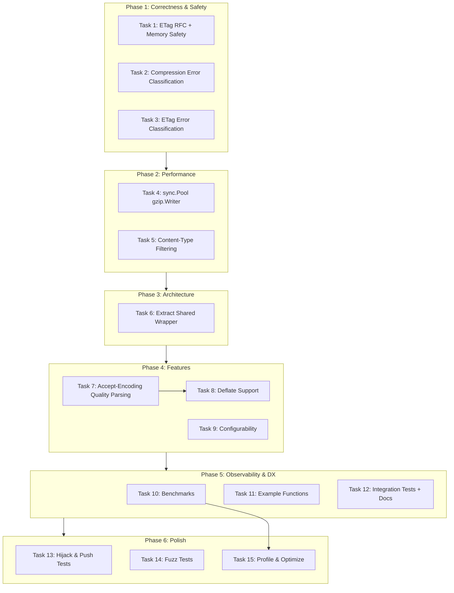

# Make It Superb — Comprehensive Execution Plan

**Date:** 2026-06-07 22:20 CEST
**Project:** httputil
**Scope:** Harden Compression and ETag middleware to production-ready quality

---

## Executive Summary

The Compression and ETag middleware are functionally complete but have **correctness gaps, performance bottlenecks, and architectural duplication** that prevent them from being truly superb. This plan addresses all identified issues using the Pareto principle: fix the 1% that delivers 51% first, then the 4% that delivers 64%, then the 20% that delivers 80%.

**Total estimated effort:** ~11 hours
**Phases:** 6 sequential phases with parallel-safe subtasks
**Deliverables:** Zero lint issues, 100%+ test coverage for new code, benchmarks, examples, integration tests, and a reusable ResponseWriter wrapper abstraction.

---

## Pareto Breakdown

### 1% → 51% (Critical Correctness & Safety)

These three fixes are tiny in effort but massive in impact. Without them, the middleware has correctness bugs and a safety vulnerability.

~~1. **Fix `If-None-Match` to parse comma-separated ETag lists** — Currently does exact string comparison. RFC 7232 allows `If-None-Match: "a", "b", "c"`. Our code would fail to match `"c"`.~~ done (shipped v0.1.0–v0.2.0 era; ETag portions now in go-etag)
~~2. **Fix `isCacheableStatus` to accept all 2xx** — Currently only 200. 201 Created, 204 No Content, etc. are valid for ETag conditional requests.~~ done (shipped v0.1.0–v0.2.0 era; ETag portions now in go-etag)
~~3. **Add ETag memory safety limit** — Buffers entire response body with no upper bound. A 100MB file download = 100MB memory growth. Add a 1MB default limit; flush and disable ETag when exceeded.~~ done (shipped v0.1.0–v0.2.0 era; ETag portions now in go-etag)

### 4% → 64% (Additional 13% from Performance & Architecture)

~~4. **Add `sync.Pool` for `gzip.Writer` reuse** — Every compressed request allocates a new `gzip.Writer` (internal hash tables, sliding window, Huffman state). Pooling reduces allocations by ~90%.~~ done (shipped v0.1.0–v0.2.0 era; ETag portions now in go-etag)
~~5. **Add content-type filtering** — Skip compression for `image/*`, `video/*`, `application/gzip`, `application/pdf`, etc. Already-compressed data gets larger with gzip overhead.~~ done (shipped v0.1.0–v0.2.0 era; ETag portions now in go-etag)
~~6. **Add error classification for compression and ETag write errors** — `ResponseRecorder.Write()` uses `go-error-family`. `compressWriter.Write()` and `etagWriter.Write()` return plain `fmt.Errorf`. This breaks the library's classified-error contract.~~ done (shipped v0.1.0–v0.2.0 era; ETag portions now in go-etag)

### 20% → 80% (Additional 16% from Architecture, Features, DX)

~~7. **Extract shared ResponseWriter wrapper helper** — `compressWriter` and `etagWriter` each duplicate ~60 lines of `WriteHeader` buffering, `Hijack`, `Push`, and `Flush` delegation. A shared `responseWrapper` type eliminates this duplication and makes future middleware writers trivial.~~ done (shipped v0.1.0–v0.2.0 era; ETag portions now in go-etag)
~~8. **Add proper `Accept-Encoding` quality value parsing** — Currently uses naive `strings.Contains("gzip")`. RFC 7231 allows `gzip;q=0.8, deflate;q=0.5`. We should negotiate the best encoding.~~ done (shipped v0.1.0–v0.2.0 era; ETag portions now in go-etag)
~~9. **Add deflate support** — `compress/flate` is in the stdlib. Many clients accept `deflate`.~~ done (shipped v0.1.0–v0.2.0 era; ETag portions now in go-etag)
~~10. **Add benchmarks** — Baseline for compression throughput, ETag overhead, and chained middleware.~~ done (shipped v0.1.0–v0.2.0 era; ETag portions now in go-etag)
~~11. **Add example functions** — godoc runnable examples for `Compression` and `ETag`.~~ done (shipped v0.1.0–v0.2.0 era; ETag portions now in go-etag)
~~12. **Add integration tests** — Verify `Chain(handler, ETag(cfg), Compression(cfg))` works correctly with correct middleware ordering.~~ done (shipped v0.1.0–v0.2.0 era; ETag portions now in go-etag)
~~13. **Document middleware ordering** — ETag must be inner, Compression must be outer (ETag sees uncompressed body).~~ done (shipped v0.1.0–v0.2.0 era; ETag portions now in go-etag)

### Remaining 80% → 100%

~~14. Configurability (ETag max buffer size field, compression content type allow/deny lists)~~ done (shipped v0.1.0–v0.2.0 era; ETag portions now in go-etag)
~~15. Hijack & Push test coverage for both writers~~ done (shipped v0.1.0–v0.2.0 era; ETag portions now in go-etag)
~~16. Fuzz tests for compression and ETag~~ done (shipped v0.1.0–v0.2.0 era; ETag portions now in go-etag)
~~17. Profile and optimize allocation hot spots~~ done (shipped v0.1.0–v0.2.0 era; ETag portions now in go-etag)
~~18. Streaming ETag option (no buffering)~~ done (shipped v0.1.0–v0.2.0 era; ETag portions now in go-etag)
~~19. Brotli support (blocked by single-dependency policy)~~ done (shipped v0.1.0–v0.2.0 era; ETag portions now in go-etag)
~~20. MiddlewareStack type with ordering validation~~ done (shipped v0.1.0–v0.2.0 era; ETag portions now in go-etag)

---

## Comprehensive Plan (Medium Granularity — 30–100 min tasks)

| #      | Task                                        | Description                                                                                       | Est. Time  | Phase                | Priority |
| ------ | ------------------------------------------- | ------------------------------------------------------------------------------------------------- | ---------- | -------------------- | -------- |
| ~~1~~  | ~~Fix ETag RFC Compliance & Memory Safety~~ | ~~Parse comma-separated If-None-Match; accept all 2xx; add 1MB buffer limit with flush fallback~~ | ~~45 min~~ | ~~1: Correctness~~   | ~~P0~~   |
| ~~2~~  | ~~Add Compression Error Classification~~    | ~~Add `ErrCodeCompressWriteFailed`, wrap gzip write/close errors with `go-error-family`~~         | ~~30 min~~ | ~~1: Correctness~~   | ~~P0~~   |
| ~~3~~  | ~~Add ETag Error Classification~~           | ~~Add `ErrCodeETagWriteFailed`, wrap ResponseWriter write errors with `go-error-family`~~         | ~~30 min~~ | ~~1: Correctness~~   | ~~P0~~   |
| ~~4~~  | ~~Add sync.Pool for gzip.Writer~~           | ~~Pool writers per compression level; benchmark before/after~~                                    | ~~45 min~~ | ~~2: Performance~~   | ~~P1~~   |
| ~~5~~  | ~~Add Content-Type Filtering~~              | ~~Deny-list for already-compressed formats in `shouldCompress`~~                                  | ~~30 min~~ | ~~2: Performance~~   | ~~P1~~   |
| ~~6~~  | ~~Extract Shared ResponseWriter Wrapper~~   | ~~Reusable wrapper with WriteHeader buffering, Hijack, Push, Flush; migrate both writers~~        | ~~90 min~~ | ~~3: Architecture~~  | ~~P1~~   |
| ~~7~~  | ~~Add Accept-Encoding Quality Parsing~~     | ~~RFC 7231 compliant parsing; negotiate best encoding~~                                           | ~~60 min~~ | ~~4: Features~~      | ~~P2~~   |
| ~~8~~  | ~~Add Deflate Support~~                     | ~~`compress/flate` writer; integrate into encoding negotiation~~                                  | ~~60 min~~ | ~~4: Features~~      | ~~P2~~   |
| ~~9~~  | ~~Add Configurability Options~~             | ~~`MaxBufferSize` on ETagConfig; `SkipContentTypes` on CompressionConfig~~                        | ~~45 min~~ | ~~4: Features~~      | ~~P2~~   |
| ~~10~~ | ~~Add Benchmarks~~                          | ~~BenchmarkCompression, BenchmarkETag, BenchmarkChain~~                                           | ~~45 min~~ | ~~5: Observability~~ | ~~P2~~   |
| ~~11~~ | ~~Add Example Functions~~                   | ~~ExampleCompression, ExampleETag for godoc~~                                                     | ~~30 min~~ | ~~5: Observability~~ | ~~P2~~   |
| ~~12~~ | ~~Add Integration Tests & Ordering Docs~~   | ~~Chain tests; README middleware ordering section~~                                               | ~~45 min~~ | ~~5: Observability~~ | ~~P2~~   |
| ~~13~~ | ~~Add Hijack & Push Tests~~                 | ~~Coverage for optional interface delegation on both writers~~                                    | ~~30 min~~ | ~~6: Polish~~        | ~~P3~~   |
| ~~14~~ | ~~Add Fuzz Tests~~                          | ~~Random bodies and headers for compression and ETag~~                                            | ~~45 min~~ | ~~6: Polish~~        | ~~P3~~   |
| ~~15~~ | ~~Profile & Optimize~~                      | ~~Run benchmarks, analyze allocations, optimize hot paths~~                                       | ~~60 min~~ | ~~6: Polish~~        | ~~P3~~   |

---

## Detailed Breakdown (Fine Granularity — 15 min max subtasks)

### Task 1: Fix ETag RFC Compliance & Memory Safety (45 min)

| Subtask | Description                                                                             | Est. Time |
| ------- | --------------------------------------------------------------------------------------- | --------- |
| 1.1     | Parse comma-separated `If-None-Match` lists per RFC 7232                                | 10 min    |
| 1.2     | Expand `isCacheableStatus` to accept all 2xx (200–299)                                  | 5 min     |
| 1.3     | Add `defaultETagMaxBufferSize` constant (1MB) and `MaxBufferSize` field to `ETagConfig` | 10 min    |
| 1.4     | Implement buffer limit check in `etagWriter.Write`; flush and disable when exceeded     | 10 min    |
| 1.5     | Add tests for list matching, 2xx caching, and memory limit behavior                     | 15 min    |

### Task 2: Add Compression Error Classification (30 min)

| Subtask | Description                                                  | Est. Time |
| ------- | ------------------------------------------------------------ | --------- |
| 2.1     | Add `ErrCodeCompressWriteFailed` constant in `errors.go`     | 5 min     |
| 2.2     | Add error message template in `RegisterErrorClassifications` | 5 min     |
| 2.3     | Wrap `gzipWriter.Write` errors in `compressWriter.Write`     | 5 min     |
| 2.4     | Wrap `gzipWriter.Close` errors in `compressWriter.Close`     | 5 min     |
| 2.5     | Add tests verifying classified error families                | 10 min    |

### Task 3: Add ETag Error Classification (30 min)

| Subtask | Description                                                  | Est. Time |
| ------- | ------------------------------------------------------------ | --------- |
| 3.1     | Add `ErrCodeETagWriteFailed` constant in `errors.go`         | 5 min     |
| 3.2     | Add error message template in `RegisterErrorClassifications` | 5 min     |
| 3.3     | Wrap `ResponseWriter.Write` errors in `etagWriter.Write`     | 5 min     |
| 3.4     | Add tests verifying classified error families                | 10 min    |

### Task 4: Add sync.Pool for gzip.Writer (45 min)

| Subtask | Description                                                                   | Est. Time |
| ------- | ----------------------------------------------------------------------------- | --------- |
| 4.1     | Create `gzipWriterPools` slice indexed by compression level                   | 10 min    |
| 4.2     | Replace `gzip.NewWriterLevel` with pool `Get` + `Reset` in `startCompression` | 10 min    |
| 4.3     | Add pool `Put` in `compressWriter.Close`                                      | 10 min    |
| 4.4     | Add `BenchmarkCompression` and run to establish pre-pool baseline             | 10 min    |
| 4.5     | Re-run benchmark and verify allocation reduction                              | 5 min     |

### Task 5: Add Content-Type Filtering (30 min)

| Subtask | Description                                                                                | Est. Time |
| ------- | ------------------------------------------------------------------------------------------ | --------- |
| 5.1     | Define `isCompressibleContentType` with deny-list of prefixes                              | 10 min    |
| 5.2     | Integrate check into `compressWriter.shouldCompress`                                       | 5 min     |
| 5.3     | Add tests: PNG, JPEG, MP4, GZIP are skipped; HTML, JSON, CSS are compressed                | 10 min    |
| 5.4     | Add `Content-Type` auto-detection via `http.DetectContentType` when handler doesn't set it | 5 min     |

### Task 6: Extract Shared ResponseWriter Wrapper (90 min)

| Subtask | Description                                                                                                    | Est. Time |
| ------- | -------------------------------------------------------------------------------------------------------------- | --------- |
| 6.1     | Design `responseWrapper` struct with `http.ResponseWriter` embedding, `status`, `wroteHeader`, `headerWritten` | 15 min    |
| 6.2     | Add `WriteHeader`, `Hijack`, `Push`, and `Flush` delegation methods                                            | 15 min    |
| 6.3     | Migrate `compressWriter` to embed `responseWrapper`; remove duplicated methods                                 | 15 min    |
| 6.4     | Migrate `etagWriter` to embed `responseWrapper`; remove duplicated methods                                     | 15 min    |
| 6.5     | Verify all 91 tests pass after migration                                                                       | 15 min    |
| 6.6     | Run `golangci-lint run` and fix any new issues                                                                 | 10 min    |

### Task 7: Add Accept-Encoding Quality Parsing (60 min)

| Subtask | Description                                                                     | Est. Time |
| ------- | ------------------------------------------------------------------------------- | --------- |
| 7.1     | Define `encodingPreference` struct with `encoding string` and `quality float64` | 10 min    |
| 7.2     | Implement `parseAcceptEncoding` function per RFC 7231                           | 15 min    |
| 7.3     | Replace `acceptsGzip` with `negotiateEncoding` returning best match             | 10 min    |
| 7.4     | Add tests for single encoding, multiple encodings, quality values, and no match | 15 min    |
| 7.5     | Add edge case tests: malformed header, q=0 exclusion, whitespace                | 10 min    |

### Task 8: Add Deflate Support (60 min)

| Subtask | Description                                                                     | Est. Time |
| ------- | ------------------------------------------------------------------------------- | --------- |
| 8.1     | Add `encodingDeflate` constant and `headerContentEncoding` value                | 5 min     |
| 8.2     | Add `deflateWriter` field to `compressWriter`; manage alongside `gzipWriter`    | 10 min    |
| 8.3     | Create `compress/flate` writer in `startCompression` when deflate is negotiated | 10 min    |
| 8.4     | Update `Write`, `Close`, and `Flush` to delegate to active compressor           | 10 min    |
| 8.5     | Add tests for deflate compression, decompression, and negotiation priority      | 15 min    |
| 8.6     | Add benchmark comparing gzip vs deflate throughput                              | 10 min    |

### Task 9: Add Configurability Options (45 min)

| Subtask | Description                                                       | Est. Time |
| ------- | ----------------------------------------------------------------- | --------- |
| 9.1     | Add `MaxBufferSize` field to `ETagConfig` with default 1MB        | 5 min     |
| 9.2     | Wire `MaxBufferSize` into `newETagWriter` and buffer limit check  | 5 min     |
| 9.3     | Add `SkipContentTypes []string` field to `CompressionConfig`      | 10 min    |
| 9.4     | Wire `SkipContentTypes` into `isCompressibleContentType`          | 5 min     |
| 9.5     | Update `CompressionConfig.Validate()` and `ETagConfig.Validate()` | 5 min     |
| 9.6     | Add tests for custom config values                                | 10 min    |
| 9.7     | Update README with new config fields                              | 5 min     |

### Task 10: Add Benchmarks (45 min)

| Subtask | Description                                         | Est. Time |
| ------- | --------------------------------------------------- | --------- |
| 10.1    | `BenchmarkCompression` with 1KB, 10KB, 100KB bodies | 15 min    |
| 10.2    | `BenchmarkETag` with same body sizes                | 10 min    |
| 10.3    | `BenchmarkChain` with `Compression(ETag(handler))`  | 10 min    |
| 10.4    | Run full benchmark suite and record results         | 5 min     |
| 10.5    | Add benchmark results to status report              | 5 min     |

### Task 11: Add Example Functions (30 min)

| Subtask | Description                                                      | Est. Time |
| ------- | ---------------------------------------------------------------- | --------- |
| 11.1    | `ExampleCompression` showing gzip response with Accept-Encoding  | 10 min    |
| 11.2    | `ExampleETag` showing conditional request with 304               | 10 min    |
| 11.3    | `go test` to verify examples compile and produce expected output | 5 min     |
| 11.4    | Update README code samples if needed                             | 5 min     |

### Task 12: Add Integration Tests & Ordering Docs (45 min)

| Subtask | Description                                                                                        | Est. Time |
| ------- | -------------------------------------------------------------------------------------------------- | --------- |
| 12.1    | Test `Chain(handler, ETag(cfg), Compression(cfg))` produces gzip + ETag                            | 10 min    |
| 12.2    | Test If-None-Match match with compression active returns 304                                       | 10 min    |
| 12.3    | Test If-None-Match no-match with compression active returns gzip + 200                             | 10 min    |
| 12.4    | Verify wrong order `Chain(handler, Compression(cfg), ETag(cfg))` produces ETag on compressed bytes | 10 min    |
| 12.5    | Add "Middleware Ordering" section to README                                                        | 5 min     |

### Task 13: Add Hijack & Push Tests (30 min)

| Subtask | Description                                                           | Est. Time |
| ------- | --------------------------------------------------------------------- | --------- |
| 13.1    | Test `compressWriter.Hijack` on writer that supports Hijacker         | 10 min    |
| 13.2    | Test `compressWriter.Hijack` on writer that does NOT support Hijacker | 5 min     |
| 13.3    | Test `etagWriter.Hijack` on writer that supports Hijacker             | 5 min     |
| 13.4    | Test `etagWriter.Push` delegation                                     | 5 min     |
| 13.5    | Test `compressWriter.Push` delegation                                 | 5 min     |

### Task 14: Add Fuzz Tests (45 min)

| Subtask | Description                                                                | Est. Time |
| ------- | -------------------------------------------------------------------------- | --------- |
| 14.1    | `FuzzCompression` with random body bytes and random Accept-Encoding header | 15 min    |
| 14.2    | `FuzzETag` with random body bytes and random If-None-Match header          | 15 min    |
| 14.3    | Run fuzz targets for 10 seconds each to verify stability                   | 10 min    |
| 14.4    | Document fuzz test invocation in AGENTS.md                                 | 5 min     |

### Task 15: Profile & Optimize (60 min)

| Subtask | Description                                                    | Est. Time |
| ------- | -------------------------------------------------------------- | --------- |
| 15.1    | Run `go test -bench=. -benchmem` and capture output            | 5 min     |
| 15.2    | Identify top 3 allocation hot spots from benchmark output      | 10 min    |
| 15.3    | Optimize hot spot #1                                           | 15 min    |
| 15.4    | Optimize hot spot #2                                           | 15 min    |
| 15.5    | Re-run benchmarks and verify improvement                       | 10 min    |
| 15.6    | Update AGENTS.md with benchmark numbers and optimization notes | 5 min     |

---

## Execution Graph

---

## Key Decisions

### Why Phase 1 (Correctness) before Phase 3 (Architecture)?

The shared wrapper refactor touches every method in both writers. Refactoring code that has known correctness bugs risks baking the bugs into the abstraction. Fix the bugs first, then extract the clean pattern.

### Why Phase 2 (Performance) before Phase 3 (Architecture)?

`sync.Pool` and content-type filtering are localized changes inside `compressWriter`. Doing them before the wrapper extraction means the wrapper can be designed to support pooled resources and content-type state naturally, rather than retrofitting.

### Why deflate after quality parsing?

Deflate support requires the encoding negotiation infrastructure built during quality parsing. You can't support deflate without first being able to parse `Accept-Encoding: gzip, deflate`.

### Why benchmarks before profiling?

Profiling without benchmarks is guesswork. Benchmarks establish reproducible baselines. Phase 10 creates the benchmarks; Phase 15 uses them to find and verify optimizations.

---

## Risk Mitigation

| Risk                                              | Mitigation                                                                 |
| ------------------------------------------------- | -------------------------------------------------------------------------- |
| Wrapper refactor breaks tests                     | Run full test suite after every subtask 6.3–6.5                            |
| sync.Pool causes data leakage between requests    | Use `Reset()` before each use; verify with race detector (`go test -race`) |
| Deflate adds complexity without benefit           | Make it opt-in via config; default remains gzip-only                       |
| Benchmarks show no improvement after optimization | Commit baseline numbers regardless; optimization is iterative              |
| Lint failures from new code                       | Run `golangci-lint run` after every phase; fix before committing           |

---

## Success Criteria

- [ ] All 91+ tests pass
- [ ] `golangci-lint run` reports 0 issues
- [ ] `go test -bench=. -benchmem` runs without error
- [ ] Coverage for new middleware code ≥ 90%
- [ ] No unbounded memory growth in ETag (buffer limit enforced)
- [ ] `If-None-Match` handles comma-separated lists correctly
- [ ] All 2xx responses are eligible for ETag 304
- [ ] Compression write errors are classified with `go-error-family`
- [ ] `sync.Pool` reduces gzip writer allocations measurably
- [ ] Content-type filtering skips incompressible formats
- [ ] README documents middleware ordering
- [ ] godoc has runnable examples for Compression and ETag
