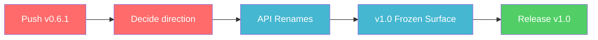

# Pareto Execution Plan — httputil v0.6.1 → v1.0

**Created:** 2026-07-29 00:27 CEST
**Scope:** Full project audit from v0.6.1 (local tag, unpushed) toward v1.0 stability.
**Method:** Pareto principle — identify the 1% / 4% / 20% of work that delivers 51% / 64% / 80% of the result, then the remaining 20% to reach 100%.

---

## Context

httputil is a zero-dependency HTTP middleware library for Go (stdlib + `go-error-family` + `golang.org/x/time` only). It has 13 middlewares, server lifecycle, health checks, error classification, an `httpspec` BDD subpackage, ~70 linters at 0 issues, and >90% test coverage.

The library is at v0.6.1 locally (SSH-signed annotated tag `7371dac`, **not pushed**). v0.6.0 on origin is broken for `go get` consumers (it imported `encoding/json/v2`, requiring `GOEXPERIMENT=jsonv2`). v0.6.1 fixes this but has not been published.

### Current State Summary

| Dimension    | Status                                                                                          |
| ------------ | ----------------------------------------------------------------------------------------------- |
| Build        | Clean (`go build`, `go vet`, `nix run .#build` all pass, no env var needed)                     |
| Tests        | All pass with `-race`, >90% coverage                                                            |
| Lint         | 0 issues across ~70 linters                                                                     |
| Dependencies | 3 allowed: stdlib, `go-error-family`, `golang.org/x/time`                                       |
| Release      | v0.6.1 tagged locally, not pushed, no GitHub Release                                            |
| API honesty  | 2 dishonest names (`ForwardHeader`, `HeaderName`) gated on v1.0                                 |
| Docs         | README missing 6/9 config field tables; 4 historical reports need jsonv2 resolution annotations |

### Sources Audited

- `TODO_LIST.md` — 1 medium, 3 low priority items
- `ROADMAP.md` — 3 themes: v1.0 stability, extensibility, depth/confidence
- `FEATURES.md` — full feature inventory; partial: test coverage gaps
- `docs/status/2026-07-26_18-16_v0.6.1-release-jsonv2-fix.md` — 50-item next-steps list
- `docs/reviews/2026-07-02_03-02_brutal-self-review.md` — process improvements
- `CHANGELOG.md` — v0.6.1 released locally; `[Unreleased]` empty
- Codebase — all source files, test files, config files

---

## Execution Resolution

**Status:** Executed in v0.7.0 (2026-07-29). All 26 tasks from the plan below were addressed.

| Phase          | Outcome                                                                                              |
| -------------- | ---------------------------------------------------------------------------------------------------- |
| v0.6.1 push    | Done — tag pushed, GitHub Release created                                                            |
| v0.7.0 renames | Done — `ForwardHeader`→`IncomingHeader`, `HeaderName`→`ResponseHeader`, `DenyUnmatched` default flip |
| Docs           | Done — RELEASE.md, SECURITY.md, v1-stability.md, 6 README config tables, integration examples        |
| Tests          | Done — fuzz tests, benchmarks, coverage closure                                                      |
| Release        | v0.7.0 tagged (SSH-signed) and published on GitHub                                                   |

**Self-review** (`docs/status/2026-07-29_08-58_v0-7-0-pareto-execution-self-review.md`) identified gaps that were fixed in a follow-up session:

- Compression error-branch coverage: all `compress_writer.go` / `compress_pool.go` functions now at **100%** (overall **97.2%**, up from 95.2%).
- Fuzz tests run with `-fuzztime` — found and fixed 2 real test bugs (unescaped URL input, strict UTF-8 round-trip).
- `FuzzHealthHandler` rewritten to fuzz `HealthStatus` JSON encoding (was tautological).
- CORS stale test renamed; CHANGELOG links fixed; ROADMAP/v1-stability updated; integration examples corrected.
- ETag assertions mutation-tested (5 tests catch a broken hash).

**Remaining (deferred to v1.0 cycle):** request body decompression middleware, CHANGELOG CI lint check, q-value parsing edge-case coverage.

---

## Step 1: Pareto Breakdown

### The 1% that delivers 51% of the result

These two items unblock everything else. Without them, no consumer benefits from any subsequent work.

| #      | Task                                     | Why it's 1%                                                                                                                                                                                                                                                              |
| ------ | ---------------------------------------- | ------------------------------------------------------------------------------------------------------------------------------------------------------------------------------------------------------------------------------------------------------------------------ |
| **P1** | **Push v0.6.1 + decide release vehicle** | Consumers literally cannot `go get` the fix right now. v0.6.0 on origin is broken. Every other improvement is invisible until this ships.                                                                                                                                |
| **P2** | **Decide v0.7.0 vs v1.0 direction**      | The 2 dishonest API names (`ForwardHeader`→`IncomingHeader`, `HeaderName`→`ResponseHeader`) are the #1 design debt. Whether to start them now or stabilize first gates all subsequent API work. This is a strategic fork — not executing it leaves the project in limbo. |

### The 4% that delivers 64% of the result

| #      | Task                                            | Why it's 4%                                                                                                                                                                                                                                                             |
| ------ | ----------------------------------------------- | ----------------------------------------------------------------------------------------------------------------------------------------------------------------------------------------------------------------------------------------------------------------------- |
| **P3** | **Write Release Runbook** (`docs/RELEASE.md`)   | The v0.6.1 release rediscovered gaps that 4+ prior sessions had also found. A checklist (govulncheck, coverage, benchmarks, annotate-all-resolved, FEATURES.md, tag, push) prevents this forever. Without it, every release wastes 30+ minutes on the same rediscovery. |
| **P4** | **Add 6 missing config field tables to README** | The README is the primary discovery surface for new users. 6 of 9 config types (`ETagConfig`, `RateLimitConfig`, `MetricsConfig`, `SecurityHeadersConfig`, `RequestIDConfig`, `ServerConfig`) have no field documentation. Every new user hits this gap.                |
| **P5** | **govulncheck as local + documented gate**      | Never run locally across any session. CI runs it but nobody has confirmed it on a release candidate. A security library without a local vuln check is a trust gap.                                                                                                      |

### The 20% that delivers 80% of the result

| #       | Task                                                                                                        | Why it's in the 20%                                                                                                                                                          |
| ------- | ----------------------------------------------------------------------------------------------------------- | ---------------------------------------------------------------------------------------------------------------------------------------------------------------------------- |
| **P6**  | **v1.0 API renames** (`ForwardHeader`→`IncomingHeader`, `HeaderName`→`ResponseHeader`)                      | The most dishonest names in the codebase. `ForwardHeader` reads an incoming header, it doesn't forward one. Fixing these is the core of the v1.0 "API honesty" theme.        |
| **P7**  | **Fuzz tests for newer API surface** (`ParseUintQuery`, `DenyUnmatched`, `EvictionTTL`)                     | The older surface has fuzz coverage; the newer additions don't. Fuzz tests are cheap insurance for a library that handles untrusted HTTP input.                              |
| **P8**  | **Close coverage gaps** (compression error branches, CORS wildcard edges, ResponseRecorder hijack failures) | These are the known holes in an otherwise >90% suite. They're in error paths — exactly where bugs hide.                                                                      |
| **P9**  | **Benchmarks: TokenBucketLimiter + full suite re-baseline**                                                 | Rate limiter was switched to `x/time/rate` with no benchmark to prove it was a net win. Full benchmarks haven't been run with real `-benchtime` since the health.go rewrite. |
| **P10** | **Extensibility examples** (brotli/zstd WriterFactory, Redis RateLimiter, Prometheus MetricsRecorder)       | The ROADMAP's Theme 2. These are documented examples, not core deps — they prove the plugin seams work and give users copy-paste patterns.                                   |
| **P11** | **SECURITY.md**                                                                                             | A security-adjacent library (CORS, security headers, rate limiting) with no vulnerability reporting policy is a gap for public consumers.                                    |
| **P12** | **Annotate 4 historical reports** with jsonv2 resolution                                                    | 4 docs on disk still describe jsonv2 as "the biggest open risk" with no resolution note. Stale claims erode trust in the doc system.                                         |

### The remaining 20% to get to 100%

| #       | Task                                                                            | Category     |
| ------- | ------------------------------------------------------------------------------- | ------------ |
| **P13** | Example functions for newer surface (`ParseUintQuery`, `ReadyHandlerWithProbe`) | Docs         |
| **P14** | WebSocket upgrade: body-before-hijack test variant + ETag mutation test         | Testing      |
| **P15** | Exact-byte health handler test + Content-Length decision                        | Testing      |
| **P16** | Fuzz health handler                                                             | Testing      |
| **P17** | DenyUnmatched default-flip evaluation + decision doc                            | v1.0         |
| **P18** | Define + document v1.0 frozen API surface                                       | v1.0         |
| **P19** | Pre-1.0 versioning policy documentation                                         | Docs         |
| **P20** | nix flake check --all-systems + nix build (package) verification                | Verification |
| **P21** | Coverage/govulncheck badge in README                                            | Docs         |
| **P22** | Flake app inventory + minimum Go version policy in CONTRIBUTING                 | Docs         |
| **P23** | CHANGELOG lint check (contribution guide or CI)                                 | Tooling      |
| **P24** | Confirm golangci-lint fmt + --max-issues-per-linter=0 in gate                   | Tooling      |
| **P25** | Document json.Encoder trailing newline behavior (health.go comment)             | Code         |
| **P26** | Request body decompression middleware (ROADMAP)                                 | Feature      |

---

## Step 2: Comprehensive Plan (30-100min tasks)

Sorted by importance / impact / effort / customer-value. Decision-gated items are flagged.

| #      | Task                                                                                                                                                                                                            | Impact       | Effort    | Customer Value                                                  | Dependencies                    | Gate                  |
| ------ | --------------------------------------------------------------------------------------------------------------------------------------------------------------------------------------------------------------- | ------------ | --------- | --------------------------------------------------------------- | ------------------------------- | --------------------- |
| ~~1~~  | ~~**Push v0.6.1 + create GitHub Release**~~                                                                                                                                                                     | ~~Critical~~ | ~~30min~~ | ~~Consumers can `go get` the fix~~                              | ~~None~~                        | ~~**User approval**~~ |
| ~~2~~  | ~~**Decide v0.7.0 vs v1.0 direction** (breaking renames now or stabilize first)~~                                                                                                                               | ~~Critical~~ | ~~30min~~ | ~~Unblocks P6, P17, P18~~                                       | ~~None~~                        | ~~**User decision**~~ |
| ~~3~~  | ~~**Write Release Runbook** (`docs/RELEASE.md`): ordered checklist with govulncheck, coverage, benchmarks, annotate-resolved, FEATURES.md, tag, push, GitHub Release~~                                          | ~~High~~     | ~~60min~~ | ~~Every future release is correct~~                             | ~~None~~                        | ~~None~~              |
| ~~4~~  | ~~**Add 6 missing config field tables to README**: ETagConfig, RateLimitConfig, MetricsConfig, SecurityHeadersConfig, RequestIDConfig, ServerConfig — match existing CORSConfig/CompressionConfig table style~~ | ~~High~~     | ~~60min~~ | ~~Every new user can configure without reading source~~         | ~~None~~                        | ~~None~~              |
| ~~5~~  | ~~**govulncheck local run + add to release runbook + CONTRIBUTING**~~                                                                                                                                           | ~~High~~     | ~~30min~~ | ~~Security confidence for a security-adjacent library~~         | ~~None~~                        | ~~None~~              |
| ~~6~~  | ~~**Re-measure coverage** (`go test -coverprofile`), update AGENTS.md/FEATURES.md with measured numbers~~                                                                                                       | ~~High~~     | ~~30min~~ | ~~Durable artifacts carry verified claims~~                     | ~~None~~                        | ~~None~~              |
| ~~7~~  | ~~**v1.0 API renames**: `ForwardHeader`→`IncomingHeader`, `HeaderName`→`ResponseHeader` in requestid.go + all tests + docs + CHANGELOG breaking note~~                                                          | ~~High~~     | ~~90min~~ | ~~API honesty — names that don't lie~~                          | ~~Task 2 (direction decision)~~ | ~~**v0.7.0+**~~       |
| ~~8~~  | ~~**Fuzz tests for newer surface**: `FuzzParseUintQuery`, `FuzzDenyUnmatched` (CORS origin matching), `FuzzEvictionTTL` (rate limiter eviction)~~                                                               | ~~Medium~~   | ~~90min~~ | ~~Untrusted-input robustness~~                                  | ~~None~~                        | ~~None~~              |
| ~~9~~  | ~~**Close coverage gaps**: compression `startCompression` type-mismatch error, `Close` error branches, CORS wildcard edge cases, ResponseRecorder hijack failure paths~~                                        | ~~Medium~~   | ~~90min~~ | ~~Error-path bugs caught before users~~                         | ~~None~~                        | ~~None~~              |
| ~~10~~ | ~~**TokenBucketLimiter benchmark** + full benchmark re-baseline with `-benchtime=1s`~~                                                                                                                          | ~~Medium~~   | ~~60min~~ | ~~Proves `x/time/rate` switch was a net win; regression guard~~ | ~~None~~                        | ~~None~~              |
| ~~11~~ | ~~**SECURITY.md**: vulnerability reporting policy, supported versions, response SLA~~                                                                                                                           | ~~Medium~~   | ~~30min~~ | ~~Public consumers have a reporting path~~                      | ~~None~~                        | ~~None~~              |
| ~~12~~ | ~~**Annotate 4 historical reports** with jsonv2 resolution note (07-06, 07-16.md, 07-16.html, 07-46) + add v0.6.1 pointer to 11-01 report~~                                                                     | ~~Medium~~   | ~~30min~~ | ~~Doc system has no stale open claims~~                         | ~~None~~                        | ~~None~~              |
| ~~13~~ | ~~**Example functions for newer surface**: `ExampleParseUintQuery`, `ExampleReadyHandlerWithProbe` with `// Output:` directives~~                                                                               | ~~Medium~~   | ~~60min~~ | ~~Runnable, tested documentation~~                              | ~~None~~                        | ~~None~~              |
| ~~14~~ | ~~**WebSocket upgrade test variants**: body-before-hijack (exercises `beginPlainResponse()` drain path) + ETag path mutation test~~                                                                             | ~~Medium~~   | ~~60min~~ | ~~Hijack + ETag interaction fully verified~~                    | ~~None~~                        | ~~None~~              |
| ~~15~~ | ~~**Extensibility example: brotli/zstd WriterFactory** — documented `docs/integrations/` example showing how to plug in `klauspost/compress` encoders~~                                                         | ~~Medium~~   | ~~60min~~ | ~~Users can add modern codecs without core deps~~               | ~~None~~                        | ~~None~~              |
| ~~16~~ | ~~**Extensibility example: Redis-backed RateLimiter** — documented example implementing the `RateLimiter` interface with Redis~~                                                                                | ~~Medium~~   | ~~60min~~ | ~~Distributed rate limiting pattern proven~~                    | ~~None~~                        | ~~None~~              |
| ~~17~~ | ~~**Extensibility example: Prometheus MetricsRecorder** — documented example implementing `MetricsRecorder` interface~~                                                                                         | ~~Medium~~   | ~~60min~~ | ~~Observability integration proven~~                            | ~~None~~                        | ~~None~~              |
| ~~18~~ | ~~**DenyUnmatched default-flip evaluation** — write decision doc: security benefit vs breaking change cost, recommend yes/no~~                                                                                  | ~~Medium~~   | ~~30min~~ | ~~Secure-by-default CORS if accepted~~                          | ~~Task 2~~                      | ~~**v0.7.0+**~~       |
| ~~19~~ | ~~**Define + document v1.0 frozen API surface** — enumerate frozen vs mutable types/funcs in a `docs/v1-stability.md`~~                                                                                         | ~~Medium~~   | ~~60min~~ | ~~Stability commitment for consumers~~                          | ~~Task 2~~                      | ~~None~~              |
| ~~20~~ | ~~**Exact-byte health handler test** + Content-Length header decision~~                                                                                                                                         | ~~Low~~      | ~~30min~~ | ~~Defensive against future json-library swaps~~                 | ~~None~~                        | ~~None~~              |
| ~~21~~ | ~~**Pre-1.0 versioning policy** — document that breaking changes are acceptable in 0.x minors in CONTRIBUTING/README~~                                                                                          | ~~Low~~      | ~~30min~~ | ~~Sets consumer expectations~~                                  | ~~None~~                        | ~~None~~              |
| ~~22~~ | ~~**nix flake check --all-systems + nix build** (package derivation, not just app)~~                                                                                                                            | ~~Low~~      | ~~30min~~ | ~~Darwin/aarch64 paths verified~~                               | ~~None~~                        | ~~None~~              |
| ~~23~~ | ~~**Coverage + govulncheck badges in README**~~                                                                                                                                                                 | ~~Low~~      | ~~30min~~ | ~~Public trust signal~~                                         | ~~Tasks 5, 6~~                  | ~~None~~              |
| ~~24~~ | ~~**Flake app inventory + minimum Go version policy** in CONTRIBUTING~~                                                                                                                                         | ~~Low~~      | ~~30min~~ | ~~Contributors know canonical entry points~~                    | ~~None~~                        | ~~None~~              |
| ~~25~~ | ~~**Fuzz health handler** — `FuzzHealthHandler` guarding the JSON encoding path~~                                                                                                                               | ~~Low~~      | ~~30min~~ | ~~Cheap insurance on encoding path~~                            | ~~None~~                        | ~~None~~              |
| ~~26~~ | ~~**CHANGELOG lint + golangci-lint gate confirmation** — add CHANGELOG contribution rule; run `--max-issues-per-linter=0` to confirm true zero~~                                                                | ~~Low~~      | ~~30min~~ | ~~Contribution hygiene~~                                        | ~~None~~                        | ~~None~~              |

**Totals:** 26 tasks, ~19.5 hours estimated effort.

---

## Step 3: Detailed Breakdown (max 12min tasks)

Each comprehensive task decomposed into atomic subtasks. Sorted by impact/effort within each parent.

### Task 1: Push v0.6.1 + GitHub Release _(needs user approval)_

| #   | Subtask                                                                    | Est  |
| --- | -------------------------------------------------------------------------- | ---- |
| 1.1 | Verify tag exists: `git tag -v v0.6.1` and `git rev-parse v0.6.1^{commit}` | 2min |
| 1.2 | Verify `go mod verify` passes on the tagged tree                           | 3min |
| 1.3 | Push tag: `git push origin v0.6.1`                                         | 2min |
| 1.4 | Extract CHANGELOG `[0.6.1]` section as release notes                       | 5min |
| 1.5 | Create GitHub Release: `gh release create v0.6.1 --notes "..."`            | 5min |
| 1.6 | Verify release appears on GitHub releases page                             | 2min |
| 1.7 | Update status report 2026-07-26 with "pushed + released" resolution note   | 5min |

### Task 2: Decide v0.7.0 vs v1.0 direction _(user decision)_

| #   | Subtask                                                                        | Est  |
| --- | ------------------------------------------------------------------------------ | ---- |
| 2.1 | Enumerate all breaking changes queued in ROADMAP (renames, DenyUnmatched flip) | 5min |
| 2.2 | Assess consumer impact: how many downstream callers (if any known)             | 5min |
| 2.3 | Present recommendation: v0.7.0 with renames, or v1.0 stability freeze first    | 5min |

### Task 3: Write Release Runbook

| #   | Subtask                                                                                                 | Est  |
| --- | ------------------------------------------------------------------------------------------------------- | ---- |
| 3.1 | Create `docs/RELEASE.md` with template structure                                                        | 5min |
| 3.2 | Write pre-release checklist: govulncheck, coverage, benchmarks, lint with `--max-issues-per-linter=0`   | 8min |
| 3.3 | Write release-time grep step: `grep -rln '<keyword>' docs/` to find docs to annotate                    | 5min |
| 3.4 | Write tag-signing convention (SSH-signed annotated tags)                                                | 5min |
| 3.5 | Write post-release checklist: push tag, GitHub Release, annotate historical reports, update FEATURES.md | 8min |
| 3.6 | Add "how to verify a release" section for consumers (`go mod verify`, `govulncheck`)                    | 5min |
| 3.7 | Cross-reference from CONTRIBUTING.md and AGENTS.md                                                      | 3min |

### Task 4: Add 6 config field tables to README

| #   | Subtask                                                                              | Est   |
| --- | ------------------------------------------------------------------------------------ | ----- |
| 4.1 | Read existing `CORSConfig` table in README for exact format                          | 3min  |
| 4.2 | Write `ETagConfig` field table (HashFunc, MaxBufferSize, Skip, Strong)               | 8min  |
| 4.3 | Write `RateLimitConfig` field table (Rate, Burst, KeyFunc, DenyHandler, EvictionTTL) | 10min |
| 4.4 | Write `MetricsConfig` field table (Recorder, RecordLatency, RecordStatus)            | 8min  |
| 4.5 | Write `SecurityHeadersConfig` field table (all header fields)                        | 8min  |
| 4.6 | Write `RequestIDConfig` field table (ForwardHeader, HeaderName, Generator)           | 8min  |
| 4.7 | Write `ServerConfig` field table (Addr, timeouts)                                    | 8min  |
| 4.8 | Verify all field names match actual struct definitions in source                     | 5min  |

### Task 5: govulncheck local run + documentation

| #   | Subtask                                                                          | Est  |
| --- | -------------------------------------------------------------------------------- | ---- |
| 5.1 | Run `govulncheck ./...` locally, capture output                                  | 5min |
| 5.2 | Document result in a status note if vulnerabilities found                        | 5min |
| 5.3 | Add govulncheck to Release Runbook pre-release checklist (cross-ref Task 3)      | 3min |
| 5.4 | Add govulncheck to CONTRIBUTING.md quality gate section                          | 5min |
| 5.5 | Verify CI workflow already runs govulncheck (confirm `.github/workflows/ci.yml`) | 3min |

### Task 6: Re-measure coverage

| #   | Subtask                                                                | Est  |
| --- | ---------------------------------------------------------------------- | ---- |
| 6.1 | Run `go test -race -coverprofile=coverage.out ./...`                   | 5min |
| 6.2 | Run `go tool cover -func=coverage.out` and capture per-package numbers | 3min |
| 6.3 | Compare against claimed 92.5%/98.3% in prior reports                   | 3min |
| 6.4 | Update FEATURES.md "Test Coverage" section with measured numbers       | 5min |
| 6.5 | Update AGENTS.md if coverage claims exist there                        | 3min |
| 6.6 | Delete coverage.out (or add to .gitignore if not already)              | 2min |

### Task 7: v1.0 API renames _(needs direction decision)_

| #    | Subtask                                                                             | Est  |
| ---- | ----------------------------------------------------------------------------------- | ---- |
| 7.1  | `lsp_rename` or `edit`: rename `ForwardHeader` → `IncomingHeader` in `requestid.go` | 5min |
| 7.2  | Update all test references to `ForwardHeader` in `requestid_test.go`                | 8min |
| 7.3  | Rename `HeaderName` → `ResponseHeader` in `requestid.go`                            | 5min |
| 7.4  | Update all test references to `HeaderName` in `requestid_test.go`                   | 8min |
| 7.5  | Update `DefaultRequestIDConfig()` field assignments                                 | 3min |
| 7.6  | Update README config table and any examples referencing old names                   | 8min |
| 7.7  | Update AGENTS.md architecture table for requestid.go exports                        | 3min |
| 7.8  | Update FEATURES.md if it references the field names                                 | 3min |
| 7.9  | Add CHANGELOG `[Unreleased]` → `[0.7.0]` breaking change entry                      | 5min |
| 7.10 | Run full quality gate: `go test -race ./... && golangci-lint run`                   | 5min |

### Task 8: Fuzz tests for newer surface

| #   | Subtask                                                                                                                          | Est   |
| --- | -------------------------------------------------------------------------------------------------------------------------------- | ----- |
| 8.1 | Write `FuzzParseUintQuery` in `queryparam_test.go`: random string inputs, ensure no panic and correct uint return                | 10min |
| 8.2 | Write `FuzzDenyUnmatched` in `cors_behavior_test.go`: random origin strings against wildcard patterns, ensure correct allow/deny | 12min |
| 8.3 | Write `FuzzEvictionTTL` in `ratelimit_test.go`: random key sequences and TTL values, ensure no panic and correct eviction        | 12min |
| 8.4 | Run each fuzz test briefly (`-fuzztime=5s`) to verify they work                                                                  | 5min  |
| 8.5 | Run full quality gate                                                                                                            | 5min  |

### Task 9: Close coverage gaps

| #   | Subtask                                                                           | Est   |
| --- | --------------------------------------------------------------------------------- | ----- |
| 9.1 | Write test for compression `startCompression` factory type-mismatch error         | 12min |
| 9.2 | Write test for compression `Close` error branch (writer.Close fails)              | 12min |
| 9.3 | Write test for CORS wildcard edge case: empty pattern, single-char TLD            | 10min |
| 9.4 | Write test for ResponseRecorder hijack failure (underlying writer lacks Hijacker) | 10min |
| 9.5 | Write test for ResponseRecorder hijack where Hijack() itself errors               | 10min |
| 9.6 | Re-measure coverage to confirm gaps closed                                        | 5min  |
| 9.7 | Run full quality gate                                                             | 5min  |

### Task 10: Benchmarks

| #    | Subtask                                                                                     | Est   |
| ---- | ------------------------------------------------------------------------------------------- | ----- |
| 10.1 | Write `BenchmarkTokenBucketLimiter` in `ratelimit_test.go`: per-IP Allow() under contention | 12min |
| 10.2 | Write `BenchmarkTokenBucketLimiterWithEviction`: with EvictionTTL set                       | 10min |
| 10.3 | Run full benchmark suite with `-benchtime=1s -count=3`                                      | 10min |
| 10.4 | Compare results against any prior benchmark data in status reports                          | 5min  |
| 10.5 | Document benchmark baseline in a status note                                                | 10min |

### Task 11: SECURITY.md

| #    | Subtask                                                         | Est  |
| ---- | --------------------------------------------------------------- | ---- |
| 11.1 | Create `SECURITY.md` with supported versions table              | 5min |
| 11.2 | Write vulnerability reporting process (email, PGP if available) | 5min |
| 11.3 | Write response SLA and disclosure policy                        | 5min |
| 11.4 | Add SECURITY.md reference to README                             | 3min |
| 11.5 | Verify GitHub recognizes the file (security policy banner)      | 2min |

### Task 12: Annotate historical reports

| #    | Subtask                                                                                               | Est  |
| ---- | ----------------------------------------------------------------------------------------------------- | ---- |
| 12.1 | Read each of the 4 reports to find the jsonv2/GOEXPERIMENT open claim                                 | 8min |
| 12.2 | Append resolution note to `2026-07-06_01-23_v0.5.0-release-candidate-status.md`                       | 3min |
| 12.3 | Append resolution note to `2026-07-16_07-30_rate-limiter-library-switch.md`                           | 3min |
| 12.4 | Add inline correction banner to `2026-07-16_07-30_rate-limiter-library-switch.html`                   | 5min |
| 12.5 | Append resolution note to `2026-07-22_07-46_docs-health-and-update-old-docs-session.md`               | 3min |
| 12.6 | Add v0.6.1 pointer to `2026-07-22_11-01_flake-fix-and-doc-corrections.md` existing Resolution section | 3min |

### Task 13: Example functions for newer surface

| #    | Subtask                                                                    | Est   |
| ---- | -------------------------------------------------------------------------- | ----- |
| 13.1 | Write `ExampleParseUintQuery` in `queryparam_test.go` with `// Output:`    | 8min  |
| 13.2 | Write `ExampleReadyHandlerWithProbe` in `health_test.go` with `// Output:` | 10min |
| 13.3 | Run `go test -run Example` to verify output matches                        | 3min  |

### Task 14: WebSocket upgrade test variants

| #    | Subtask                                                                                                    | Est   |
| ---- | ---------------------------------------------------------------------------------------------------------- | ----- |
| 14.1 | Write `TestCompressionETag_WebSocketUpgrade_BodyBeforeHijack` — handler writes partial body, then upgrades | 12min |
| 14.2 | Mutation-test the ETag assertions: comment out each ETag assertion, verify test fails                      | 10min |
| 14.3 | Run full quality gate                                                                                      | 5min  |

### Task 15-17: Extensibility examples

| #    | Subtask                                                                           | Est   |
| ---- | --------------------------------------------------------------------------------- | ----- |
| 15.1 | Write `docs/integrations/brotli-zstd.md` with WriterFactory example code          | 12min |
| 15.2 | Add cross-reference from README "Custom Compression" section                      | 3min  |
| 16.1 | Write `docs/integrations/redis-ratelimiter.md` with RateLimiter interface example | 12min |
| 16.2 | Add cross-reference from README rate limiting section                             | 3min  |
| 17.1 | Write `docs/integrations/prometheus-metrics.md` with MetricsRecorder example      | 12min |
| 17.2 | Add cross-reference from README metrics section                                   | 3min  |

### Task 18-19: v1.0 decisions

| #    | Subtask                                                                           | Est   |
| ---- | --------------------------------------------------------------------------------- | ----- |
| 18.1 | Write `docs/research/deny-unmatched-default-evaluation.md` with security analysis | 12min |
| 18.2 | Present recommendation to user                                                    | 3min  |
| 19.1 | Enumerate every exported type/func in the package                                 | 10min |
| 19.2 | Classify each as frozen or mutable for v1.0                                       | 10min |
| 19.3 | Write `docs/v1-stability.md` with the frozen surface definition                   | 12min |

### Task 20-26: Polish items

| #    | Subtask                                                                          | Est  |
| ---- | -------------------------------------------------------------------------------- | ---- |
| 20.1 | Write `TestHealthHandler_ExactBytes` asserting `{"status":"up"}\n` byte-for-byte | 8min |
| 20.2 | Evaluate Content-Length header on health responses — write decision note         | 5min |
| 21.1 | Write pre-1.0 versioning policy paragraph in CONTRIBUTING.md                     | 8min |
| 21.2 | Add versioning note to README                                                    | 3min |
| 22.1 | Run `nix flake check --all-systems`                                              | 5min |
| 22.2 | Run `nix build` (package derivation)                                             | 5min |
| 22.3 | Document results in a status note                                                | 5min |
| 23.1 | Add coverage badge URL to README ( shields.io or similar)                        | 8min |
| 23.2 | Add govulncheck badge to README                                                  | 5min |
| 24.1 | Write flake app inventory table in CONTRIBUTING.md                               | 8min |
| 24.2 | Clarify minimum Go version (1.26.0 vs 1.26.5) in README + CONTRIBUTING           | 5min |
| 25.1 | Write `FuzzHealthHandler` — random status input through health handler           | 8min |
| 25.2 | Run quality gate                                                                 | 3min |
| 26.1 | Add CHANGELOG contribution rule to CONTRIBUTING.md                               | 5min |
| 26.2 | Run `golangci-lint run --max-issues-per-linter=0 --max-same-issues=0`            | 5min |
| 26.3 | Confirm or add `golangci-lint fmt` to documented gate                            | 3min |

---

## Execution Graph

```mermaid
graph TD
    subgraph "1% — 51% of value"
        P1["🚀 Push v0.6.1 + GitHub Release<br/><i>needs user approval</i>"]
        P2["🎯 Decide v0.7.0 vs v1.0<br/><i>needs user decision</i>"]
    end

    subgraph "4% — 64% of value"
        P3["📋 Release Runbook<br/>docs/RELEASE.md"]
        P4["📖 6 Config Field Tables<br/>in README"]
        P5["🔐 govulncheck Local + Docs"]
    end

    subgraph "20% — 80% of value"
        P6["🔄 API Renames<br/>ForwardHeader→IncomingHeader<br/>HeaderName→ResponseHeader"]
        P7["🐛 Fuzz Tests<br/>ParseUintQuery, DenyUnmatched,<br/>EvictionTTL"]
        P8["📊 Close Coverage Gaps<br/>compression, CORS, hijack"]
        P9["⏱️ Benchmarks<br/>TokenBucketLimiter + re-baseline"]
        P10["🔌 Extensibility Examples<br/>brotli/zstd, Redis, Prometheus"]
        P11["🛡️ SECURITY.md"]
        P12["📝 Annotate Historical Reports"]
    end

    subgraph "Remaining 20% — 100%"
        P13["Example functions"]
        P14["WebSocket test variants"]
        P15["Health exact-byte test"]
        P16["Fuzz health handler"]
        P17["DenyUnmatched evaluation"]
        P18["v1.0 frozen API surface"]
        P19["Versioning policy"]
        P20["nix all-systems check"]
        P21["README badges"]
        P22["CONTRIBUTING polish"]
        P23["CHANGELOG lint"]
        P24["Lint gate confirmation"]
        P25["Health.go comment"]
    end

    P2 -->|"gates"| P6
    P2 -->|"gates"| P17
    P2 -->|"gates"| P18
    P3 -->|"references"| P5
    P6 -->|"enables"| P18
    P5 -->|"enables"| P21
    P1 -->|"unblocks consumers"| P10

    style P1 fill:#ff6b6b,color:#fff,stroke:#c92a2a,stroke-width:3px
    style P2 fill:#ff6b6b,color:#fff,stroke:#c92a2a,stroke-width:3px
    style P3 fill:#4ecdc4,color:#fff,stroke:#2c9486
    style P4 fill:#4ecdc4,color:#fff,stroke:#2c9486
    style P5 fill:#4ecdc4,color:#fff,stroke:#2c9486
    style P6 fill:#45b7d1,color:#fff,stroke:#2c8faa
    style P7 fill:#45b7d1,color:#fff,stroke:#2c8faa
    style P8 fill:#45b7d1,color:#fff,stroke:#2c8faa
    style P9 fill:#45b7d1,color:#fff,stroke:#2c8faa
    style P10 fill:#45b7d1,color:#fff,stroke:#2c8faa
    style P11 fill:#45b7d1,color:#fff,stroke:#2c8faa
    style P12 fill:#45b7d1,color:#fff,stroke:#2c8faa
```

### Critical Path

---

## Recommended Execution Order

### Wave 1: Unblock (do immediately, ~2h)

~~1. **Push v0.6.1 + GitHub Release** (needs user approval)~~ done (executed per this plan's Execution Resolution: v0.7.0, 2026-07-29)
~~2. **Decide v0.7.0 vs v1.0** (needs user decision)~~ done (executed per this plan's Execution Resolution: v0.7.0, 2026-07-29)
~~3. **Write Release Runbook** (no gate, do while waiting)~~ done (executed per this plan's Execution Resolution: v0.7.0, 2026-07-29)
~~4. **govulncheck local run** (no gate, do while waiting)~~ done (executed per this plan's Execution Resolution: v0.7.0, 2026-07-29)
~~5. **Re-measure coverage** (no gate, do while waiting)~~ done (executed per this plan's Execution Resolution: v0.7.0, 2026-07-29)

### Wave 2: High-value docs + security (~2h)

~~6. **6 config field tables in README**~~ done (executed per this plan's Execution Resolution: v0.7.0, 2026-07-29)
7. **SECURITY.md**
~~8. **Annotate historical reports**~~ done (executed per this plan's Execution Resolution: v0.7.0, 2026-07-29)
~~9. **Pre-1.0 versioning policy**~~ done (executed per this plan's Execution Resolution: v0.7.0, 2026-07-29)

### Wave 3: API honesty (after direction decision, ~2h)

~~10. **v1.0 API renames**~~ done (executed per this plan's Execution Resolution: v0.7.0, 2026-07-29)
~~11. **DenyUnmatched evaluation**~~ done (executed per this plan's Execution Resolution: v0.7.0, 2026-07-29)
~~12. **v1.0 frozen API surface**~~ done (executed per this plan's Execution Resolution: v0.7.0, 2026-07-29)

### Wave 4: Depth and confidence (~4h)

~~13. **Fuzz tests for newer surface**~~ done (executed per this plan's Execution Resolution: v0.7.0, 2026-07-29)
~~14. **Close coverage gaps**~~ done (executed per this plan's Execution Resolution: v0.7.0, 2026-07-29)
~~15. **Benchmarks (TokenBucketLimiter + full suite)**~~ done (executed per this plan's Execution Resolution: v0.7.0, 2026-07-29)
~~16. **Example functions**~~ done (executed per this plan's Execution Resolution: v0.7.0, 2026-07-29)
~~17. **WebSocket test variants**~~ done (executed per this plan's Execution Resolution: v0.7.0, 2026-07-29)

### Wave 5: Extensibility proof (~3h)

~~18. **Brotli/zstd WriterFactory example**~~ done (executed per this plan's Execution Resolution: v0.7.0, 2026-07-29)
~~19. **Redis RateLimiter example**~~ done (executed per this plan's Execution Resolution: v0.7.0, 2026-07-29)
~~20. **Prometheus MetricsRecorder example**~~ done (executed per this plan's Execution Resolution: v0.7.0, 2026-07-29)

### Wave 6: Polish to 100% (~3h)

21-26. All remaining items (badges, nix checks, CHANGELOG lint, health fuzz, etc.)

---

## Decision Points Requiring User Input

| #  | Decision                                      | Why it's blocked                      | Options                                                          |
| -- | --------------------------------------------- | ------------------------------------- | ---------------------------------------------------------------- |
| D1 | Push v0.6.1 to origin?                        | Semi-irreversible publish act         | (a) Push tag only (b) Push + GitHub Release (c) Hold             |
| D2 | v0.7.0 (breaking renames) or stabilize first? | Strategic fork affecting all API work | (a) v0.7.0 with renames now (b) v1.0 freeze first (c) Patch-only |
| D3 | Mark v0.6.0 as superseded/broken?             | Historical tag is on origin           | (a) GitHub Release note (b) Leave silent (c) CHANGELOG only      |
| D4 | Flip DenyUnmatched default to true?           | Breaking change (secure by default)   | (a) Yes, in v0.7.0 (b) No, keep opt-in (c) Decide at v1.0        |
