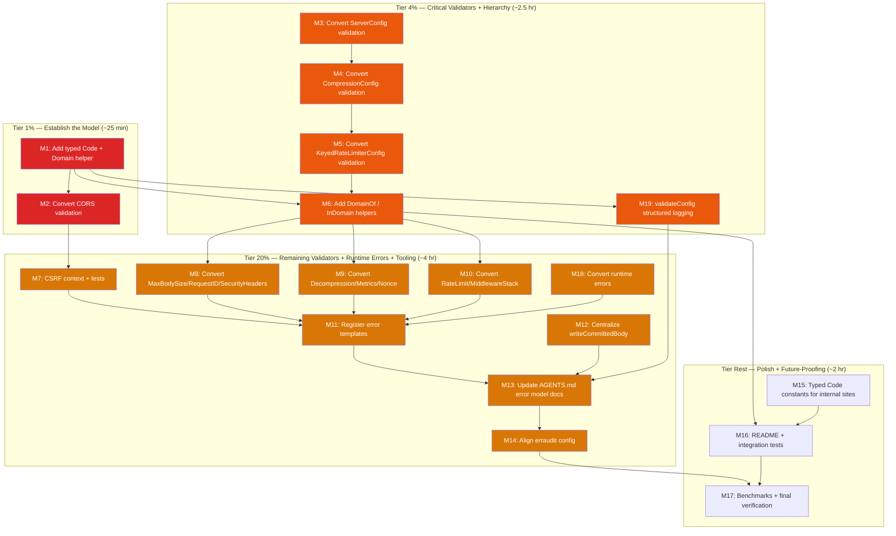

# Pareto Execution Plan — 2026-08-14 13:53 — Typed Hierarchical Error System

> **Context:** The project already uses `github.com/larsartmann/go-error-family` for runtime HTTP errors, but configuration-validation errors are still plain stdlib sentinels (`errors.New` + `fmt.Errorf`). The erraudit scan reports 83 violations, most of which are artifacts of the mismatched `--enforce-samber-oops` flag. The goal is to make every error typed, hierarchical, and fully classified without adding dependencies or breaking the public API.
>
> **Source:** `docs/reviews/2026-08-14_error-system-review.html` and the erraudit output attached to the review session.
>
> **Sorted by:** importance → impact → effort → customer-value. Customer = downstream library consumer. Correctness (typed config errors) > trust (no false positives) > resilience (tooling alignment) > polish (docs/predicates).

---

## Amendments (2026-08-14, post-review)

The plan was reviewed against the codebase and the `go-error-family` v0.10.0 API before execution. Amendments:

~~1. **Scope fixed: runtime errors included.** The original goal said "every error typed" but tasks only covered config validators. Added M18: convert the remaining unclassified runtime errors — `errDecompressionSizeExceeded` (bomb protection, the most security-relevant error in the library), `errServerShutdownFailed`, decompression read/close wraps, `errUnexpectedPoolType`, and the q-value parse sentinels.~~ done (executed: shipped as v0.12.0, 2026-08-16)
~~2. **Added M19: `validateConfig` structured logging.** Constructors swallow validation errors into `slog` with only `err.Error()` (`recorder.go:22`). That log line is the primary surface where classified config errors materialize. Without teaching it to emit `code` and `family` fields, converting 12 validators delivers classification consumers rarely see. Promoted to the 4% tier.~~ done (executed: shipped as v0.12.0, 2026-08-16)
~~3. **M15 reworked — no dual string aliases.** Parallel `Code` + `string` constants give every code two names (split brain) and typing the exported constants silently breaks consumers assigning them to `string`. New approach: `type Code string` earns its keep via constructor methods (`code.Rejection(msg)` → `*errorfamily.Error`), exported `ErrCode*` constants stay untyped strings (zero breakage, no duplication), internal call sites migrate to typed `Code` constants.~~ done (executed: shipped as v0.12.0, 2026-08-16)
~~4. **Domain taxonomy decided upfront (see below).** `http.etag_*` codes already live in the `http` domain; deciding the domain list after M1 ships would have baked in inconsistency.~~ done (executed: shipped as v0.12.0, 2026-08-16)
~~5. **M14 corrected: not just "drop the flag."** The aligned invocation is `--type-aware` plus `--enforce-go-error-family` (the flag matching this library). The `--enforce-go-error-family` flag is unverified against the binary — verify with `erraudit --help` first. Dropping enforcement entirely would leave the real findings unenforced.~~ done (executed: shipped as v0.12.0, 2026-08-16)
~~6. **F16.1 per-middleware predicates cut.** `IsCORSConfigError` etc. are subsumed by `DomainOf`/`InDomain` — redundant API surface. README guidance shows the domain-based matching instead.~~ done (executed: shipped as v0.12.0, 2026-08-16)
~~7. **F6.2 wording fixed:** standalone `func Test*` per house convention, not table-driven tests.~~ done (executed: shipped as v0.12.0, 2026-08-16)
~~8. **CSRF (M7) is more done than estimated:** `CSRFConfig.Validate()` already produces classified errors with `WithCause(ErrCSRFConfig)` chaining (csrf.go:162-198). Remaining work: context + tests only.~~ done (executed: shipped as v0.12.0, 2026-08-16)

### Domain Taxonomy (decided)

Domain = the prefix before the first `.` of an error code. **By component, not by lifecycle** — the `Family` (Rejection/Transient/…) already encodes lifecycle; the domain answers "which middleware failed," which is what ops dashboards group by.

| Domain          | Codes                                               | Notes                                           |
| --------------- | --------------------------------------------------- | ----------------------------------------------- |
| `http`          | `http.write_failed`, `http.hijack_*`, `http.etag_*` | Existing + go-etag codes (already shipped here) |
| `csrf`          | `csrf_invalid`, `csrf_config`, `csrf_*`             | Existing, unchanged                             |
| `cors`          | `cors.*`                                            | New (config validation)                         |
| `server`        | `server.*`                                          | New (config + `server.shutdown_failed`)         |
| `compression`   | `compression.*`, `compression.qvalue_*`             | New (config + pool + q-value parse)             |
| `decompression` | `decompression.*`                                   | New (config + size exceeded + read/close)       |
| `ratelimit`     | `ratelimit.*`                                       | New (deprecated + keyed configs)                |
| `stack`         | `stack.*`                                           | New (MiddlewareStack validation)                |
| `maxbodysize`   | `maxbodysize.*`                                     | New                                             |
| `requestid`     | `requestid.*`                                       | New                                             |
| `security`      | `security.*`                                        | New                                             |
| `metrics`       | `metrics.*`                                         | New                                             |
| `nonce`         | `nonce.*`                                           | New                                             |

CSRF config errors stay under `csrf.*` as `Infrastructure` for backward compatibility, even though new config errors use `Rejection` — the classification difference is documented in AGENTS.md rather than broken.

---

## Step 1: Pareto Breakdown

### The 1% that delivers 51%

**Establish the typed-code model and convert the smallest visible validator.** This is ~25 minutes of work that proves the entire approach: a `Code` type, domain extraction, package-level classified sentinels, contextual clones, and a test that asserts `Coded`/`Classified`/`Contextual`.

| #       | Item                                                                                                                                                     | Why it's the 1%                                              | Effort     |
| ------- | -------------------------------------------------------------------------------------------------------------------------------------------------------- | ------------------------------------------------------------ | ---------- |
| ~~1.1~~ | ~~Add `type Code string`, `Code.Domain()`, constructor methods (`Rejection`/`Transient`/…), and typed constants for existing HTTP codes in `errors.go`~~ | ~~Creates the type system every other task builds on~~       | ~~10 min~~ |
| ~~1.2~~ | ~~Convert `CORSConfig.Validate()` to classified sentinels with context~~                                                                                 | ~~Proves the pattern in the smallest non-trivial validator~~ | ~~10 min~~ |
| ~~1.3~~ | ~~Add a test that asserts CORS validation errors are Coded/Classified/Contextual~~                                                                       | ~~Prevents regression and shows consumers how to match~~     | ~~5 min~~  |

### The 4% that delivers 64%

**The above + convert the three most critical config validators, add `DomainOf` / `InDomain` helpers, and make `validateConfig` log the classification.** After this cluster (~2.5 hours), every major middleware has at least one classified config error, consumers can query errors by domain, and the classification is visible in the log surface where it actually matters.

| #       | Item                                                                       | Why it's in the 4%                                                        | Effort     |
| ------- | -------------------------------------------------------------------------- | ------------------------------------------------------------------------- | ---------- |
| 1.x     | All 1% items                                                               | —                                                                         | 25 min     |
| ~~2.1~~ | ~~Convert `ServerConfig.Validate()` to classified errors~~                 | ~~Server config errors are high-impact (timeouts, TLS, address)~~         | ~~30 min~~ |
| ~~2.2~~ | ~~Convert `CompressionConfig.Validate()` to classified errors~~            | ~~Complex validator with multiple invariant failures~~                    | ~~30 min~~ |
| ~~2.3~~ | ~~Convert `KeyedRateLimiterConfig.Validate()` to classified errors~~       | ~~Rate-limiting correctness depends on valid config~~                     | ~~20 min~~ |
| ~~2.4~~ | ~~Add `DomainOf(err)` and `InDomain(err, domain)` helpers~~                | ~~Enables hierarchical matching without string parsing~~                  | ~~15 min~~ |
| ~~2.5~~ | ~~Add tests asserting all converted validators return classified errors~~  | ~~Guarantees the new model holds for the 4% tier~~                        | ~~15 min~~ |
| ~~2.6~~ | ~~Emit `code` + `family` structured fields from `validateConfig` logging~~ | ~~The log line is the primary consumer-visible surface of config errors~~ | ~~15 min~~ |

### The 20% that delivers 80%

**The above + all remaining validators + runtime errors + error template registration + write-swallow helper + AGENTS.md update + erraudit alignment.** This cluster (~6 hours) makes the error system internally consistent and tooling-clean.

| #        | Item                                                                                                                                                              | Why it's in the 20%                                                  | Effort     |
| -------- | ----------------------------------------------------------------------------------------------------------------------------------------------------------------- | -------------------------------------------------------------------- | ---------- |
| 2.x      | All 4% items                                                                                                                                                      | —                                                                    | 2.5 hr     |
| ~~3.1~~  | ~~Convert `MaxBodySizeConfig.Validate()` to classified errors~~                                                                                                   | ~~Correctness: negative body-size limit is a bug~~                   | ~~15 min~~ |
| ~~3.2~~  | ~~Convert `RequestIDConfig.Validate()` to classified errors~~                                                                                                     | ~~Small validator, completes propagation middleware~~                | ~~15 min~~ |
| ~~3.3~~  | ~~Convert `SecurityHeadersConfig.Validate()` to classified errors~~                                                                                               | ~~Security-related config should be diagnostic~~                     | ~~15 min~~ |
| ~~3.4~~  | ~~Convert `CSRFConfig.Validate()` — add context + tests (errors already classified)~~                                                                             | ~~Already exports `ErrCSRFConfig`; finish the rest~~                 | ~~10 min~~ |
| ~~3.5~~  | ~~Convert `DecompressionConfig.Validate()` to classified errors~~                                                                                                 | ~~Bomb-protection config should be diagnostic~~                      | ~~15 min~~ |
| ~~3.6~~  | ~~Convert `MetricsConfig.Validate()` and `NonceConfig.Validate()` to classified errors~~                                                                          | ~~Small validators, completes coverage~~                             | ~~20 min~~ |
| ~~3.7~~  | ~~Convert `RateLimitConfig.Validate()` and `MiddlewareStack.Validate()` to classified errors~~                                                                    | ~~Deprecated but still exported API~~                                | ~~20 min~~ |
| ~~3.8~~  | ~~Convert runtime errors: `errDecompressionSizeExceeded`, `errServerShutdownFailed`, decompression read/close wraps, `errUnexpectedPoolType`, q-value sentinels~~ | ~~Goal says "every error typed" — these were silently out of scope~~ | ~~30 min~~ |
| ~~3.9~~  | ~~Register error templates for all new error codes~~                                                                                                              | ~~Enables user-facing `what/why/fix/escape` messages~~               | ~~30 min~~ |
| ~~3.10~~ | ~~Centralize intentional post-header write swallows in `writeCommittedBody`~~                                                                                     | ~~Makes a correct-but-noisy pattern explicit~~                       | ~~20 min~~ |
| ~~3.11~~ | ~~Update `AGENTS.md` error classification table and policy~~                                                                                                      | ~~Future sessions know the model~~                                   | ~~20 min~~ |
| ~~3.12~~ | ~~Align erraudit invocation: `--type-aware` + `--enforce-go-error-family` (verify flags via `erraudit --help` first)~~                                            | ~~Removes false-positive flood AND keeps real findings enforced~~    | ~~15 min~~ |
| ~~3.13~~ | ~~Add comprehensive tests for typed code matching, domain helpers, and template completeness~~                                                                    | ~~Guarantees hierarchy is testable~~                                 | ~~25 min~~ |

### The other 20% (to get to 100%)

Everything else: migrate internal call sites to typed `Code` constants (exported `ErrCode*` stay untyped strings — no dual aliases), README consumer guidance for `DomainOf`/`InDomain` matching, benchmarks for error construction, and consider v1 API changes (concrete `*errorfamily.Error` return types).

---

## Step 2: Comprehensive Plan (Medium Granularity — 30 to 100 min tasks)

Sorted by importance / impact / effort / customer-value.

| #       | Task                                                                                                                      | Pareto Tier | Impact       | Effort     | Customer Value                                              |
| ------- | ------------------------------------------------------------------------------------------------------------------------- | ----------- | ------------ | ---------- | ----------------------------------------------------------- |
| ~~M1~~  | ~~Add `type Code string`, `Code.Domain()`, constructor methods, and typed constants in `errors.go`~~                      | ~~1%~~      | ~~Critical~~ | ~~30 min~~ | ~~Type safety: no accidental code mixing~~                  |
| ~~M2~~  | ~~Convert `CORSConfig.Validate()` to classified errors with context and tests~~                                           | ~~1%~~      | ~~High~~     | ~~30 min~~ | ~~Model proof + visible improvement~~                       |
| ~~M3~~  | ~~Convert `ServerConfig.Validate()` to classified errors with tests~~                                                     | ~~4%~~      | ~~High~~     | ~~60 min~~ | ~~Correctness: server config failures are diagnostic~~      |
| ~~M4~~  | ~~Convert `CompressionConfig.Validate()` to classified errors with tests~~                                                | ~~4%~~      | ~~High~~     | ~~60 min~~ | ~~Correctness: compression config failures are diagnostic~~ |
| ~~M5~~  | ~~Convert `KeyedRateLimiterConfig.Validate()` to classified errors with tests~~                                           | ~~4%~~      | ~~High~~     | ~~45 min~~ | ~~Correctness: rate-limit config failures are diagnostic~~  |
| ~~M6~~  | ~~Add `DomainOf(err)`, `InDomain(err, domain)`, and tests~~                                                               | ~~4%~~      | ~~High~~     | ~~30 min~~ | ~~Hierarchy: consumers can match by domain~~                |
| ~~M19~~ | ~~Emit `code`/`family` structured fields from `validateConfig` + tests~~                                                  | ~~4%~~      | ~~High~~     | ~~20 min~~ | ~~Visibility: classification reaches the log surface~~      |
| ~~M7~~  | ~~Add context to `CSRFConfig.Validate()` classified errors + tests~~                                                      | ~~20%~~     | ~~Medium~~   | ~~20 min~~ | ~~Consistency: complete partial work~~                      |
| ~~M8~~  | ~~Convert `MaxBodySizeConfig.Validate()` + `RequestIDConfig.Validate()` + `SecurityHeadersConfig.Validate()` with tests~~ | ~~20%~~     | ~~Medium~~   | ~~45 min~~ | ~~Coverage: propagation/security validators~~               |
| ~~M9~~  | ~~Convert `DecompressionConfig.Validate()` + `MetricsConfig.Validate()` + `NonceConfig.Validate()` with tests~~           | ~~20%~~     | ~~Medium~~   | ~~45 min~~ | ~~Coverage: remaining lifecycle validators~~                |
| ~~M10~~ | ~~Convert `RateLimitConfig.Validate()` + `MiddlewareStack.Validate` with tests~~                                          | ~~20%~~     | ~~Low~~      | ~~45 min~~ | ~~Coverage: deprecated/stack validators~~                   |
| ~~M18~~ | ~~Convert runtime errors (decompression size/read/close, server shutdown, pool type, q-value sentinels) + tests~~         | ~~20%~~     | ~~High~~     | ~~45 min~~ | ~~Completeness: "every error classified" is actually true~~ |
| ~~M11~~ | ~~Register error templates for all new error codes + completeness test~~                                                  | ~~20%~~     | ~~Medium~~   | ~~30 min~~ | ~~UX: structured user-facing messages~~                     |
| ~~M12~~ | ~~Centralize post-header write swallows in `writeCommittedBody`~~                                                         | ~~20%~~     | ~~Low~~      | ~~30 min~~ | ~~Clarity: explicit intentional swallow pattern~~           |
| ~~M13~~ | ~~Update `AGENTS.md` error model documentation~~                                                                          | ~~20%~~     | ~~Medium~~   | ~~30 min~~ | ~~Trust: future sessions know the policy~~                  |
| ~~M14~~ | ~~Align erraudit: verify flags via `--help`, use `--type-aware` + `--enforce-go-error-family`~~                           | ~~20%~~     | ~~High~~     | ~~30 min~~ | ~~Trust: tooling reports match project policy~~             |
| ~~M15~~ | ~~Migrate internal call sites to typed `Code` constants (no dual string aliases; exported `ErrCode*` unchanged)~~         | ~~Rest~~    | ~~Medium~~   | ~~45 min~~ | ~~Type safety: compile-time code grouping~~                 |
| ~~M16~~ | ~~README section: "Handling errors from httputil" via `DomainOf`/`InDomain`~~                                             | ~~Rest~~    | ~~Low~~      | ~~30 min~~ | ~~Polish: consumer-friendly matching guidance~~             |
| ~~M17~~ | ~~Benchmark error construction and run final verification suite~~                                                         | ~~Rest~~    | ~~Low~~      | ~~60 min~~ | ~~Confidence: no perf regression~~                          |

**Total estimated effort:** ~11 hours. (Original 12-min subtask estimates were optimistic against ~70 linters with `wsl_v5` formatting; budget 1.5-2x.)

---

## Step 3: Detailed Breakdown (Fine Granularity — max 12 min per task)

Every medium task broken into subtasks of 12 min or less. Sorted by Pareto tier first, then importance.

### Tier 1% — Establish the Model (M1, M2)

| #        | Subtask                                                                                                                        | Parent | Effort     |
| -------- | ------------------------------------------------------------------------------------------------------------------------------ | ------ | ---------- |
| ~~F1.1~~ | ~~Define `type Code string`, `func (Code) Domain()`, and `type Domain string` in `errors.go`~~                                 | ~~M1~~ | ~~10 min~~ |
| ~~F1.2~~ | ~~Add constructor methods (`Rejection`/`Transient`/`Infrastructure`/…) on `Code` returning `*errorfamily.Error`~~              | ~~M1~~ | ~~10 min~~ |
| ~~F1.3~~ | ~~Add `DomainOf(err)` helper using `errors.AsType[errorfamily.Coded]`~~                                                        | ~~M1~~ | ~~10 min~~ |
| ~~F1.4~~ | ~~Add tests for `Code.Domain()` and `DomainOf()`~~                                                                             | ~~M1~~ | ~~10 min~~ |
| ~~F2.1~~ | ~~Replace CORS stdlib sentinels with classified constants~~                                                                    | ~~M2~~ | ~~10 min~~ |
| ~~F2.2~~ | ~~Update `CORSConfig.Validate()` to clone sentinels with context (`WithContext` returns a clone — safe for shared sentinels)~~ | ~~M2~~ | ~~10 min~~ |
| ~~F2.3~~ | ~~Add test asserting CORS error is Coded/Classified/Contextual~~                                                               | ~~M2~~ | ~~10 min~~ |
| ~~F2.4~~ | ~~Run `go test -race ./...` and `golangci-lint run` for CORS changes~~                                                         | ~~M2~~ | ~~5 min~~  |

### Tier 4% — Critical Validators + Hierarchy Helpers (M3-M6, M19)

| #         | Subtask                                                                              | Parent  | Effort     |
| --------- | ------------------------------------------------------------------------------------ | ------- | ---------- |
| ~~F3.1~~  | ~~Replace ServerConfig stdlib sentinels with classified constants~~                  | ~~M3~~  | ~~12 min~~ |
| ~~F3.2~~  | ~~Update `ServerConfig.Validate()` branches to clone with context~~                  | ~~M3~~  | ~~12 min~~ |
| ~~F3.3~~  | ~~Add tests for all ServerConfig validation error codes~~                            | ~~M3~~  | ~~12 min~~ |
| ~~F3.4~~  | ~~Run verification suite after ServerConfig changes~~                                | ~~M3~~  | ~~5 min~~  |
| ~~F4.1~~  | ~~Replace CompressionConfig stdlib sentinels with classified constants~~             | ~~M4~~  | ~~12 min~~ |
| ~~F4.2~~  | ~~Update `CompressionConfig.Validate()` branches to clone with context~~             | ~~M4~~  | ~~12 min~~ |
| ~~F4.3~~  | ~~Add tests for all CompressionConfig validation error codes~~                       | ~~M4~~  | ~~12 min~~ |
| ~~F4.4~~  | ~~Verify compression tests still pass~~                                              | ~~M4~~  | ~~5 min~~  |
| ~~F5.1~~  | ~~Replace KeyedRateLimiterConfig stdlib sentinels with classified constants~~        | ~~M5~~  | ~~10 min~~ |
| ~~F5.2~~  | ~~Update `KeyedRateLimiterConfig.Validate()` branches~~                              | ~~M5~~  | ~~10 min~~ |
| ~~F5.3~~  | ~~Add tests for KeyedRateLimiterConfig validation errors~~                           | ~~M5~~  | ~~10 min~~ |
| ~~F6.1~~  | ~~Implement `InDomain(err, domain)` helper~~                                         | ~~M6~~  | ~~10 min~~ |
| ~~F6.2~~  | ~~Add standalone `func Test*` tests for `DomainOf`/`InDomain` across sample errors~~ | ~~M6~~  | ~~12 min~~ |
| ~~F19.1~~ | ~~Extend `validateConfig` to extract and log `code`/`family` via `errors.AsType`~~   | ~~M19~~ | ~~12 min~~ |

### Tier 20% — Remaining Validators + Runtime Errors + Tooling (M7-M14, M18)

| #         | Subtask                                                                                             | Parent  | Effort     |
| --------- | --------------------------------------------------------------------------------------------------- | ------- | ---------- |
| ~~F7.1~~  | ~~Add `.WithContext` to CSRF validation errors~~                                                    | ~~M7~~  | ~~12 min~~ |
| ~~F7.2~~  | ~~Add tests asserting CSRF config errors are classified with cause chaining~~                       | ~~M7~~  | ~~12 min~~ |
| ~~F8.1~~  | ~~Convert `MaxBodySizeConfig.Validate()` to classified errors~~                                     | ~~M8~~  | ~~10 min~~ |
| ~~F8.2~~  | ~~Convert `RequestIDConfig.Validate()` to classified errors~~                                       | ~~M8~~  | ~~10 min~~ |
| ~~F8.3~~  | ~~Convert `SecurityHeadersConfig.Validate()` to classified errors~~                                 | ~~M8~~  | ~~12 min~~ |
| ~~F8.4~~  | ~~Add tests for M8 validators~~                                                                     | ~~M8~~  | ~~10 min~~ |
| ~~F9.1~~  | ~~Convert `DecompressionConfig.Validate()` to classified errors~~                                   | ~~M9~~  | ~~10 min~~ |
| ~~F9.2~~  | ~~Convert `MetricsConfig.Validate()` to classified errors~~                                         | ~~M9~~  | ~~10 min~~ |
| ~~F9.3~~  | ~~Convert `NonceConfig.Validate()` to classified errors~~                                           | ~~M9~~  | ~~10 min~~ |
| ~~F9.4~~  | ~~Add tests for M9 validators~~                                                                     | ~~M9~~  | ~~10 min~~ |
| ~~F10.1~~ | ~~Convert `RateLimitConfig.Validate()` to classified errors~~                                       | ~~M10~~ | ~~12 min~~ |
| ~~F10.2~~ | ~~Convert `MiddlewareStack.Validate()` to classified errors~~                                       | ~~M10~~ | ~~12 min~~ |
| ~~F10.3~~ | ~~Add tests for M10 validators~~                                                                    | ~~M10~~ | ~~10 min~~ |
| ~~F18.1~~ | ~~Convert `errDecompressionSizeExceeded` → Rejection (bomb = client's fault, retry pointless)~~     | ~~M18~~ | ~~10 min~~ |
| ~~F18.2~~ | ~~Convert decompression read/close wraps → classified with cause~~                                  | ~~M18~~ | ~~12 min~~ |
| ~~F18.3~~ | ~~Convert `errServerShutdownFailed` → Infrastructure with cause (`WithCause` preserves the chain)~~ | ~~M18~~ | ~~10 min~~ |
| ~~F18.4~~ | ~~Convert `errUnexpectedPoolType` → Infrastructure; q-value sentinels → Rejection codes~~           | ~~M18~~ | ~~12 min~~ |
| ~~F18.5~~ | ~~Add tests for runtime error classification~~                                                      | ~~M18~~ | ~~12 min~~ |
| ~~F11.1~~ | ~~Collect all new error codes~~                                                                     | ~~M11~~ | ~~5 min~~  |
| ~~F11.2~~ | ~~Register message templates for new codes in `registerAllErrorTemplates()`~~                       | ~~M11~~ | ~~12 min~~ |
| ~~F11.3~~ | ~~Add test verifying `errorfamily.TemplateForCode` resolves for every config/runtime code~~         | ~~M11~~ | ~~10 min~~ |
| ~~F12.1~~ | ~~Create `writeCommittedBody(w http.ResponseWriter, body []byte)` helper~~                          | ~~M12~~ | ~~10 min~~ |
| ~~F12.2~~ | ~~Replace scattered `_, _ = w.Write(...)` post-header sites with helper~~                           | ~~M12~~ | ~~12 min~~ |
| ~~F12.3~~ | ~~Add doc comment explaining intentional swallow~~                                                  | ~~M12~~ | ~~5 min~~  |
| ~~F13.1~~ | ~~Add "Error Model" section to `AGENTS.md`~~                                                        | ~~M13~~ | ~~12 min~~ |
| ~~F13.2~~ | ~~Update error classification table with new codes~~                                                | ~~M13~~ | ~~10 min~~ |
| ~~F14.1~~ | ~~Run `erraudit --help`, verify `--enforce-go-error-family` exists~~                                | ~~M14~~ | ~~10 min~~ |
| ~~F14.2~~ | ~~Run aligned invocation (`--type-aware` + enforcement flag), triage remaining findings~~           | ~~M14~~ | ~~10 min~~ |
| ~~F14.3~~ | ~~Document the aligned invocation in `AGENTS.md` commands~~                                         | ~~M14~~ | ~~5 min~~  |

### Tier Rest — Polish + Future-Proofing (M15-M17)

| #         | Subtask                                                                                                    | Parent  | Effort     |
| --------- | ---------------------------------------------------------------------------------------------------------- | ------- | ---------- |
| ~~F15.1~~ | ~~Define typed `Code` constants for existing `http.*` codes; keep exported `ErrCode*` as untyped strings~~ | ~~M15~~ | ~~12 min~~ |
| ~~F15.2~~ | ~~Update internal call sites to use typed constants + constructors~~                                       | ~~M15~~ | ~~12 min~~ |
| ~~F15.3~~ | ~~Add compile-time assertions that typed constants match exported strings~~                                | ~~M15~~ | ~~5 min~~  |
| ~~F16.1~~ | ~~Add README section: "Handling errors from httputil" with `DomainOf`/`InDomain` examples~~                | ~~M16~~ | ~~12 min~~ |
| ~~F16.2~~ | ~~Add integration test matching errors by code/domain through middleware constructors~~                    | ~~M16~~ | ~~12 min~~ |
| ~~F17.1~~ | ~~Write benchmark for error construction and sentinel clone~~                                              | ~~M17~~ | ~~12 min~~ |
| ~~F17.2~~ | ~~Run `go test -race -count=10 ./...` final verification~~                                                 | ~~M17~~ | ~~12 min~~ |
| ~~F17.3~~ | ~~Run `golangci-lint run` and `go vet ./...` final verification~~                                          | ~~M17~~ | ~~10 min~~ |

**Total fine tasks:** 60. **Total estimated effort:** ~11 hours (budget 1.5-2x for lint-formatting passes).

---

## Execution Graph

**Legend:** Red = 1% tier (establish the model). Orange = 4% tier (critical validators + hierarchy + logging). Amber = 20% tier (remaining validators + runtime errors + tooling). Uncolored = rest/polish.

**Critical path:** M1 → M2 → M7 → M11 → M13 → M14 → M17. This is the shortest path to a project where the error model is typed, all validators are classified, templates are registered, docs are accurate, tooling is aligned, and the final verification suite passes.

---

## Anti-Verschlimmbesserung Checklist

Before executing ANY task, verify it does not make the system worse:

- [ ] **Does this change break the build?** Run `go test -race ./...` after every code change.
- [ ] **Does this change introduce a new unclassified error?** Every new error must implement `Coded`/`Classified`/`Contextual` via `go-error-family`.
- [ ] **Does this change alter a public API signature?** Keep `Validate() error` in v0.x; use `*errorfamily.Error` values internally.
- [ ] **Does this change remove an exported constant?** `ErrCodeWriteFailed` and friends stay untyped strings — no dual aliases, no type changes.
- [ ] **Does this change contradict `AGENTS.md`?** Update the error classification table if new codes are added.
- [ ] **Does this change edit frozen CHANGELOG history?** Corrections to released versions go in `[Unreleased]`.
- [ ] **Am I running the aligned erraudit flags?** `--type-aware` + `--enforce-go-error-family` (after `--help` verification), never `--enforce-samber-oops`.

---

## Open Questions (resolved 2026-08-14)

1. **Return-type migration (M-v1):** ~~Should a future v1.0 change `Validate() error` to `Validate() *errorfamily.Error`?~~ **Resolved: keep `Validate() error`.** `Coded`/`Classified`/`Contextual` are the stable consumer surface; a concrete return type couples every caller to the dependency's evolution.
   ~~2. **erraudit policy (M14):** **Resolved pragmatically:** use a config file if the binary supports one (verify via `--help`), otherwise document the aligned CLI invocation in `AGENTS.md` commands. Invocations drift via copy-paste; a config can't.~~ done (executed: shipped as v0.12.0, 2026-08-16)
   ~~3. **Execution mode:** **Resolved: execute the full plan now** (user decision, 2026-08-14).~~ done (executed: shipped as v0.12.0, 2026-08-16)

---

_Plan generated 2026-08-14 13:53 CEST, amended 2026-08-14 after codebase review. Point-in-time snapshot; route new findings to `TODO_LIST.md` via docs-health HARVEST._

> **Resolution (2026-08-30 docs-health pass):** this plan executed in full — the typed hierarchical error model (`Code`/`Domain`, all classified validators, runtime classifications, message templates) shipped as **v0.12.0 (2026-08-16)**; see the CHANGELOG `[0.12.0]` section and `docs/status/2026-08-14_15-13_typed-error-system-execution-status.md`.
